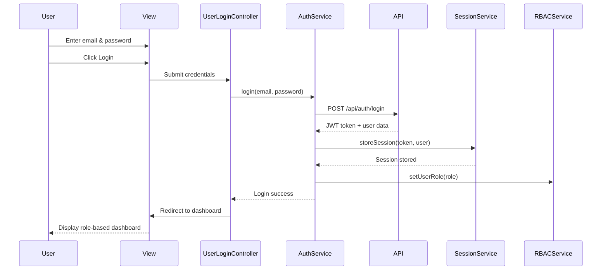

# Low-Level Design: QE-4114 - User Management and Authentication

## a. Architecture Mapping

**Component to AngularJS Artifact Mapping:**
- User Registration Interface → `UserRegistrationController` + `user-registration.html` view
- Authentication Service → `AuthService` (Factory for singleton state management)
- Role-Based Access Control → `RBACService` + `authInterceptor` (HTTP interceptor)
- Session Management → `SessionService` (Factory)
- Password Management → `PasswordService` + `PasswordResetController`
- Email/SMS Notification → External integration via `NotificationService`
- User Database → Backend API consumed via `UserService`

**Recommended Folder Structure:**
```
app/
  user/
    user.module.js
    user-registration.controller.js
    user-login.controller.js
    password-reset.controller.js
    views/
      user-registration.html
      user-login.html
      password-reset.html
    user.routes.js
  shared/
    services/
      auth.service.js
      session.service.js
      rbac.service.js
      user.service.js
      password.service.js
      notification.service.js
    interceptors/
      auth.interceptor.js
```

## b. Component Specifications

| Component Name | Artifact Type | Responsibility | Key Dependencies |
|---|---|---|---|
| UserRegistrationController | Controller | Handles user registration form submission for consumers/sellers/admins | AuthService, NotificationService |
| UserLoginController | Controller | Manages login form, credential validation, and session initiation | AuthService, SessionService, $state |
| PasswordResetController | Controller | Manages password reset request and confirmation workflows | PasswordService, NotificationService |
| AuthService | Factory | Centralized authentication logic, login/logout, token management | $http, SessionService, UserService |
| SessionService | Factory | Manages user session state, JWT token storage, expiration handling | $window.localStorage |
| RBACService | Service | Enforces role-based permissions, checks user access to features | SessionService |
| UserService | Service | API calls for user CRUD operations, profile management | $http |
| PasswordService | Service | API calls for password reset, change, validation | $http, NotificationService |
| NotificationService | Service | Sends email/SMS via external provider APIs for confirmations and alerts | $http |
| authInterceptor | Interceptor | Attaches JWT token to outgoing requests, handles 401/403 responses | SessionService, $q |

## c. Data Model

```js
User = {
  id: Number,
  email: String,
  passwordHash: String,
  role: String,  // 'consumer', 'seller', 'admin'
  firstName: String,
  lastName: String,
  phoneNumber: String,
  isVerified: Boolean,
  isActive: Boolean,
  createdAt: Date,
  lastLoginAt: Date
}

Session = {
  userId: Number,
  token: String,  // JWT
  expiresAt: Date,
  role: String
}

PasswordResetRequest = {
  email: String,
  resetToken: String,
  expiresAt: Date
}
```

## d. Data Flow

User enters registration details (email, password, role selection) in the registration view → `UserRegistrationController` validates input and calls `AuthService.register()` → `AuthService` sends POST request to `/api/users/register` via `UserService` → Backend creates user record, sends verification email via `NotificationService` → On success, user is redirected to login page → User enters credentials in login view → `UserLoginController` calls `AuthService.login()` → `AuthService` sends POST to `/api/auth/login`, receives JWT token → `SessionService` stores token in localStorage and sets user session state → `authInterceptor` attaches token to all subsequent API requests → `RBACService` checks user role to enable/disable UI features → On logout, `AuthService.logout()` clears session and redirects to login.

## e. Primary Sequence Diagram



## f. Implementation Notes

- Use constructor injection with `$inject` array annotation for all controllers and services to ensure minification safety
- Centralize all API calls in dedicated services (`AuthService`, `UserService`, `PasswordService`); controllers never call `$http` directly
- Store JWT token in `localStorage` via `SessionService`; attach to all requests using `$httpProvider.interceptors`
- Implement account lockout logic in backend; frontend displays lockout message via interceptor on 423 status code
- Use `ui-router` state resolve guards with `RBACService` to prevent unauthorized route access based on user role

## g. Error Handling

Centralized `$http` interceptor catches authentication failures (401/403), invalid credentials, and account lockout (423); user-facing errors surfaced via shared `NotificationService` with toast messages.

## h. Security Notes

Requires JWT-based authentication with token expiration; all user data encrypted in transit (HTTPS) and at rest; PCI DSS compliance for payment-related user data; input validation on client and server; account lockout after failed login attempts.