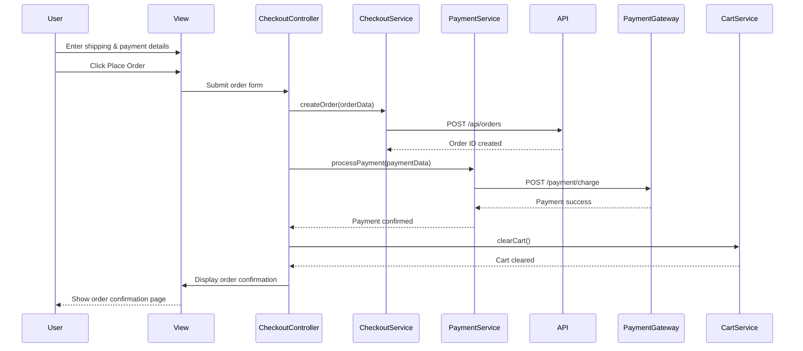

# Low-Level Design: QE-4115 - Product Discovery and Shopping Experience

## a. Architecture Mapping

**Component to AngularJS Artifact Mapping:**
- Consumer Web Interface → Multiple controllers (`ProductCatalogController`, `ProductDetailController`, `ShoppingCartController`, `CheckoutController`) + corresponding views
- Search and Filter Service → `SearchService` + `ProductFilterService`
- Product Catalog Service → `ProductCatalogService`
- Shopping Cart Service → `CartService` (Factory for singleton cart state)
- Checkout and Payment Service → `CheckoutService` + `PaymentService`
- Recommendation Engine → `RecommendationService`
- Product Reviews/Ratings → `ReviewService` + `appProductReview` directive
- Wishlist → `WishlistService` + `WishlistController`

**Recommended Folder Structure:**
```
app/
  product/
    product.module.js
    product-catalog.controller.js
    product-detail.controller.js
    product.routes.js
    views/
      product-catalog.html
      product-detail.html
  cart/
    cart.module.js
    shopping-cart.controller.js
    checkout.controller.js
    cart.routes.js
    views/
      shopping-cart.html
      checkout.html
  wishlist/
    wishlist.module.js
    wishlist.controller.js
    views/
      wishlist.html
  shared/
    services/
      product-catalog.service.js
      search.service.js
      product-filter.service.js
      cart.service.js
      checkout.service.js
      payment.service.js
      review.service.js
      recommendation.service.js
      wishlist.service.js
    directives/
      product-card.directive.js
      product-review.directive.js
```

## b. Component Specifications

| Component Name | Artifact Type | Responsibility | Key Dependencies |
|---|---|---|---|
| ProductCatalogController | Controller | Displays product list, handles search/filter/sort interactions | ProductCatalogService, SearchService, ProductFilterService |
| ProductDetailController | Controller | Shows single product details, reviews, add-to-cart, add-to-wishlist | ProductCatalogService, CartService, WishlistService, ReviewService |
| ShoppingCartController | Controller | Manages cart items, quantity updates, remove items, proceed to checkout | CartService, $state |
| CheckoutController | Controller | Handles checkout form, payment method selection, order submission | CheckoutService, PaymentService, CartService |
| WishlistController | Controller | Displays and manages user wishlist items | WishlistService |
| ProductCatalogService | Service | API calls for fetching product catalog, categories, product details | $http |
| SearchService | Service | API calls for product search with query parameters | $http |
| ProductFilterService | Service | Client-side and server-side filtering logic for products by price, category, rating | ProductCatalogService |
| CartService | Factory | Maintains shopping cart state, add/remove/update items, calculate totals | $http, $window.localStorage |
| CheckoutService | Service | API calls for order creation, address validation, order confirmation | $http |
| PaymentService | Service | Integrates with payment gateway APIs (credit card, PayPal), processes payments | $http |
| ReviewService | Service | API calls for fetching and submitting product reviews and ratings | $http |
| RecommendationService | Service | Fetches personalized product recommendations based on user behavior | $http |
| WishlistService | Service | API calls for adding/removing wishlist items, fetching user wishlist | $http |
| appProductCard | Directive | Reusable product card UI component for catalog and search results | None |
| appProductReview | Directive | Reusable product review display and submission form component | ReviewService |

## c. Data Model

```js
Product = {
  id: Number,
  sku: String,
  name: String,
  description: String,
  price: Number,
  currency: String,
  categoryId: Number,
  images: Array<String>,  // URLs
  averageRating: Number,
  reviewCount: Number,
  inStock: Boolean,
  stockQuantity: Number
}

CartItem = {
  productId: Number,
  product: Product,
  quantity: Number,
  subtotal: Number
}

Cart = {
  items: Array<CartItem>,
  totalItems: Number,
  totalPrice: Number
}

Order = {
  id: Number,
  userId: Number,
  items: Array<CartItem>,
  totalAmount: Number,
  paymentMethod: String,  // 'creditCard', 'paypal'
  shippingAddress: Address,
  billingAddress: Address,
  status: String,
  createdAt: Date
}

Address = {
  street: String,
  city: String,
  state: String,
  zipCode: String,
  country: String
}

Review = {
  id: Number,
  productId: Number,
  userId: Number,
  rating: Number,  // 1-5
  comment: String,
  createdAt: Date
}

WishlistItem = {
  id: Number,
  userId: Number,
  productId: Number,
  product: Product,
  addedAt: Date
}
```

## d. Data Flow

User navigates to product catalog view → `ProductCatalogController` calls `ProductCatalogService.getProducts()` → Service fetches products from `/api/products` via `$http` → Products displayed with `appProductCard` directive → User enters search query → `SearchService.search(query)` calls `/api/products/search` → Filtered results rendered → User clicks product card → `$state` navigates to product detail view → `ProductDetailController` loads product via `ProductCatalogService.getProductById()` and reviews via `ReviewService.getReviews()` → User clicks "Add to Cart" → `CartService.addItem()` updates cart state and persists to localStorage → User navigates to cart → `ShoppingCartController` displays cart items from `CartService.getCart()` → User proceeds to checkout → `CheckoutController` collects shipping/billing info and payment method → On submit, `CheckoutService.createOrder()` sends POST to `/api/orders` → `PaymentService.processPayment()` calls payment gateway API → On success, order confirmation displayed and cart cleared.

## e. Primary Sequence Diagram



## f. Implementation Notes

- Use constructor injection with `$inject` array for all services and controllers to ensure minification safety
- `CartService` implemented as Factory (singleton) to maintain cart state across views; persist cart to localStorage for session recovery
- All API calls centralized in services; use `$http` with promise chaining and error handling via `.catch()`
- CDN URLs for product images configured in environment config; use `ng-src` directive with lazy loading for performance
- Implement `$httpProvider.interceptors` to add loading indicators during API calls and handle payment gateway timeouts

## g. Error Handling

Centralized `$http` interceptor catches API failures, payment gateway errors, and network timeouts; user-facing errors surfaced via shared notification service with inline form validation messages.

## h. Security Notes

Requires token-based auth via existing SSO for checkout; PCI DSS compliance enforced by payment gateway integration (no card data stored client-side); input validation for payment and address forms; HTTPS for all API calls.