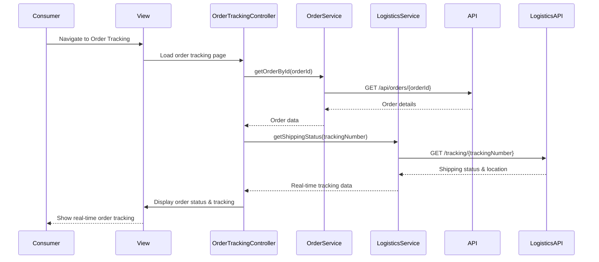

# Low-Level Design: QE-4116 - Order Management and Platform Operations

## a. Architecture Mapping

**Component to AngularJS Artifact Mapping:**
- Seller Dashboard → `SellerDashboardController` + `seller-dashboard.html` view
- Order Processing Engine → `OrderService` + `OrderProcessingService`
- Inventory Management → `InventoryService` + `InventoryController`
- Consumer Order Portal → `ConsumerOrderController` + `OrderTrackingController`
- Admin Dashboard → `AdminDashboardController` + `AdminPanelController`
- Notification Service → `NotificationService` (integrates with external email/SMS providers)
- Fraud Detection Service → `FraudDetectionService`
- Third-Party Logistics API → External integration via `LogisticsService`

**Recommended Folder Structure:**
```
app/
  seller/
    seller.module.js
    seller-dashboard.controller.js
    inventory.controller.js
    seller.routes.js
    views/
      seller-dashboard.html
      inventory-management.html
  order/
    order.module.js
    consumer-order.controller.js
    order-tracking.controller.js
    order.routes.js
    views/
      order-history.html
      order-tracking.html
  admin/
    admin.module.js
    admin-dashboard.controller.js
    admin-panel.controller.js
    admin.routes.js
    views/
      admin-dashboard.html
      dispute-resolution.html
  shared/
    services/
      order.service.js
      order-processing.service.js
      inventory.service.js
      logistics.service.js
      notification.service.js
      fraud-detection.service.js
      analytics.service.js
    interceptors/
      realtime.interceptor.js
```

## b. Component Specifications

| Component Name | Artifact Type | Responsibility | Key Dependencies |
|---|---|---|---|
| SellerDashboardController | Controller | Displays seller analytics, product listings, order summary, inventory alerts | OrderService, InventoryService, AnalyticsService |
| InventoryController | Controller | Manages product inventory, stock updates, low-stock alerts | InventoryService, NotificationService |
| ConsumerOrderController | Controller | Displays consumer order history, order details, cancellation/refund requests | OrderService |
| OrderTrackingController | Controller | Shows real-time order status, shipping updates, tracking information | OrderService, LogisticsService |
| AdminDashboardController | Controller | Displays platform KPIs, user management, fraud alerts, dispute queue | AnalyticsService, FraudDetectionService, OrderService |
| AdminPanelController | Controller | Handles dispute resolution, user account actions, fraud investigation | OrderService, FraudDetectionService |
| OrderService | Service | API calls for order CRUD, order status updates, cancellation, refund processing | $http |
| OrderProcessingService | Service | Business logic for order fulfillment workflow, status transitions | OrderService, NotificationService |
| InventoryService | Service | API calls for inventory management, stock updates, low-stock threshold checks | $http, NotificationService |
| LogisticsService | Service | Integrates with third-party logistics APIs for shipping updates and tracking | $http |
| NotificationService | Service | Sends real-time email/SMS alerts for order status, inventory, and fraud events | $http |
| FraudDetectionService | Service | API calls to fraud detection algorithms, flags suspicious orders, account verification | $http |
| AnalyticsService | Service | API calls for sales analytics, platform KPIs, reporting data | $http |
| realtimeInterceptor | Interceptor | Handles real-time order status updates via polling or WebSocket fallback | $interval, OrderService |

## c. Data Model

```js
Order = {
  id: Number,
  userId: Number,
  sellerId: Number,
  items: Array<OrderItem>,
  totalAmount: Number,
  status: String,  // 'pending', 'processing', 'shipped', 'delivered', 'cancelled', 'refunded'
  shippingAddress: Address,
  trackingNumber: String,
  createdAt: Date,
  updatedAt: Date,
  estimatedDelivery: Date
}

OrderItem = {
  productId: Number,
  productName: String,
  quantity: Number,
  price: Number,
  subtotal: Number
}

InventoryItem = {
  productId: Number,
  sellerId: Number,
  stockQuantity: Number,
  lowStockThreshold: Number,
  lastUpdated: Date
}

ShippingUpdate = {
  orderId: Number,
  trackingNumber: String,
  status: String,
  location: String,
  timestamp: Date
}

FraudAlert = {
  id: Number,
  orderId: Number,
  userId: Number,
  riskScore: Number,
  reason: String,
  status: String,  // 'pending', 'resolved', 'confirmed_fraud'
  createdAt: Date
}

Dispute = {
  id: Number,
  orderId: Number,
  userId: Number,
  sellerId: Number,
  reason: String,
  status: String,  // 'open', 'in_review', 'resolved'
  resolution: String,
  createdAt: Date
}

Analytics = {
  totalOrders: Number,
  totalRevenue: Number,
  averageOrderValue: Number,
  conversionRate: Number,
  period: String  // 'daily', 'weekly', 'monthly'
}
```

## d. Data Flow

Seller logs into dashboard → `SellerDashboardController` calls `AnalyticsService.getSalesData()` and `InventoryService.getInventory()` → Services fetch data from `/api/seller/analytics` and `/api/inventory` → Dashboard displays sales metrics and inventory alerts → Seller receives low-stock notification via `NotificationService` → Seller updates inventory via `InventoryController` → `InventoryService.updateStock()` sends PUT to `/api/inventory/{id}` → Consumer places order → Order created in backend → `OrderProcessingService` triggers status update → `NotificationService` sends order confirmation email → Consumer navigates to order tracking view → `OrderTrackingController` calls `OrderService.getOrderById()` and `LogisticsService.getShippingStatus()` → Real-time tracking updates displayed via `realtimeInterceptor` polling → Admin monitors platform via `AdminDashboardController` → `FraudDetectionService.getFraudAlerts()` fetches suspicious orders from `/api/fraud/alerts` → Admin reviews and resolves disputes via `AdminPanelController` → Order status updated and refund processed via `OrderService.processRefund()`.

## e. Primary Sequence Diagram



## f. Implementation Notes

- Use constructor injection with `$inject` array for all services and controllers to ensure minification safety
- Centralize all API calls in dedicated services; implement retry logic with exponential backoff for logistics API integration
- Real-time order updates via `realtimeInterceptor` using `$interval` polling (fallback to WebSocket if available)
- `NotificationService` queues alerts and batches API calls to external email/SMS providers to avoid rate limiting
- Fraud detection runs asynchronously; `FraudDetectionService` polls `/api/fraud/alerts` every 30 seconds for admin dashboard

## g. Error Handling

Centralized `$http` interceptor catches API failures, logistics API timeouts, and payment refund errors; user-facing errors surfaced via shared notification service with retry options for critical operations.

## h. Security Notes

Requires role-based access control via existing auth system (seller/consumer/admin roles); fraud detection algorithms run server-side with secure API endpoints; refund processing requires admin authorization; all sensitive data encrypted in transit and at rest.