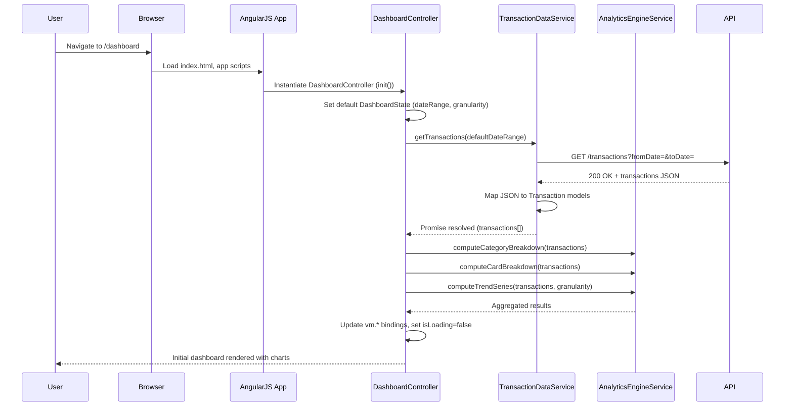
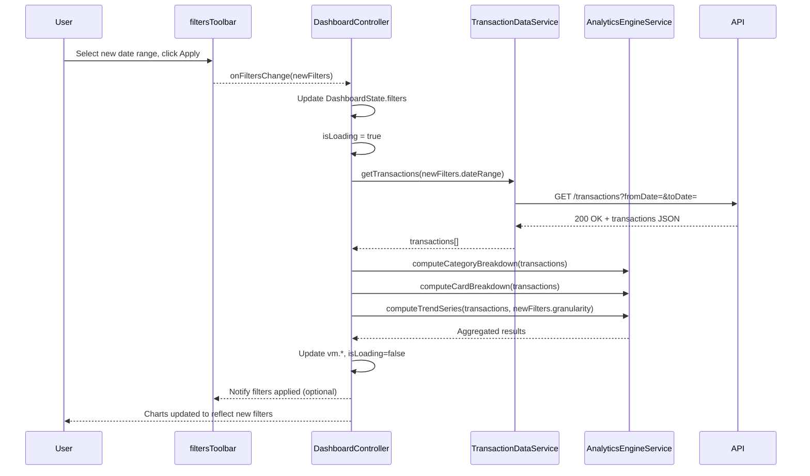
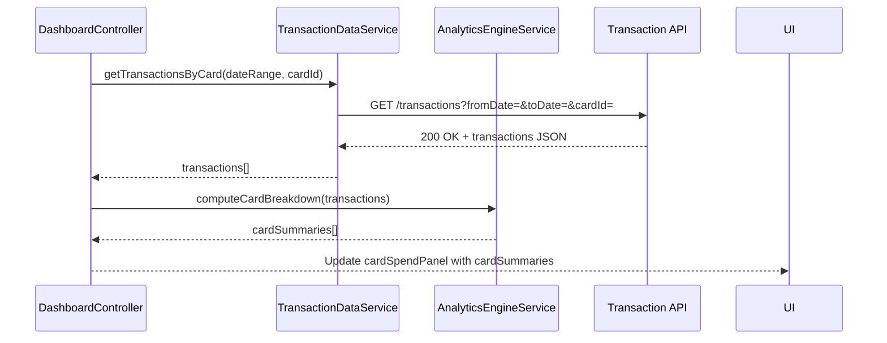
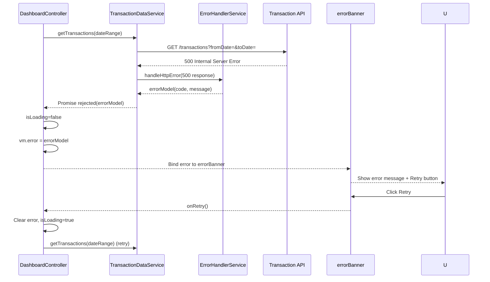

# Low-Level Design (LLD) – Interactive Spending Analytics Dashboard

## 1. Application Architecture

### 1.1 Overall Architectural Style

The application is an enterprise-grade web-based analytics dashboard implemented using:
- **Frontend:** AngularJS 1.x (MVC), JavaScript ES6 (transpiled where necessary), HTML5, CSS3, Bootstrap.
- **Backend Integration:** RESTful APIs for transaction data ingestion and analytics results retrieval.
- **Pattern:** AngularJS MVC, Service-oriented architecture on the client side, modular structure.

The HLD components map to AngularJS artifacts as follows:
- **Transaction Data Service (Upstream)** → AngularJS service(s) that call REST APIs to fetch transaction data.
- **Analytics Engine** → AngularJS services and models that perform client-side aggregation, trend computation, and category/card breakdowns (or orchestrate backend analytics APIs if present).
- **Visualization UI** → AngularJS controllers + views + directives wrapping chart libraries for interactive visualizations.

### 1.2 AngularJS MVC Mapping

- **Models:** JavaScript objects representing `Transaction`, `CategorySummary`, `CardSummary`, `TrendPoint`, and `DashboardState`.
- **Views:** HTML5 templates rendered via AngularJS directives (`ng-repeat`, `ng-if`, custom chart directives) styled with Bootstrap.
- **Controllers:** Handle UI events, orchestrate service calls, manage view state (filters, selected time range, card selection, category drill-down).
- **Services/Factories:** Encapsulate communication with REST APIs (transaction data and analytics), data transformation, caching, and error handling.
- **Directives:** Encapsulate chart rendering using a charting library (e.g., D3.js, Chart.js, Highcharts). These directives expose bindings for aggregated analytics data and options.
- **Filters:** Presentational formatting (currency, date, percentage) for rendering analytics output.
- **Configuration:** AngularJS module configuration for routes, REST base URLs, logging, feature flags.

### 1.3 Recommended Project Folder Structure

```text
/credit-card-analytics-dashboard
  /app
    app.module.js
    app.config.js
    app.routes.js
    app.run.js

    /core
      /services
        transaction-data.service.js
        analytics-engine.service.js
        chart-config.service.js
        logging.service.js
        error-handler.service.js
      /models
        transaction.model.js
        category-summary.model.js
        card-summary.model.js
        trend-point.model.js
        dashboard-state.model.js
      /filters
        currency-format.filter.js
        percentage-format.filter.js
        date-range-format.filter.js

    /features
      /dashboard
        dashboard.module.js
        dashboard.controller.js
        dashboard.state.js
        dashboard.view.html
        /components
          category-breakdown-panel.directive.js
          card-spend-panel.directive.js
          trend-chart.directive.js
          filters-toolbar.directive.js
          loading-indicator.directive.js
          error-banner.directive.js

    /config
      env.config.js
      api.config.js
      logging.config.js
      feature-flags.config.js

  /assets
    /css
      main.css
      dashboard.css
    /images
      icons/*

  /lib
    angular.js
    angular-route.js
    bootstrap.css
    chart-library.js

  index.html
```

`Application_Name` (for URL paths) will be `credit-card-analytics-dashboard`.

## 2. Component Specifications

### 2.1 AngularJS Modules

#### 2.1.1 `app` Module
- **Type:** AngularJS Module
- **File:** `app/app.module.js`
- **Responsibility:** Root module configuring dependencies (`ngRoute` or `ui.router`, core and feature modules).
- **Public API:** N/A (module definition).
- **Dependencies:** `ngRoute`, `app.core`, `app.dashboard`.

#### 2.1.2 `app.core` Module
- **Type:** AngularJS Module
- **File:** `app/core/core.module.js` (implicit via services/models/filters registration)
- **Responsibility:** Provide reusable services, models, and filters.

#### 2.1.3 `app.dashboard` Module
- **Type:** AngularJS Module
- **File:** `app/features/dashboard/dashboard.module.js`
- **Responsibility:** Bundle controllers, directives, and states/views for the analytics dashboard feature.
- **Dependencies:** `app.core`.

### 2.2 Controllers

#### 2.2.1 `DashboardController`
- **Type:** Controller
- **File:** `app/features/dashboard/dashboard.controller.js`
- **Responsibility:**
  - Initialize dashboard state.
  - Trigger data loading (transaction data and analytics results).
  - Handle user interactions (date range selection, category filter, card selection, chart drill-down).
  - Coordinate with `AnalyticsEngineService` and `TransactionDataService`.
  - Bind aggregated data to visualization directives.
- **Public Methods:**
  - `init()`: Called on controller instantiation; sets default filters and loads initial analytics.
  - `refreshAnalytics()`: Recomputes analytics based on current filters.
  - `onDateRangeChange(range)`: Updates date range filter and refreshes analytics.
  - `onCategorySelection(categoryId)`: Updates selected category and refreshes category breakdown.
  - `onCardSelection(cardId)`: Updates selected card filter and refreshes card-based views.
  - `toggleViewMode(mode)`: Switches between category, card, and trend views.
  - `handleDrillDown(event)`: Handles drill-down events from chart directives (e.g., click on bar/line point).
- **Inputs:**
  - Route parameters (optional, for deep links).
  - User actions from views (events, ng-click, directive callbacks).
- **Outputs:**
  - View model: `vm.categorySummaries`, `vm.cardSummaries`, `vm.trendSeries`, `vm.filters`, `vm.loading`, `vm.error`.
  - Emits events to child directives via bindings.
- **Dependencies (Injected):**
  - `TransactionDataService`
  - `AnalyticsEngineService`
  - `ChartConfigService`
  - `LoggingService`
  - `$q`, `$scope`, `$timeout` (as needed)

### 2.3 Services / Factories

#### 2.3.1 `TransactionDataService`
- **Type:** AngularJS Service
- **File:** `app/core/services/transaction-data.service.js`
- **Responsibility:**
  - Fetch structured transaction data from upstream REST API.
  - Normalize and map raw JSON into `Transaction` model instances.
  - Provide query methods by date range, category, card.
  - Implement client-side caching to avoid redundant requests.
- **Public Methods:**
  - `getTransactions(dateRange)`: Returns a promise resolving to an array of `Transaction` for the specified date range.
  - `getTransactionsByCard(dateRange, cardId)`: Returns transactions filtered by card.
  - `getTransactionsByCategory(dateRange, categoryId)`: Returns transactions filtered by category.
  - `invalidateCache()`: Clears cached results.
- **Inputs:**
  - `dateRange` object (`{ from: Date, to: Date }`).
  - Optional `cardId`, `categoryId`.
- **Outputs:**
  - ES6 arrays of `Transaction` objects.
- **Dependencies (Injected):**
  - `$http`
  - `$q`
  - `EnvConfig` (API base URL)
  - `LoggingService`

#### 2.3.2 `AnalyticsEngineService`
- **Type:** AngularJS Service
- **File:** `app/core/services/analytics-engine.service.js`
- **Responsibility:**
  - Process raw or pre-aggregated transaction data.
  - Compute spending trends over time.
  - Create breakdowns by category and per card.
  - Expose calculations for charts.
- **Public Methods:**
  - `computeCategoryBreakdown(transactions)`: Returns an array of `CategorySummary`.
  - `computeCardBreakdown(transactions)`: Returns an array of `CardSummary`.
  - `computeTrendSeries(transactions, granularity)`: Returns an array of `TrendPoint` grouped by day/week/month.
  - `mergeExistingState(dashboardState, newData)`: Updates `DashboardState` with new analytics.
- **Inputs:**
  - List of `Transaction` objects.
  - Granularity configuration (`'daily' | 'weekly' | 'monthly'`).
- **Outputs:**
  - Aggregated model objects ready for visualization.
- **Dependencies (Injected):**
  - `$q`
  - `LoggingService`

#### 2.3.3 `ChartConfigService`
- **Type:** Service
- **File:** `app/core/services/chart-config.service.js`
- **Responsibility:**
  - Provide reusable chart configuration (colors, tooltips, axes, responsiveness).
  - Ensure consistent interactive behavior (hover, click events).
- **Public Methods:**
  - `getTrendChartConfig()`
  - `getCategoryBreakdownChartConfig()`
  - `getCardSpendChartConfig()`
- **Inputs:** Optional overrides for styling.
- **Outputs:** Chart config objects consumed by chart directives.
- **Dependencies:** None (pure configuration service).

#### 2.3.4 `LoggingService`
- **Type:** Service
- **File:** `app/core/services/logging.service.js`
- **Responsibility:**
  - Centralized client-side logging.
  - Forward key events and errors to server-side telemetry endpoint.
- **Public Methods:**
  - `info(message, context)`
  - `warn(message, context)`
  - `error(message, context)`
- **Dependencies:** `$log`, `$http`, `EnvConfig`.

#### 2.3.5 `ErrorHandlerService`
- **Type:** Service
- **File:** `app/core/services/error-handler.service.js`
- **Responsibility:**
  - Standardize handling of REST and client-side errors.
  - Map HTTP errors to user-friendly messages and recovery strategies.
- **Public Methods:**
  - `handleHttpError(response)`: Produces error view model.
  - `handleClientError(err)`: Logs and returns error view model.

### 2.4 Directives (Visualization UI Components)

#### 2.4.1 `trendChart` Directive
- **Type:** Directive
- **File:** `app/features/dashboard/components/trend-chart.directive.js`
- **Responsibility:** Render interactive time-series chart for spending trends.
- **Public API (scope bindings):**
  - `data` (=`trendSeries`): Array of `TrendPoint`.
  - `config`: Chart configuration.
  - `onPointClick`: Callback invoked when user clicks a data point.
- **Inputs:** Bound chart data and configuration via attributes.
- **Outputs:** Emits events to parent controller through callbacks.
- **Dependencies:** Chart library, `ChartConfigService`.

#### 2.4.2 `categoryBreakdownPanel` Directive
- **Type:** Directive
- **File:** `app/features/dashboard/components/category-breakdown-panel.directive.js`
- **Responsibility:**
  - Render bar/pie chart for category-wise spending.
  - Provide filter UI for categories.
- **Bindings:**
  - `categories`: Array of `CategorySummary`.
  - `onCategorySelect`: Callback when category selected.

#### 2.4.3 `cardSpendPanel` Directive
- **Type:** Directive
- **File:** `app/features/dashboard/components/card-spend-panel.directive.js`
- **Responsibility:** Show card-wise breakdown, including totals and average spend.
- **Bindings:**
  - `cards`: Array of `CardSummary`.
  - `onCardSelect`: Callback on card selection.

#### 2.4.4 `filtersToolbar` Directive
- **Type:** Directive
- **File:** `app/features/dashboard/components/filters-toolbar.directive.js`
- **Responsibility:** Provide interactive controls for date range, granularity, and view mode.
- **Bindings:**
  - `filters`: `DashboardState.filters` object.
  - `onFiltersChange`: Callback to controller when filters change.

#### 2.4.5 `loadingIndicator` Directive
- **Type:** Directive
- **File:** `app/features/dashboard/components/loading-indicator.directive.js`
- **Responsibility:** Display loading spinner overlay during data fetch.
- **Bindings:**
  - `isLoading`: Boolean.

#### 2.4.6 `errorBanner` Directive
- **Type:** Directive
- **File:** `app/features/dashboard/components/error-banner.directive.js`
- **Responsibility:** Display user-friendly error messages with retry button.
- **Bindings:**
  - `error`: Error view model.
  - `onRetry`: Callback to trigger reload.

### 2.5 Filters

#### 2.5.1 `currencyFormat`
- **Type:** Filter
- **File:** `app/core/filters/currency-format.filter.js`
- **Responsibility:** Format numeric amounts into localized currency strings.

#### 2.5.2 `percentageFormat`
- **Type:** Filter
- **File:** `app/core/filters/percentage-format.filter.js`
- **Responsibility:** Render ratios and breakdown percentages.

#### 2.5.3 `dateRangeFormat`
- **Type:** Filter
- **File:** `app/core/filters/date-range-format.filter.js`
- **Responsibility:** Format date ranges for display in UI.

## 3. Component Responsibilities

### 3.1 Transaction Data Service
- Owns integration with upstream Transaction Data REST API.
- Responsible for:
  - Building HTTP requests with query parameters (date range, cardId, etc.).
  - Parsing JSON responses into `Transaction` models.
  - Handling API errors using `ErrorHandlerService`.
  - Caching data per date range to support interactive re-filtering without unnecessary network calls.

### 3.2 Analytics Engine
- Owns business logic for spending analysis:
  - Aggregation by category: sum of transaction amounts per category, percentage of overall spend, count of transactions.
  - Aggregation by card: total per card, average per transaction, number of active days.
  - Trend analysis: group by date bucket, compute total spend per bucket.
  - Filtering logic: apply filters (category, card, date, minimum amount) before aggregation.
- Ensures algorithms are efficient for typical transaction volumes by using:
  - ES6 array methods (`map`, `filter`, `reduce`).
  - Immutable transformations to avoid accidental state mutation.

### 3.3 Visualization Components
- Own UI handling:
  - Mapping aggregated data to charts.
  - Managing chart options (labels, tooltips, legends).
  - Handling user interactions: clicks, hover tooltips, legend toggling.
- Maintain separation of concerns: directives don’t fetch data; they only render and emit events.

### 3.4 Controllers and State Management
- `DashboardController` owns:
  - Orchestration between services and directives.
  - Maintaining `DashboardState` (current filters, active view, loading/error flags).
  - Ensuring UI remains responsive and consistent when data updates.
- Uses `$scope` or `controllerAs` syntax with `vm` to expose state.

### 3.5 Validation Responsibilities
- Input validation (date ranges, numeric values) executed within controller before invoking services.
- Data integrity validation (transaction data completeness) executed in `AnalyticsEngineService`.

## 4. Interface Specifications

### 4.1 REST API Interfaces – Transaction Data

#### 4.1.1 Get Transactions
- **Endpoint:** `GET {{EnvConfig.apiBaseUrl}}/transactions`
- **Query Parameters:**
  - `fromDate` (ISO 8601 string, required)
  - `toDate` (ISO 8601 string, required)
  - `cardId` (string, optional)
  - `categoryId` (string, optional)
- **Request Payload:** None (query-only).
- **Response Structure (JSON):**
  ```json
  {
    "transactions": [
      {
        "id": "T12345",
        "cardId": "CARD-001",
        "categoryId": "FOOD",
        "categoryName": "Food & Dining",
        "amount": 45.70,
        "currency": "USD",
        "transactionDate": "2026-07-01T10:15:00Z",
        "merchantName": "ABC Restaurant"
      }
    ],
    "meta": {
      "count": 250,
      "fromDate": "2026-07-01",
      "toDate": "2026-07-31"
    }
  }
  ```
- **Error Responses:**
  - `400 Bad Request`: Invalid date range.
    ```json
    { "errorCode": "INVALID_DATE_RANGE", "message": "fromDate must be before toDate" }
    ```
  - `401 Unauthorized`: Authentication failure.
  - `500 Internal Server Error`: Upstream processing error.

### 4.2 REST API Interfaces – Analytics (Optional Backend Support)

If analytics calculations are delegated to backend:

#### 4.2.1 Get Category Breakdown
- **Endpoint:** `POST {{EnvConfig.apiBaseUrl}}/analytics/category-breakdown`
- **Request Payload:**
  ```json
  {
    "fromDate": "2026-07-01",
    "toDate": "2026-07-31",
    "cardId": "CARD-001"
  }
  ```
- **Response Structure:**
  ```json
  {
    "categories": [
      {
        "categoryId": "FOOD",
        "categoryName": "Food & Dining",
        "totalAmount": 300.5,
        "transactionCount": 20,
        "percentageOfTotal": 0.25
      }
    ],
    "totalAmount": 1200.0
  }
  ```

#### 4.2.2 Get Card Breakdown
- **Endpoint:** `POST {{EnvConfig.apiBaseUrl}}/analytics/card-breakdown`

#### 4.2.3 Get Trend Series
- **Endpoint:** `POST {{EnvConfig.apiBaseUrl}}/analytics/trend-series`

### 4.3 Internal Interfaces

#### 4.3.1 Controller ↔ TransactionDataService
- **Interaction:** Controller calls `TransactionDataService.getTransactions(dateRange)`.
- **Data Contract:** `dateRange` object; response array of `Transaction` models.

#### 4.3.2 Controller ↔ AnalyticsEngineService
- **Interaction:** Controller passes transactions to analytics methods.
- **Data Contract:** Arrays of `Transaction`; responses arrays of `CategorySummary`, `CardSummary`, `TrendPoint`.

#### 4.3.3 Controller ↔ Directives
- **Interaction:** One-way bindings of aggregated data; event callbacks for interactions.

## 5. Data Model Design

### 5.1 `Transaction` Model
- **File:** `app/core/models/transaction.model.js`
- **Attributes:**
  - `id: string` (default: `null`, required).
  - `cardId: string` (default: `null`, required).
  - `categoryId: string` (default: `null`, required).
  - `categoryName: string` (default: `""`).
  - `amount: number` (default: `0.0`, required, >= 0).
  - `currency: string` (default: `"USD"`).
  - `transactionDate: Date` (default: `new Date(0)`).
  - `merchantName: string` (default: `""`).
- **Validation Rules:**
  - `amount >= 0`.
  - `cardId` and `categoryId` not empty.
  - `transactionDate` within selected date range.

### 5.2 `CategorySummary` Model
- **File:** `app/core/models/category-summary.model.js`
- **Attributes:**
  - `categoryId: string`.
  - `categoryName: string`.
  - `totalAmount: number` (>= 0).
  - `transactionCount: number` (integer >= 0).
  - `percentageOfTotal: number` (0–1).
- **Default Values:** All numeric attributes default to 0.
- **Validation Rules:**
  - `percentageOfTotal` computed consistently: sum of all categories <= 1.01 (tolerance).

### 5.3 `CardSummary` Model
- **File:** `app/core/models/card-summary.model.js`
- **Attributes:**
  - `cardId: string`.
  - `cardAlias: string` (masked card representation).
  - `totalAmount: number`.
  - `transactionCount: number`.
  - `averageAmount: number`.
- **Validation Rules:**
  - `averageAmount` = `totalAmount / max(transactionCount, 1)`.

### 5.4 `TrendPoint` Model
- **File:** `app/core/models/trend-point.model.js`
- **Attributes:**
  - `bucketStartDate: Date`.
  - `bucketLabel: string`.
  - `totalAmount: number`.
  - `transactionCount: number`.
- **Validation Rules:**
  - Buckets must not overlap.

### 5.5 `DashboardState` Model
- **File:** `app/core/models/dashboard-state.model.js`
- **Attributes:**
  - `filters`:
    - `dateRange: { from: Date, to: Date }`.
    - `granularity: 'daily' | 'weekly' | 'monthly'`.
    - `selectedCategoryId: string | null`.
    - `selectedCardId: string | null`.
  - `viewMode: 'category' | 'card' | 'trend'`.
  - `isLoading: boolean`.
  - `error: { code: string, message: string } | null`.
- **State Transitions:**
  - `INIT` → `LOADING` → `READY`.
  - `READY` → `LOADING` (on filter change) → `READY`.
  - `READY` → `ERROR` (on unrecoverable error), with potential `ERROR` → `LOADING` (on retry).

## 6. Data Flow

### 6.1 End-to-End Flow

**User Action → View → Controller → Service → Model/API → Response → UI Update**

1. **User Action:** User selects a date range and clicks "Apply" on `filtersToolbar`.
2. **View:** `filtersToolbar` directive captures selections and invokes `onFiltersChange(filters)`.
3. **Controller:** `DashboardController.onDateRangeChange(range)` updates `DashboardState.filters.dateRange`, sets `isLoading = true`, clears current analytics.
4. **Service Call:** Controller calls `TransactionDataService.getTransactions(dateRange)`.
5. **API Interaction:** `TransactionDataService` issues `GET /transactions` with query params.
6. **Response Handling:**
   - On success, `TransactionDataService` normalizes JSON into `Transaction` models and resolves promise.
   - On failure, `TransactionDataService` delegates to `ErrorHandlerService` and rejects with error model.
7. **Analytics Computation:** Controller passes transactions to `AnalyticsEngineService`:
   - `computeCategoryBreakdown(transactions)`.
   - `computeCardBreakdown(transactions)`.
   - `computeTrendSeries(transactions, granularity)`.
8. **State Update:** `DashboardController` updates `vm.categorySummaries`, `vm.cardSummaries`, `vm.trendSeries`, sets `isLoading = false`.
9. **UI Update:**
   - `trendChart`, `categoryBreakdownPanel`, `cardSpendPanel` directives receive updated bindings and re-render charts.
   - Filters and stats are displayed with formatted values via filters.

### 6.2 Event Handling and State Changes

- **Drill-down on Category:**
  - User clicks on a category bar → `categoryBreakdownPanel` calls `onCategorySelect(categoryId)` → controller updates filters and recomputes analytics for selected category.
- **Card Selection:**
  - User selects card → `cardSpendPanel` callback triggers `onCardSelection(cardId)` → controller filters transactions by card.
- **View Mode Toggle:**
  - `filtersToolbar` calls `toggleViewMode(mode)` on controller → controller sets `DashboardState.viewMode` and UI conditionally renders relevant panels.

## 7. Sequence Diagrams (Mermaid)

### 7.1 Application Initialization



### 7.2 Primary User Workflow – Filter Change



### 7.3 Service/API Interactions – Card Breakdown



### 7.4 Error Handling Scenario – API Failure



## 8. Implementation Details

### 8.1 AngularJS Implementation Approach
- Use `controllerAs` syntax and avoid `$scope` where possible.
- Define modules in separate files and load via `index.html`.
- Register services via `.service()` and directives via `.directive()`.
- Utilize `$routeProvider` or `$stateProvider` to define `/dashboard` route.

### 8.2 JavaScript ES6 Patterns
- Use `const` and `let` for variable declarations.
- Use arrow functions for callbacks in services.
- Use ES6 classes for models where supported, transpiled via Babel if necessary.

Example `Transaction` model:
```javascript
class Transaction {
  constructor({ id = null, cardId = null, categoryId = null, categoryName = '', amount = 0.0,
                currency = 'USD', transactionDate = new Date(0), merchantName = '' } = {}) {
    this.id = id;
    this.cardId = cardId;
    this.categoryId = categoryId;
    this.categoryName = categoryName;
    this.amount = amount;
    this.currency = currency;
    this.transactionDate = new Date(transactionDate);
    this.merchantName = merchantName;
  }
}
```

### 8.3 Dependency Injection
- Use AngularJS DI to inject `$http`, `$q`, and custom services.
- Ensure annotations are minification-safe (either `ngAnnotate` or array syntax).

Example:
```javascript
TransactionDataService.$inject = ['$http', '$q', 'EnvConfig', 'LoggingService', 'ErrorHandlerService'];
function TransactionDataService($http, $q, EnvConfig, LoggingService, ErrorHandlerService) {
  // ... implementation ...
}
```

### 8.4 Business Logic Flow
- Implement analytics logic in `AnalyticsEngineService` with pure functions where possible.
- Avoid side effects; return new arrays instead of mutating input.

### 8.5 Validation Logic
- Implement input validation in controller before making service calls.
- Use dedicated validation helpers in models if necessary.

### 8.6 State Management Approach
- Use a single `DashboardState` object bound to controller.
- Update state via discrete functions (`setLoading`, `setError`, `updateFilters`).

### 8.7 DOM Interaction Approach
- Direct DOM manipulation should be encapsulated within directives.
- Use AngularJS lifecycle hooks (`link`, `compile`) for chart initialization.

### 8.8 API Integration Approach
- Use `$http` with `interceptors` for authentication headers and global error handling.
- Respect environment-specific base URLs from `EnvConfig`.

## 9. Configuration

### 9.1 AngularJS Configuration Files

#### 9.1.1 `env.config.js`
- Defines environment-specific properties:
  - `apiBaseUrl`
  - `telemetryUrl`
  - `loggingLevel`

#### 9.1.2 `api.config.js`
- Exposes constants for endpoint paths.

#### 9.1.3 `feature-flags.config.js`
- Feature flags for:
  - `enableCardBreakdown`
  - `enableCategoryDrilldown`
  - `enableTrendGranularityToggle`

#### 9.1.4 `logging.config.js`
- `LoggingService` configuration for log levels and sampling.

### 9.2 Environment-Specific Properties
- `dev`, `test`, `prod` environments, each with:
  - Different `apiBaseUrl`.
  - Different logging verbosity.

### 9.3 API Base URLs
- Example:
  - Dev: `https://dev-api.example.com/credit-card`
  - Prod: `https://api.example.com/credit-card`

### 9.4 Logging and Telemetry
- Client logs sent to `telemetryUrl` via `LoggingService`.
- Include context: user id (if available), timestamp, dashboard filters.

## 10. Error Handling and Resiliency

### 10.1 Client-side Exception Handling
- Wrap critical operations (analytics computation, chart rendering) in try/catch.
- Use `ErrorHandlerService.handleClientError(err)` to produce consistent error models.

### 10.2 REST API Error Handling
- Use `$http` interceptors to detect error HTTP codes and route them through `ErrorHandlerService`.
- Display error banner with actionable messages (retry, adjust filters).

### 10.3 Retry Mechanisms
- Implement manual retry via UI (Retry button triggering re-fetch).
- Optionally implement exponential backoff for transient errors (HTTP 5xx) within `TransactionDataService`.

### 10.4 Logging Strategy
- All errors logged via `LoggingService.error()`.
- Key business events (filter change, drill-down) logged via `LoggingService.info()`.

### 10.5 Recovery and Fallback Behavior
- In case charts fail to render, show tabular backup views for analytics.
- Maintain last known good analytics state to display while data re-loads.

## 11. Security Considerations

### 11.1 Input Validation and Sanitization
- Validate date inputs to avoid invalid values.
- Sanitize any free-text filters (if added) using AngularJS built-in mechanisms and custom sanitization.

### 11.2 XSS Prevention
- Use AngularJS binding (`{{ }}`) instead of manual DOM insertion.
- Avoid using `ng-bind-html` with unsafe content; if required, use `$sce` with strict whitelisting.

### 11.3 CSRF Protection
- Ensure `$http` includes CSRF tokens in requests (provided by backend, e.g., cookies + header).

### 11.4 Secure API Communication
- Use HTTPS for all API calls.
- Ensure environment configuration enforces TLS endpoints.

### 11.5 Authentication and Authorization
- Integrate with existing auth (e.g., JWT, session-based) via `$http` interceptors.
- Restrict analytics access based on user roles.

### 11.6 Sensitive Data Handling
- Mask card identifiers in UI (`CARD-001` → `**** 001`).
- Do not log full card numbers or personally identifiable information.

### 11.7 Audit Logging
- Log important user actions (login, filter changes, card selection) with timestamps and anonymized identifiers.
- Send audit events to backend telemetry service.
