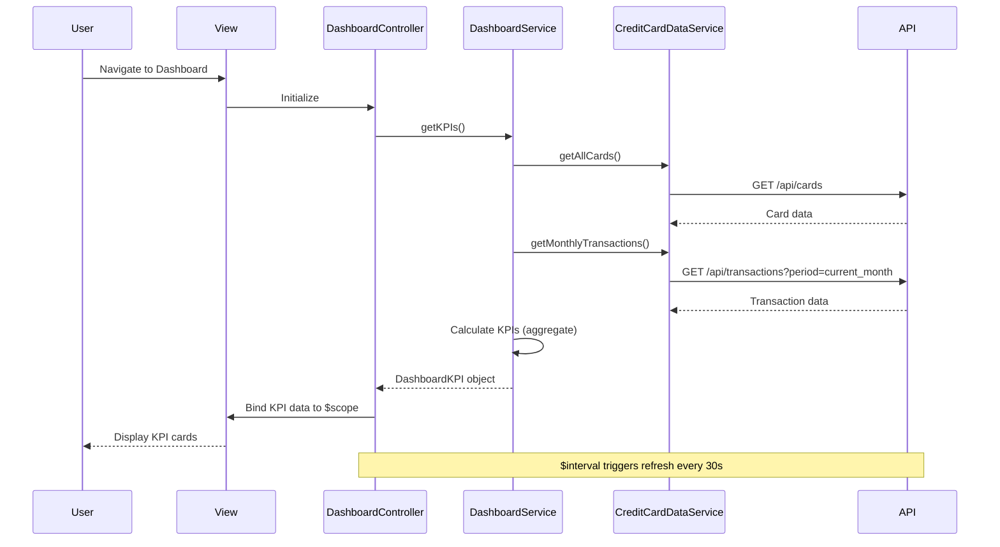

# Low-Level Design: QE-4147 - Credit Card Dashboard and KPI Monitoring

## a. Architecture Mapping

**Component to Artifact Mapping:**
- User Interface → DashboardController + dashboard.html view
- Dashboard Service → DashboardService (Factory for API calls and KPI calculations)
- Credit Card Data Service → CreditCardDataService (Factory for card/transaction data retrieval)
- Real-time refresh mechanism → $interval service for periodic polling

**Folder Structure:**
```
app/
  dashboard/
    dashboard.module.js
    dashboard.controller.js
    dashboard.service.js
    dashboard.routes.js
    views/dashboard.html
  shared/
    services/creditCardData.service.js
    interceptors/http.interceptor.js
```

## b. Component Specifications

| Name | Artifact Type | Responsibility | Key Dependencies |
|------|---------------|----------------|------------------|
| DashboardController | Controller | Orchestrates KPI display, handles user interactions, manages view state | DashboardService, $scope, $interval |
| DashboardService | Factory | Aggregates card data, calculates KPIs (available credit, outstanding), manages refresh logic | CreditCardDataService, $http, $q |
| CreditCardDataService | Factory | Retrieves card information and transaction data from REST API | $http, $q |
| dashboard.html | View | Renders KPI cards (monthly spend, credit limit, available credit, outstanding), responsive layout using Bootstrap grid | DashboardController |
| HttpInterceptor | Interceptor | Handles API errors, manages loading states | $q, NotificationService |
| dashboard.routes.js | Config | Defines ui-router state for dashboard page | $stateProvider |

## c. Data Model

```js
CreditCard = {
  id: String,
  cardNumber: String,
  issuer: String,
  creditLimit: Number,
  currentBalance: Number,
  availableCredit: Number,
  outstandingAmount: Number
}

DashboardKPI = {
  monthlySpend: Number,
  totalCreditLimit: Number,
  totalAvailableCredit: Number,
  totalOutstanding: Number,
  lastUpdated: Date
}

Transaction = {
  id: String,
  cardId: String,
  amount: Number,
  date: Date,
  category: String
}
```

## d. Data Flow

User navigates to dashboard page → ui-router loads DashboardController and dashboard.html view → Controller invokes DashboardService.getKPIs() → DashboardService calls CreditCardDataService.getAllCards() and CreditCardDataService.getMonthlyTransactions() via $http to REST API → API returns card details and transaction data → DashboardService aggregates data to calculate totalCreditLimit, totalAvailableCredit, totalOutstanding, and monthlySpend → Service returns DashboardKPI object to Controller → Controller binds KPI data to $scope → View renders KPI cards with two-way data binding → $interval triggers periodic refresh every 30 seconds, repeating the data flow to achieve near real-time updates.

## e. Primary Sequence Diagram



## f. Implementation Notes

- Use Factory pattern for DashboardService and CreditCardDataService with $inject annotation for minification safety
- Implement KPI calculation logic in DashboardService using Array.reduce() for aggregating card limits and balances
- Use $interval service for 30-second polling; cancel interval on $scope.$on('$destroy') to prevent memory leaks
- Apply Bootstrap responsive grid (col-xs-12 col-sm-6 col-md-3) for KPI cards to support mobile, tablet, and desktop layouts
- Cache API responses in DashboardService using a simple object store with timestamp-based invalidation to meet 2-second load requirement

## g. Error Handling

Centralized $http interceptor catches API failures; user-facing errors surfaced via shared NotificationService displaying Bootstrap alerts.

## h. Security Notes

Requires token-based authentication via existing SSO; card data transmitted over HTTPS with encrypted storage assumed.