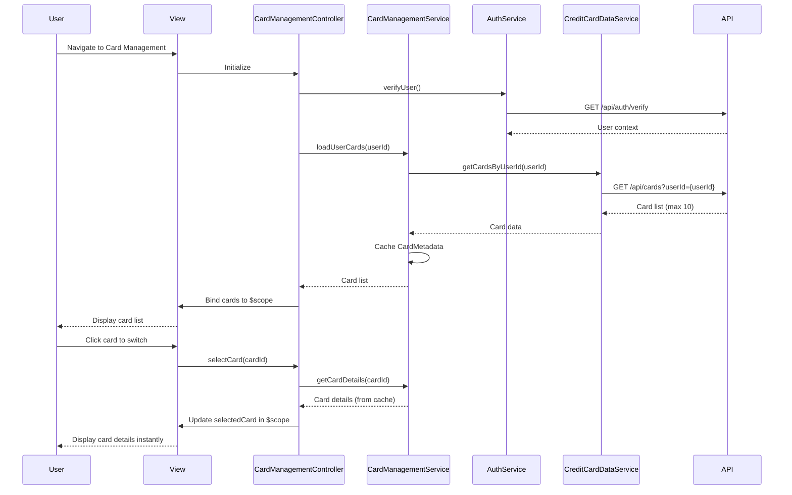

# Low-Level Design: QE-4148 - Multi-Card Management and Viewing

## a. Architecture Mapping

**Component to Artifact Mapping:**
- User Interface → CardManagementController + cardManagement.html view
- Card Management Service → CardManagementService (Factory for card operations and switching logic)
- User Authentication Service → AuthService (Factory for identity verification)
- Credit Card Data Service → CreditCardDataService (Factory for card CRUD operations)
- Card switching UI → cardSwitcher Directive (custom directive for card selection)

**Folder Structure:**
```
app/
  cards/
    cards.module.js
    cardManagement.controller.js
    cardManagement.service.js
    cards.routes.js
    views/cardManagement.html
  shared/
    services/auth.service.js
    services/creditCardData.service.js
    directives/cardSwitcher.directive.js
    interceptors/auth.interceptor.js
```

## b. Component Specifications

| Name | Artifact Type | Responsibility | Key Dependencies |
|------|---------------|----------------|------------------|
| CardManagementController | Controller | Manages card list display, handles card selection, coordinates view updates | CardManagementService, AuthService, $scope |
| CardManagementService | Factory | Orchestrates card retrieval, manages selected card state, caches card metadata for instant switching | CreditCardDataService, $q |
| CreditCardDataService | Factory | Performs CRUD operations for card data via REST API, retrieves card details | $http, $q |
| AuthService | Factory | Verifies user identity, manages authentication tokens, provides user context | $http, $window |
| cardSwitcher | Directive | Renders card selection UI with instant switching, displays card thumbnails | CardManagementService |
| cardManagement.html | View | Displays card list, card details (number, issuer, limit, balance), card-wise spend summary | CardManagementController |
| AuthInterceptor | Interceptor | Injects authentication tokens into API requests, handles 401 responses | $q, AuthService |

## c. Data Model

```js
CreditCard = {
  id: String,
  cardNumber: String,
  maskedNumber: String,
  issuer: String,
  creditLimit: Number,
  currentBalance: Number,
  availableCredit: Number,
  cardType: String,
  expiryDate: String
}

CardMetadata = {
  id: String,
  maskedNumber: String,
  issuer: String,
  cardType: String
}

CardSpendSummary = {
  cardId: String,
  monthlySpend: Number,
  categoryBreakdown: Array<Object>
}

User = {
  id: String,
  name: String,
  email: String,
  cardIds: Array<String>
}
```

## d. Data Flow

User authenticates and navigates to card management page → AuthService verifies identity and retrieves user context → CardManagementController initializes and calls CardManagementService.loadUserCards() → Service invokes CreditCardDataService.getCardsByUserId() via $http to REST API → API returns up to 10 cards per user → Service caches CardMetadata array in memory for instant switching → Controller binds card list to $scope → View renders card list using ng-repeat → User clicks card in cardSwitcher directive → Directive emits card selection event → Controller updates selectedCard in $scope → Service retrieves full card details from cache or API if needed → View updates card details section and card-wise spend summary → All card switching operations complete client-side using cached metadata for instantaneous response.

## e. Primary Sequence Diagram



## f. Implementation Notes

- Use Factory singleton pattern for CardManagementService to maintain selected card state across views
- Pre-load all CardMetadata on page init and store in service-level cache for zero-latency card switching
- Mask card numbers using custom filter (e.g., **** **** **** 1234) applied in view binding
- Implement cardSwitcher directive with isolate scope and two-way binding to selectedCard model
- Use $inject array annotation for all services and controllers to ensure minification compatibility

## g. Error Handling

Centralized $http interceptor catches failures; user-facing errors surfaced via a shared notification service.

## h. Security Notes

Requires token-based auth via existing SSO; card data encrypted in transit (HTTPS) and at rest; PCI-compliant card number masking enforced.