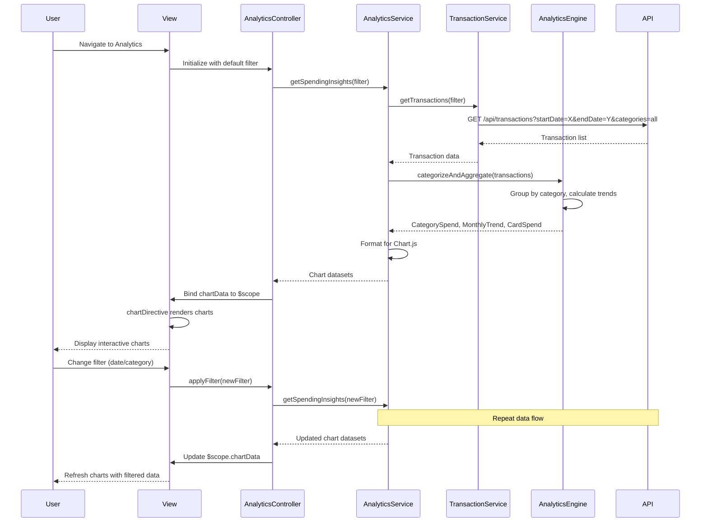

# Low-Level Design: QE-4149 - Spending Analytics and Insights

## a. Architecture Mapping

**Component to Artifact Mapping:**
- User Interface → AnalyticsController + analytics.html view
- Analytics Service → AnalyticsService (Factory for data aggregation and chart preparation)
- Transaction Service → TransactionService (Factory for transaction data retrieval)
- Analytics Engine → AnalyticsEngine (Factory for categorization, trend calculation, and data processing)
- Interactive charts → chartDirective (custom directive wrapping Chart.js or D3.js)
- Filter controls → filterPanel Directive (custom directive for date range and category filters)

**Folder Structure:**
```
app/
  analytics/
    analytics.module.js
    analytics.controller.js
    analytics.service.js
    analyticsEngine.factory.js
    analytics.routes.js
    views/analytics.html
  shared/
    services/transaction.service.js
    directives/chartDirective.directive.js
    directives/filterPanel.directive.js
```

## b. Component Specifications

| Name | Artifact Type | Responsibility | Key Dependencies |
|------|---------------|----------------|------------------|
| AnalyticsController | Controller | Manages analytics view state, handles filter interactions, coordinates chart updates | AnalyticsService, $scope, $filter |
| AnalyticsService | Factory | Orchestrates data retrieval, aggregates spending data, prepares chart datasets | TransactionService, AnalyticsEngine, $q |
| TransactionService | Factory | Retrieves transaction data from REST API with date range and category filters | $http, $q |
| AnalyticsEngine | Factory | Categorizes transactions, calculates monthly trends, performs card-wise aggregation | - |
| chartDirective | Directive | Renders interactive charts (bar, line, pie) using Chart.js, handles responsive resizing | AnalyticsService |
| filterPanel | Directive | Provides date range picker and category multi-select, emits filter change events | $scope |
| analytics.html | View | Displays monthly spend trends chart, category-wise spending breakdown, card-wise spend table | AnalyticsController |

## c. Data Model

```js
Transaction = {
  id: String,
  cardId: String,
  amount: Number,
  date: Date,
  category: String,
  merchant: String,
  description: String
}

CategorySpend = {
  category: String,
  totalAmount: Number,
  transactionCount: Number,
  percentage: Number
}

MonthlyTrend = {
  month: String,
  totalSpend: Number,
  categoryBreakdown: Array<CategorySpend>
}

CardSpend = {
  cardId: String,
  cardName: String,
  totalSpend: Number,
  categoryBreakdown: Array<CategorySpend>
}

AnalyticsFilter = {
  startDate: Date,
  endDate: Date,
  categories: Array<String>
}
```

## d. Data Flow

User navigates to analytics page → AnalyticsController initializes with default filter (current month, all categories) → Controller calls AnalyticsService.getSpendingInsights(filter) → Service invokes TransactionService.getTransactions(filter) via $http to REST API → API returns transaction list → Service passes transactions to AnalyticsEngine.categorizeAndAggregate() → Engine groups transactions by category (Food & Dining, Fuel, Shopping, Travel, Entertainment, Utilities, Healthcare, Education, Miscellaneous) and calculates monthly trends → Engine returns aggregated data (CategorySpend array, MonthlyTrend array, CardSpend array) → Service formats data for Chart.js and returns to Controller → Controller binds chart data to $scope → chartDirective watches $scope.chartData and renders interactive charts → User changes filter in filterPanel directive → Directive emits filter change event → Controller updates filter and re-invokes AnalyticsService.getSpendingInsights() → View updates charts and tables with new data within 3 seconds.

## e. Primary Sequence Diagram



## f. Implementation Notes

- Use Chart.js library wrapped in custom chartDirective for responsive, interactive visualizations (bar for monthly trends, pie for category breakdown)
- Implement AnalyticsEngine as stateless Factory with pure functions for categorization using predefined category mapping rules
- Pre-aggregate transaction data on API side for current month to meet 3-second rendering requirement; use $q.all for parallel API calls if multiple endpoints needed
- Apply Angular $filter service for date formatting and currency display in view
- Use debounce pattern (300ms) on filter changes to prevent excessive API calls during user interaction

## g. Error Handling

Centralized $http interceptor catches API failures; user-facing errors surfaced via a shared notification service displaying Bootstrap alerts.

## h. Security Notes

Standard input validation and secure API calls assumed; transaction data transmitted over HTTPS with user-level access control enforced by API.