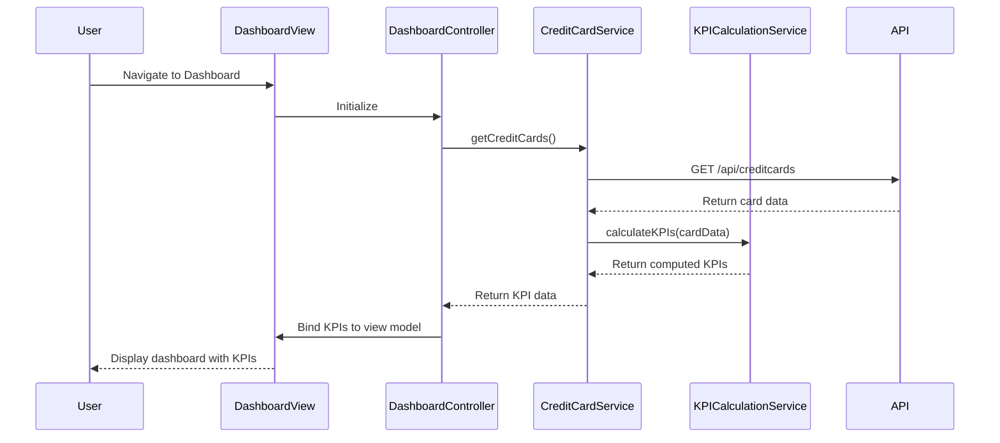

# Low-Level Design: Credit Card Analysis Dashboard

**Epic ID:** QE-4150

---

## a. Architecture Mapping

- **Dashboard Module** (`app.creditCardDashboard`) - Main AngularJS module for the dashboard feature
- **Dashboard Controller** (`CreditCardDashboardController`) - Manages dashboard view logic and KPI presentation
- **Credit Card Service** (`CreditCardService`) - Factory handling data retrieval and business logic for credit card operations
- **KPI Calculation Service** (`KPICalculationService`) - Service computing monthly spend, available credit, and outstanding amounts
- **Dashboard Directive** (`ccDashboardCard`) - Reusable directive for rendering individual credit card KPI cards

**Recommended Folder Structure:**
```
app/
  modules/
    credit-card-dashboard/
      controllers/
      services/
      directives/
      views/
      credit-card-dashboard.module.js
```

---

## b. Component Specifications

| Component Name | Artifact Type | Responsibility | Key Dependencies |
|---|---|---|---|
| `app.creditCardDashboard` | Module | Root module for credit card dashboard feature | `ngRoute`, `app.core` |
| `CreditCardDashboardController` | Controller | Orchestrates dashboard view, fetches and displays KPIs for all cards | `CreditCardService`, `KPICalculationService` |
| `CreditCardService` | Factory | Retrieves credit card data from backend/mock service via REST API | `$http`, `API_ENDPOINTS` |
| `KPICalculationService` | Service | Computes monthly spend, available credit, outstanding amount from raw card data | None |
| `ccDashboardCard` | Directive | Renders individual credit card KPI card with responsive layout | None |

---

## c. Data Model

**CreditCard Model:**
```javascript
{
  cardId: String,
  cardNumber: String,
  cardType: String,
  totalCreditLimit: Number,
  currentBalance: Number,
  availableCredit: Number,
  monthlySpend: Number,
  outstandingAmount: Number
}
```

**DashboardKPI Model:**
```javascript
{
  totalMonthlySpend: Number,
  totalCreditLimit: Number,
  totalAvailableCredit: Number,
  totalOutstandingAmount: Number,
  cards: Array<CreditCard>
}
```

---

## d. Data Flow

User navigates to the dashboard → View loads and triggers `CreditCardDashboardController` initialization → Controller calls `CreditCardService.getCreditCards()` → Service makes REST API call to retrieve user's credit card data → Raw data is passed to `KPICalculationService` to compute aggregated and per-card KPIs → Calculated KPIs are bound to the view model → Dashboard view renders consolidated KPI summary and individual card details using `ccDashboardCard` directive → UI updates responsively across devices.

---

## e. Primary Sequence Diagram



---

## f. Implementation Notes

- Use AngularJS Dependency Injection to inject `CreditCardService` and `KPICalculationService` into `CreditCardDashboardController`
- Implement `CreditCardService` as a factory using `$http` for REST API calls with promise-based async handling
- Use ES6 classes for service implementations with proper encapsulation and arrow functions for callbacks
- Apply Bootstrap grid system (col-xs, col-sm, col-md) in dashboard view for responsive multi-card layout
- Leverage AngularJS `ng-repeat` to iterate over cards array and render `ccDashboardCard` directive for each card

---

## g. Error Handling

HTTP interceptor-based error handling with user-friendly notification service for API failures and try/catch blocks in KPI calculation logic.

---

## h. Security Notes

Requires token-based authentication via existing SSO; all API calls include authorization headers with user session tokens.