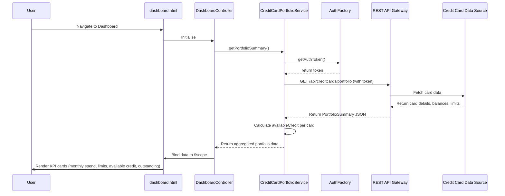

# Low-Level Design: Credit Card Portfolio Dashboard

**Epic ID:** QE-4170

---

## a. Architecture Mapping

- **Dashboard API Gateway** → AngularJS Module: `app.creditCardDashboard`
- **Credit Card Portfolio Service** → AngularJS Service: `CreditCardPortfolioService` (handles API calls and data aggregation)
- **Dashboard UI Component** → AngularJS Controller: `DashboardController` + View: `dashboard.html` + Directive: `portfolioKpiCard`
- **Authentication Service** → AngularJS Factory: `AuthFactory` (manages token-based authentication)
- **Credit Card Data Source System** → REST API endpoints consumed by `CreditCardPortfolioService`

**Recommended Folder Structure:**
```
app/
├── modules/
│   └── creditCardDashboard/
│       ├── controllers/
│       │   └── dashboardController.js
│       ├── services/
│       │   └── creditCardPortfolioService.js
│       ├── directives/
│       │   └── portfolioKpiCard.js
│       ├── views/
│       │   └── dashboard.html
│       └── creditCardDashboard.module.js
├── shared/
│   └── factories/
│       └── authFactory.js
└── app.js
```

---

## b. Component Specifications

| Component Name | Artifact Type | Responsibility | Key Dependencies |
|----------------|---------------|----------------|------------------|
| `app.creditCardDashboard` | Module | Main module for credit card dashboard feature | `ngRoute`, `AuthFactory` |
| `DashboardController` | Controller | Manages dashboard state, triggers data fetch, exposes KPIs to view | `CreditCardPortfolioService`, `$scope` |
| `CreditCardPortfolioService` | Service | Fetches card data from REST API, aggregates KPIs (monthly spend, total limit, available credit, outstanding) | `$http`, `AuthFactory` |
| `portfolioKpiCard` | Directive | Reusable UI component to display individual KPI card (e.g., monthly spend, available credit) | None |
| `AuthFactory` | Factory | Handles user authentication, token management, and authorization checks | `$http`, `$window` (for localStorage) |
| `dashboard.html` | View | Renders responsive dashboard layout with KPI cards using Bootstrap grid | `DashboardController`, `portfolioKpiCard` |

---

## c. Data Model

**CreditCard (JS Object):**
```javascript
{
  cardId: String,
  cardNumber: String (masked),
  cardType: String,
  creditLimit: Number,
  outstandingAmount: Number,
  availableCredit: Number,
  monthlySpend: Number
}
```

**PortfolioSummary (JS Object):**
```javascript
{
  totalCreditLimit: Number,
  totalOutstanding: Number,
  totalAvailableCredit: Number,
  totalMonthlySpend: Number,
  cards: Array<CreditCard>
}
```

---

## d. Data Flow

User navigates to dashboard → `dashboard.html` loads and `DashboardController` initializes → Controller calls `CreditCardPortfolioService.getPortfolioSummary()` → Service sends authenticated GET request to `/api/creditcards/portfolio` via `$http` with token from `AuthFactory` → Backend aggregates card data (limits, balances, outstanding amounts) and returns `PortfolioSummary` JSON → Service calculates `availableCredit` for each card if not provided (creditLimit - outstandingAmount) → Service returns aggregated data to Controller → Controller binds data to `$scope.portfolioSummary` → View updates with KPI cards rendered via `portfolioKpiCard` directive using Bootstrap responsive grid → User views consolidated portfolio health with monthly spend, total credit limit, available credit, and outstanding amounts.

---

## e. Primary Sequence Diagram



---

## f. Implementation Notes

- Use AngularJS Dependency Injection to inject `CreditCardPortfolioService` and `AuthFactory` into `DashboardController`.
- Implement `CreditCardPortfolioService` as a singleton service using `.service()` to maintain state and cache portfolio data for 5 minutes to reduce API calls.
- Use ES6 arrow functions and `const`/`let` for cleaner service and controller code; leverage Promises with `$http` for async API calls.
- Apply Bootstrap 3 grid system (col-xs, col-sm, col-md) in `dashboard.html` to ensure responsive layout across mobile and desktop devices.
- Implement `portfolioKpiCard` directive with isolated scope (`scope: { kpiTitle: '@', kpiValue: '=', kpiIcon: '@' }`) for reusability across different KPI displays.

---

## g. Error Handling

Use AngularJS `$http` interceptor to catch API errors (401, 500) and display user-friendly notifications via a shared `NotificationService`; wrap service calls in try/catch for synchronous errors.

---

## h. Security Notes

Requires token-based authentication via existing SSO; `AuthFactory` injects JWT token in Authorization header for all API requests to `/api/creditcards/*`.