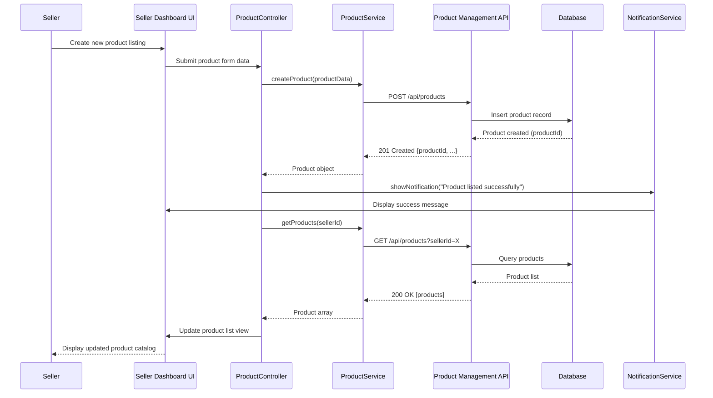

# Low-Level Design: Seller Management Platform
**Epic ID**: QE-4180

## a. Architecture Mapping

- **Seller Dashboard Module** (`app.sellerDashboard`) → Main AngularJS module containing all seller-related features
- **Authentication Controller** (`AuthController`) → Handles seller login/registration flows
- **Product Management Controller** (`ProductController`) → Manages product listing, editing, deletion
- **Inventory Controller** (`InventoryController`) → Handles inventory updates and low-stock alerts
- **Order Processing Controller** (`OrderController`) → Manages order fulfillment workflows
- **Analytics Controller** (`AnalyticsController`) → Displays sales performance metrics and charts
- **Seller Service** (`SellerService`) → Factory for seller profile and authentication API calls
- **Product Service** (`ProductService`) → Factory for product CRUD operations
- **Inventory Service** (`InventoryService`) → Factory for inventory management and threshold monitoring
- **Order Service** (`OrderService`) → Factory for order processing and status updates
- **Analytics Service** (`AnalyticsService`) → Factory for sales data aggregation and reporting
- **Notification Service** (`NotificationService`) → Factory for real-time alerts (low inventory, order updates)
- **Product Listing Directive** (`productCard`) → Reusable component for displaying product information
- **Inventory Alert Directive** (`inventoryAlert`) → Component for displaying low-stock warnings

**Recommended Folder Structure**:
```
app/
├── modules/
│   └── seller/
│       ├── controllers/
│       ├── services/
│       ├── directives/
│       └── views/
├── shared/
│   ├── services/
│   └── directives/
├── assets/
│   ├── css/
│   └── js/
└── index.html
```

## b. Component Specifications

| Component Name | Artifact Type | Responsibility | Key Dependencies |
|----------------|---------------|----------------|------------------|
| AuthController | Controller | Manage seller authentication (login, registration, session) | SellerService, $scope, $location |
| ProductController | Controller | Handle product listing creation, editing, deletion, and catalog updates | ProductService, $scope, NotificationService |
| InventoryController | Controller | Manage inventory levels, trigger low-stock alerts, update quantities | InventoryService, NotificationService, $scope |
| OrderController | Controller | Process orders, update fulfillment status, coordinate shipping | OrderService, $scope, NotificationService |
| AnalyticsController | Controller | Display sales metrics, charts, and performance insights | AnalyticsService, $scope, $filter |
| SellerService | Factory | API calls for seller authentication, profile management, and session handling | $http, $q, AuthInterceptor |
| ProductService | Factory | CRUD operations for products via REST API | $http, $q |
| InventoryService | Factory | Inventory updates, threshold monitoring, alert triggering | $http, $q, WebSocket (for real-time updates) |
| OrderService | Factory | Order retrieval, status updates, payment/logistics API integration | $http, $q |
| AnalyticsService | Factory | Aggregate sales data, generate reports, fetch dashboard metrics | $http, $q |
| NotificationService | Factory | Push real-time notifications (low inventory, order status) to UI | WebSocket, $rootScope |
| productCard | Directive | Reusable product display component with image, title, price, stock status | ProductService |
| inventoryAlert | Directive | Visual alert component for low-stock warnings with threshold display | InventoryService |

## c. Data Model

**Seller Model**:
```javascript
{
  sellerId: String,
  email: String,
  businessName: String,
  contactNumber: String,
  authToken: String,
  role: String, // 'seller', 'admin'
  registrationDate: Date,
  isVerified: Boolean
}
```

**Product Model**:
```javascript
{
  productId: String,
  sku: String,
  title: String,
  description: String,
  price: Number,
  currency: String,
  images: Array<String>, // URLs
  category: String,
  sellerId: String,
  createdAt: Date,
  updatedAt: Date
}
```

**Inventory Model**:
```javascript
{
  inventoryId: String,
  productId: String,
  quantity: Number,
  lowStockThreshold: Number,
  lastUpdated: Date,
  isLowStock: Boolean
}
```

**Order Model**:
```javascript
{
  orderId: String,
  productId: String,
  sellerId: String,
  buyerId: String,
  quantity: Number,
  totalAmount: Number,
  orderStatus: String, // 'pending', 'confirmed', 'shipped', 'delivered', 'cancelled'
  paymentStatus: String, // 'pending', 'completed', 'failed'
  shippingTrackingId: String,
  orderDate: Date,
  deliveryDate: Date
}
```

**Analytics Model**:
```javascript
{
  sellerId: String,
  totalSales: Number,
  totalOrders: Number,
  averageOrderValue: Number,
  topProducts: Array<{productId: String, salesCount: Number}>,
  salesByDate: Array<{date: Date, revenue: Number}>,
  period: String // 'daily', 'weekly', 'monthly'
}
```

## d. Data Flow

Seller authenticates via AuthController, which calls SellerService to validate credentials against the Authentication API and stores the session token. Upon successful login, the seller accesses the dashboard where ProductController loads product listings via ProductService from the Product Management API. When the seller creates or updates a product, ProductController sends the data through ProductService to the backend, triggering an event-driven catalog update that propagates within 1 minute. InventoryController monitors stock levels via InventoryService, which polls or receives WebSocket updates from the Inventory Management API; when inventory falls below the configured threshold, NotificationService pushes a real-time alert to the seller's dashboard. OrderController retrieves orders via OrderService from the Order Processing API, displaying payment status from the Payment Gateway and shipping updates from Logistics APIs; sellers update fulfillment status, which triggers backend workflows and notifies buyers. AnalyticsController fetches aggregated sales data via AnalyticsService from the Analytics API and renders charts using a charting library (e.g., Chart.js), providing real-time performance insights on the dashboard.

## e. Primary Sequence Diagram



## f. Implementation Notes

- Use AngularJS dependency injection to inject services into controllers; configure `$httpProvider` interceptor for automatic token attachment to all API requests
- Implement ES6 classes for service factories where appropriate; use arrow functions for callbacks to maintain lexical `this` context
- Leverage Bootstrap grid system and components (cards, modals, forms) for responsive seller dashboard UI; use ng-repeat with track by for efficient product list rendering
- Integrate WebSocket or Server-Sent Events (SSE) via `NotificationService` for real-time inventory alerts and order status updates without polling
- Use AngularJS `$q` promises for asynchronous API calls; chain `.then()` and `.catch()` for sequential operations and error handling

## g. Error Handling

Implement HTTP interceptor (`$httpProvider.interceptors`) to catch API errors globally, display user-friendly notifications via `NotificationService`, and handle 401 responses by redirecting to login.

## h. Security Notes

Requires token-based authentication via existing SSO with JWT stored in sessionStorage; all API calls include Authorization header; seller data encrypted in transit (HTTPS) and at rest.