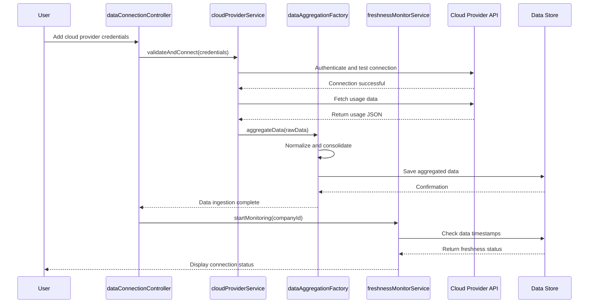

# Low-Level Design: Cloud Provider Data Integration
**Epic ID:** QE-4194

## a. Architecture Mapping

- **Data Ingestion Module** → AngularJS Service (`cloudProviderService`) for API client management
- **Data Aggregation Engine** → AngularJS Factory (`dataAggregationFactory`) for data normalization
- **Freshness Monitor** → AngularJS Service (`freshnessMonitorService`) with $interval for scheduled checks
- **Notification Service** → AngularJS Service (`notificationService`) for alert display
- **UI Components** → AngularJS Controller (`dataConnectionController`) and Directives (`cloudProviderStatus`)

**Folder Structure:**
```
/app
  /modules
    /data-integration
      /controllers
      /services
      /factories
      /directives
      /views
```

## b. Component Specifications

| Name | Artifact Type | Responsibility | Key Dependencies |
|------|---------------|----------------|------------------|
| cloudProviderService | Service | Manage secure API connections to AWS/Azure/GCP and retrieve usage data | $http, $q, authService |
| dataAggregationFactory | Factory | Normalize and consolidate data across providers | cloudProviderService, dataTransformUtil |
| freshnessMonitorService | Service | Check data timestamps and trigger alerts for stale data | $interval, notificationService, dataStore |
| notificationService | Service | Display user notifications for missing/outdated data | $rootScope, toastr |
| dataConnectionController | Controller | Manage credential input and connection status UI | $scope, cloudProviderService, freshnessMonitorService |
| cloudProviderStatus | Directive | Display real-time connection status badges | freshnessMonitorService |

## c. Data Model

**CloudConnection:**
```javascript
{
  id: String,
  companyId: String,
  provider: String, // 'AWS' | 'AZURE' | 'GCP'
  credentials: Object, // {apiKey, secretKey, region}
  status: String, // 'connected' | 'disconnected' | 'error'
  lastSync: Date,
  isActive: Boolean
}
```

**UsageData:**
```javascript
{
  id: String,
  companyId: String,
  provider: String,
  service: String,
  usageMetrics: Object, // {requests, tokens, computeHours}
  cost: Number,
  currency: String,
  timestamp: Date
}
```

**AggregatedData:**
```javascript
{
  companyId: String,
  totalCost: Number,
  providers: Array, // [{provider, cost, lastUpdated}]
  dataFreshness: String, // 'current' | 'stale' | 'missing'
  lastAggregated: Date
}
```

## d. Data Flow

User navigates to the data integration view where the dataConnectionController loads existing cloud connections via cloudProviderService. When adding a new connection, credentials are validated and stored securely. The cloudProviderService polls provider APIs at scheduled intervals using $http, retrieving usage and billing data in JSON format. Raw responses are passed to dataAggregationFactory, which normalizes provider-specific formats into a unified structure and stores results in the encrypted data store. The freshnessMonitorService runs on a $interval timer, comparing data timestamps against the 24-hour threshold and invoking notificationService to display alerts when data becomes stale. The UI updates reactively via $scope bindings to reflect connection status and data freshness.

## e. Primary Sequence Diagram



## f. Implementation Notes

- Use AngularJS Dependency Injection to inject $http, $q, and $interval into services for API calls and scheduled tasks
- Implement provider-specific adapters within cloudProviderService using ES6 classes with a common interface
- Store encrypted credentials using existing authService token management; never expose secrets in client-side code
- Use $http interceptors for adding authentication headers and handling 401/403 responses globally
- Leverage $q.all() for parallel API calls to multiple providers to minimize aggregation time

## g. Error Handling

HTTP interceptor captures API failures, retries once with exponential backoff, then displays user-friendly error via notificationService with fallback to cached data.

## h. Security Notes

Requires token-based auth via existing SSO; credentials transmitted over TLS 1.2+ only; client stores only encrypted credential references, not raw secrets.