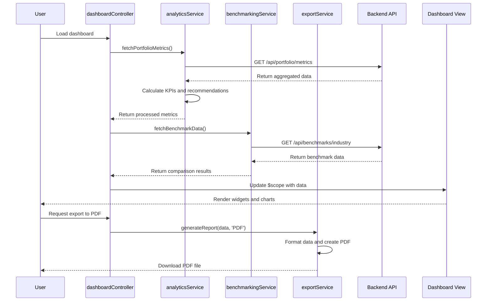

# Low-Level Design: Dashboard Visualization Interface
**Epic ID:** QE-4195

## a. Architecture Mapping

- **Dashboard UI Module** → AngularJS Module (`dashboardModule`) with Controllers and Views
- **Analytics Engine** → AngularJS Service (`analyticsService`) for metric calculations
- **Benchmarking Service** → AngularJS Service (`benchmarkingService`) for comparative data
- **Export Service** → AngularJS Service (`exportService`) for PDF/Excel generation
- **Widget System** → AngularJS Directives (`dashboardWidget`, `chartWidget`) for customizable components

**Folder Structure:**
```
/app
  /modules
    /dashboard
      /controllers
      /services
      /directives
      /views
      /filters
```

## b. Component Specifications

| Name | Artifact Type | Responsibility | Key Dependencies |
|------|---------------|----------------|------------------|
| dashboardController | Controller | Manage dashboard state, widget configuration, and user interactions | $scope, analyticsService, exportService |
| analyticsService | Service | Process usage data, calculate KPIs, generate cost optimization recommendations | $http, dataAggregationFactory |
| benchmarkingService | Service | Retrieve industry benchmarks and compare portfolio performance | $http, $q, analyticsService |
| exportService | Service | Generate PDF and Excel reports from dashboard data | $http, FileSaver |
| dashboardWidget | Directive | Render customizable widget containers with drag-drop support | $compile, widgetRegistry |
| chartWidget | Directive | Display charts using D3.js or Chart.js with real-time updates | analyticsService, chartLibrary |
| portfolioFilter | Filter | Format currency, percentages, and date values for display | N/A |

## c. Data Model

**DashboardConfig:**
```javascript
{
  userId: String,
  widgets: Array, // [{id, type, position, size, config}]
  layout: String, // 'grid' | 'list'
  filters: Object, // {dateRange, companies, departments}
  lastModified: Date
}
```

**PortfolioMetrics:**
```javascript
{
  totalSpend: Number,
  monthlyTrend: Array, // [{month, spend, usage}]
  topCompanies: Array, // [{companyId, name, spend, change}]
  providerBreakdown: Object, // {AWS: Number, Azure: Number, GCP: Number}
  recommendations: Array // [{type, description, potentialSavings}]
}
```

**BenchmarkData:**
```javascript
{
  industryAverage: Number,
  peerComparison: Array, // [{metric, portfolioValue, industryValue, percentile}]
  trends: Array, // [{period, value}]
  lastUpdated: Date
}
```

## d. Data Flow

User accesses the dashboard where dashboardController loads saved widget configuration from user profile and initializes the view. The analyticsService fetches aggregated data from the data aggregation system via $http, processes metrics, calculates KPIs, and generates AI-driven cost optimization recommendations using business logic rules. Processed data is bound to $scope and rendered through chartWidget and dashboardWidget directives with two-way binding for real-time updates. When users apply filters or drill down into company-specific details, the controller updates query parameters and re-fetches filtered data. The benchmarkingService retrieves industry data from external APIs and compares portfolio metrics against peers. Users can customize widget layout via drag-drop, with preferences saved to their profile. Export requests trigger exportService to format data and generate PDF/Excel files using client-side libraries, then initiate browser download.

## e. Primary Sequence Diagram



## f. Implementation Notes

- Use AngularJS two-way data binding ($scope) for reactive widget updates without manual DOM manipulation
- Implement widget registry pattern using ES6 Map to register and instantiate widget types dynamically
- Leverage $http caching for benchmark data with 1-hour TTL to reduce API calls
- Use angular-gridster or angular-ui-grid directive for drag-drop widget layout with localStorage persistence
- Integrate Chart.js via angular-chart.js wrapper for consistent chart rendering across widgets

## g. Error Handling

$http interceptor catches API errors, displays toast notifications via toastr, and falls back to cached data when available; user-facing error messages avoid technical details.

## h. Security Notes

All API calls include JWT token from SSO in Authorization header; RBAC enforced server-side; client validates user permissions before rendering sensitive widgets.