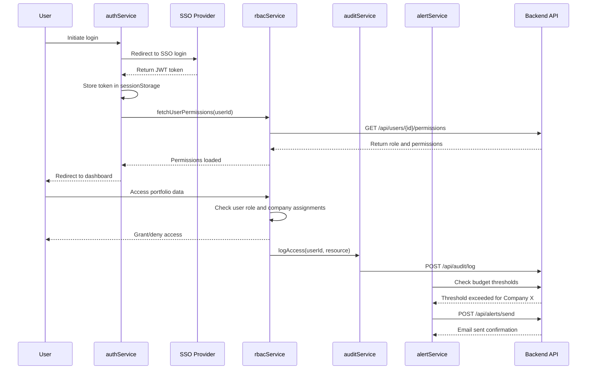

# Low-Level Design: Security and Access Control Framework
**Epic ID:** QE-4196

## a. Architecture Mapping

- **Authentication Module** → AngularJS Service (`authService`) for SSO integration
- **RBAC Engine** → AngularJS Service (`rbacService`) for permission checks
- **Audit Logger** → AngularJS Service (`auditService`) for activity tracking
- **Alert Service** → AngularJS Service (`alertService`) for budget threshold notifications
- **Access Control Directives** → AngularJS Directives (`hasRole`, `hasPermission`) for UI element visibility

**Folder Structure:**
```
/app
  /modules
    /security
      /services
      /directives
      /interceptors
      /guards
```

## b. Component Specifications

| Name | Artifact Type | Responsibility | Key Dependencies |
|------|---------------|----------------|------------------|
| authService | Service | Handle SSO authentication, token management, and session lifecycle | $http, $window, $q |
| rbacService | Service | Evaluate user roles and permissions for data access control | authService, $http |
| auditService | Service | Log user activities and security events to audit trail | $http, $rootScope |
| alertService | Service | Monitor budget thresholds and send email notifications | $http, $interval |
| authInterceptor | Factory | Inject JWT tokens into requests and handle 401/403 responses | $q, $injector, authService |
| hasRole | Directive | Show/hide UI elements based on user role | rbacService |
| hasPermission | Directive | Control access to specific features based on permissions | rbacService |

## c. Data Model

**User:**
```javascript
{
  id: String,
  email: String,
  name: String,
  role: String, // 'GP' | 'LP' | 'OperatingPartner' | 'PortfolioCEO'
  companyAssignments: Array, // [companyId1, companyId2]
  permissions: Array, // ['view:all', 'edit:own', 'export:reports']
  lastLogin: Date,
  isLocked: Boolean
}
```

**AuditLog:**
```javascript
{
  id: String,
  userId: String,
  action: String, // 'login', 'view_data', 'export_report', 'modify_settings'
  resource: String,
  timestamp: Date,
  ipAddress: String,
  success: Boolean
}
```

**BudgetAlert:**
```javascript
{
  id: String,
  companyId: String,
  threshold: Number,
  currentSpend: Number,
  percentageUsed: Number,
  recipients: Array, // [email1, email2]
  status: String, // 'pending' | 'sent' | 'acknowledged'
  triggeredAt: Date
}
```

## d. Data Flow

User initiates login, redirected to SSO provider for authentication via authService. Upon successful authentication, SSO returns JWT token containing user claims, which authService stores in $window.sessionStorage and includes in all subsequent API requests via authInterceptor. The rbacService fetches user role and company assignments from the backend, caching permissions in memory for fast access checks. When user navigates to any view, route guards invoke rbacService to verify permissions before rendering, and hasRole/hasPermission directives conditionally display UI elements. All user actions trigger auditService to log events asynchronously to the backend audit trail. The alertService runs on $interval, polling budget data and comparing against thresholds; when exceeded, it calls backend API to send email notifications to Operating Partners within 5-minute SLA. For locked accounts, authService detects lockout status and triggers recovery email flow via backend API.

## e. Primary Sequence Diagram



## f. Implementation Notes

- Use AngularJS $httpProvider.interceptors to register authInterceptor for automatic token injection and 401 handling
- Implement route guards using $routeProvider resolve property to check permissions before controller instantiation
- Store JWT in sessionStorage (not localStorage) to limit token lifetime to browser session
- Use $rootScope.$broadcast for auth state changes to notify all controllers of login/logout events
- Leverage ES6 Promises ($q) for async permission checks with caching to minimize repeated API calls

## g. Error Handling

authInterceptor catches 401/403 responses, clears session, and redirects to SSO login; all security events logged to auditService with try/catch blocks preventing UI disruption.

## h. Security Notes

Requires token-based auth via existing SSO (SAML 2.0/OAuth 2.0); all API calls over TLS 1.2+; JWT validated server-side; RBAC enforced at API layer; client-side checks for UX only.