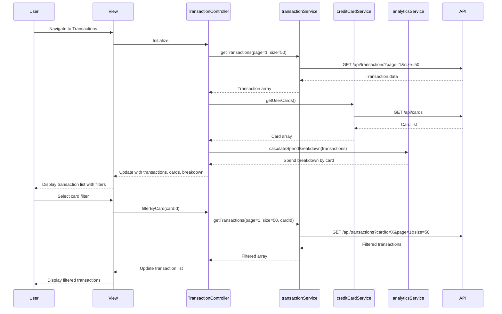

# Low-Level Design: Transaction Management System

**Epic ID:** QE-4199

## a. Architecture Mapping

- **Transaction Management Service** → AngularJS Service (`transactionService.js`) - handles transaction data retrieval and filtering
- **Credit Card Service** → AngularJS Service (`creditCardService.js`) - provides card-level filtering capabilities
- **Dashboard Analytics Service** → AngularJS Service (`analyticsService.js`) - aggregates spend data for breakdowns
- **User Interface** → AngularJS Controller (`transactionController.js`) + View (`transaction-list.html`) - displays transaction list and details
- **Transaction Details Component** → AngularJS Directive (`transactionDetail.js`) - renders individual transaction detail view

**Recommended Folder Structure:**
```
/app
  /modules
    /transactions
      /controllers
      /services
      /directives
      /views
  /shared
    /services
```

## b. Component Specifications

| Name | Artifact Type | Responsibility | Key Dependencies |
|------|---------------|----------------|------------------|
| transactionModule | Module | Root module for transaction management feature | ngRoute, ui.bootstrap |
| TransactionController | Controller | Manages transaction list view, pagination, and filtering | transactionService, creditCardService, analyticsService |
| transactionService | Service | Fetches transaction data from REST API with pagination and filters | $http, $q |
| creditCardService | Service | Retrieves user's credit cards and provides card filtering | $http |
| analyticsService | Service | Aggregates card-level spend breakdowns from transaction data | transactionService |
| transactionDetail | Directive | Displays detailed view of a single transaction | None |
| transactionFilter | Filter | Formats transaction amounts and timestamps | None |

## c. Data Model

**Transaction Object:**
```javascript
{
  id: String,
  cardId: String,
  merchantName: String,
  amount: Number,
  currency: String,
  timestamp: Date,
  category: String,
  status: String,
  description: String
}
```

**Card Object:**
```javascript
{
  cardId: String,
  cardNumber: String,
  cardType: String,
  cardHolder: String
}
```

**SpendBreakdown Object:**
```javascript
{
  cardId: String,
  totalSpend: Number,
  transactionCount: Number,
  currency: String
}
```

## d. Data Flow

User navigates to transaction list view → TransactionController initializes and calls transactionService.getTransactions() with default pagination (page 1, size 50) → transactionService sends GET request to /api/transactions endpoint with query parameters → On response, controller invokes analyticsService.calculateSpendBreakdown() to aggregate card-level totals → Controller updates $scope with transaction array and spend breakdown data → View renders transaction list with pagination controls and card filter dropdown (populated via creditCardService) → User selects card filter or pagination → Controller re-fetches filtered/paginated data and updates view → User clicks transaction row → transactionDetail directive displays full transaction details in modal or expanded view.

## e. Primary Sequence Diagram



## f. Implementation Notes

- Use AngularJS dependency injection to inject services into controllers; follow module-based organization for maintainability
- Implement pagination using ui-bootstrap pagination directive with server-side page/size query parameters
- Use $http service with promise-based API calls; handle responses with .then() and .catch() for error handling
- Apply ES6 arrow functions and const/let for service implementations; use Angular 1.5+ component syntax where applicable
- Integrate REST API endpoints: GET /api/transactions (with query params: page, size, cardId), GET /api/cards, GET /api/transactions/:id

## g. Error Handling

HTTP interceptor captures API errors; transactionService returns rejected promises with user-friendly messages displayed via Bootstrap alert components in the view.

## h. Security Notes

Requires token-based authentication via existing SSO; transaction API endpoints validate user ownership before returning data.