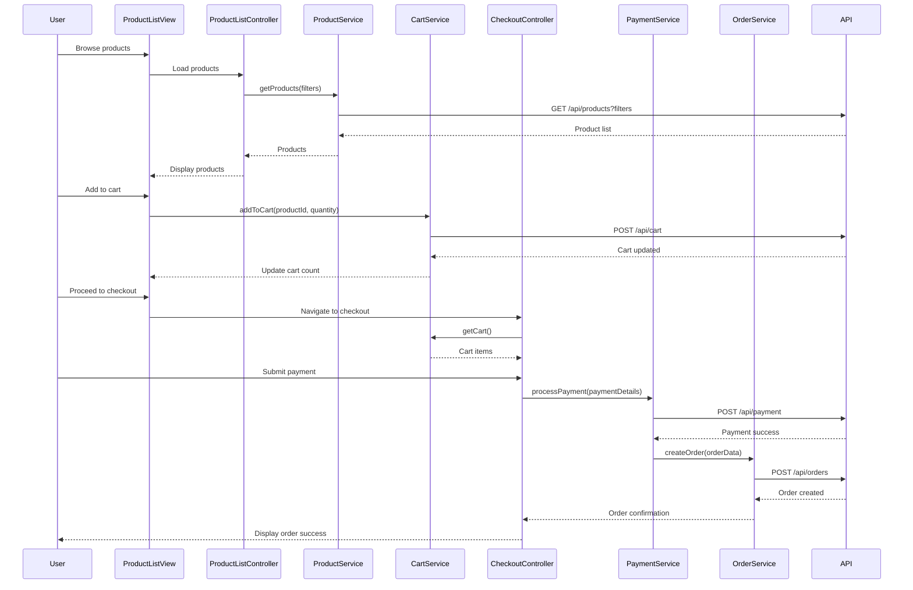

# Low-Level Design: Online Shopping Platform

**Epic ID:** QE-4213

---

## a. Architecture Mapping

- **Authentication Service** → AngularJS Module: `auth.module.js`, Service: `AuthService`, Interceptor: `AuthInterceptor`
- **Product Catalog Service** → Module: `catalog.module.js`, Controller: `ProductListController`, `ProductDetailController`, Service: `ProductService`
- **Shopping Cart Service** → Module: `cart.module.js`, Controller: `CartController`, Service: `CartService`, Directive: `cartSummary`
- **Checkout & Payment Service** → Module: `checkout.module.js`, Controller: `CheckoutController`, Service: `CheckoutService`, `PaymentService`
- **Order Management Service** → Module: `orders.module.js`, Controller: `OrderHistoryController`, `OrderDetailController`, Service: `OrderService`
- **Notification Service** → Service: `NotificationService` (WebSocket/polling), Factory: `ToastFactory`

**Recommended Folder Structure:**
```
/app
  /modules
    /auth
    /catalog
    /cart
    /checkout
    /orders
  /shared
    /services
    /directives
    /filters
  /assets
```

---

## b. Component Specifications

| Component Name | Artifact Type | Responsibility | Key Dependencies |
|---|---|---|---|
| AuthService | Service | Manages user login, logout, token storage, session validation | $http, $window.localStorage, API Gateway |
| AuthInterceptor | Interceptor | Attaches JWT token to outgoing requests, handles 401 responses | $q, $injector, AuthService |
| ProductService | Service | Fetches product catalog, handles search/filter queries, retrieves product details | $http, API Gateway |
| ProductListController | Controller | Manages product listing view, search, filters, pagination | ProductService, $scope |
| ProductDetailController | Controller | Displays product details, reviews, ratings, add-to-cart action | ProductService, CartService, $routeParams |
| CartService | Service | Manages cart state (add/remove/update items), persists cart to backend | $http, $rootScope, API Gateway |
| CartController | Controller | Displays cart items, calculates totals, handles quantity updates | CartService, $scope |
| cartSummary | Directive | Displays mini cart icon with item count in header | CartService |
| CheckoutController | Controller | Manages checkout workflow, validates cart, collects shipping/billing info | CheckoutService, PaymentService, CartService |
| CheckoutService | Service | Validates checkout data, submits order to backend | $http, API Gateway |
| PaymentService | Service | Integrates with payment gateway API, processes payment transactions | $http, Payment Gateway API |
| OrderService | Service | Fetches order history, order details, handles cancellation/refund requests | $http, API Gateway |
| OrderHistoryController | Controller | Displays user's order history with status | OrderService, $scope |
| OrderDetailController | Controller | Shows detailed order information, tracking, cancellation option | OrderService, $routeParams |
| NotificationService | Service | Manages real-time notifications via WebSocket or polling | $websocket/$interval, $rootScope |
| ToastFactory | Factory | Displays user-facing toast notifications for success/error messages | angular-toastr or custom implementation |

---

## c. Data Model

**User**
```javascript
{
  userId: String,
  email: String,
  name: String,
  token: String,
  addresses: Array<Address>
}
```

**Product**
```javascript
{
  productId: String,
  name: String,
  description: String,
  price: Number,
  imageUrl: String,
  category: String,
  stock: Number,
  ratings: Number,
  reviews: Array<Review>
}
```

**CartItem**
```javascript
{
  cartItemId: String,
  productId: String,
  productName: String,
  quantity: Number,
  price: Number,
  imageUrl: String
}
```

**Order**
```javascript
{
  orderId: String,
  userId: String,
  items: Array<CartItem>,
  totalAmount: Number,
  status: String,
  shippingAddress: Address,
  paymentMethod: String,
  createdAt: Date,
  trackingNumber: String
}
```

**Address**
```javascript
{
  addressId: String,
  street: String,
  city: String,
  state: String,
  zipCode: String,
  country: String
}
```

---

## d. Data Flow

User authenticates via login form → AuthService sends credentials to API Gateway → token stored in localStorage and attached to subsequent requests via AuthInterceptor → User browses products via ProductListController which calls ProductService to fetch catalog with search/filter parameters → User views product details via ProductDetailController and adds item to cart → CartService sends POST to API Gateway to persist cart item → User proceeds to checkout via CheckoutController which validates cart with CheckoutService → PaymentService submits payment details to Payment Gateway API → On success, CheckoutService creates order via Order Management Service → OrderService stores order in database and triggers NotificationService → Real-time order status updates pushed to UI via WebSocket or polling → User views order history via OrderHistoryController and can cancel/refund via OrderService.

---

## e. Primary Sequence Diagram



---

## f. Implementation Notes

- Use AngularJS 1.x modules with dependency injection for all services, controllers, and directives
- Implement ES6 classes for services and controllers where possible; use `$inject` annotation for minification safety
- Use `$http` service with interceptors for API communication; configure base URL in app config
- Leverage `ui-router` for state-based routing with resolve blocks for data pre-fetching
- Use Bootstrap grid system and components for responsive UI; implement mobile-first CSS with media queries

---

## g. Error Handling

HTTP interceptor captures API errors (4xx/5xx), displays user-friendly messages via ToastFactory, and redirects to login on 401.

---

## h. Security Notes

Requires token-based authentication (JWT) via existing identity provider; payment processing handled by PCI DSS-compliant Payment Gateway API.