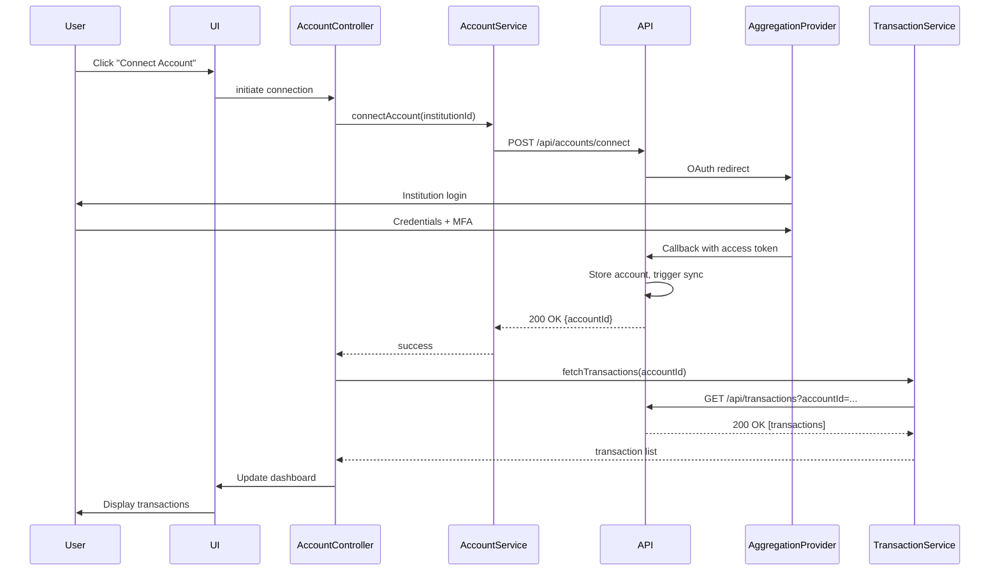

# Low-Level Design: Account Aggregation and Transaction Management

**Epic ID:** QE-4218

## a. Architecture Mapping

- **Account Connection Module** → AngularJS Module (`app.accounts`) with AccountConnectionController, AccountService (REST client), and account-list directive
- **Transaction Dashboard Module** → AngularJS Module (`app.transactions`) with TransactionController, TransactionService (REST client), and transaction-filter directive
- **Category Management** → CategoryService (Factory) for category CRUD and correction submission
- **Authentication** → AuthService (Factory) with token management and HTTP interceptor for auth headers
- **Sync Status Monitor** → SyncStatusService (polling service) and sync-status-indicator directive

**Recommended Folder Structure:**
```
/app
  /modules
    /accounts
    /transactions
    /auth
  /services
  /directives
  /models
  /config
```

## b. Component Specifications

| Name | Artifact Type | Responsibility | Key Dependencies |
|------|---------------|----------------|------------------|
| AccountConnectionController | Controller | Manage account linking flow, display connection status, handle disconnect | AccountService, AuthService, $scope |
| AccountService | Service | REST API calls for account CRUD, connection initiation, sync trigger | $http, API_CONFIG |
| TransactionController | Controller | Display transaction list, apply filters, handle category corrections, export | TransactionService, CategoryService, $scope, $filter |
| TransactionService | Service | Fetch transactions with pagination/filters, submit search queries | $http, API_CONFIG |
| CategoryService | Factory | Load categories, submit user corrections, cache category list | $http, $cacheFactory |
| AuthService | Factory | Handle login/logout, store JWT token, refresh token, MFA flow | $http, $window.localStorage |
| AuthInterceptor | HTTP Interceptor | Attach auth token to outgoing requests, handle 401 responses | AuthService, $q |
| account-list | Directive | Render connected accounts with status badges and action buttons | AccountService |
| transaction-filter | Directive | Render filter UI (date range, category, amount, search) with two-way binding | none |
| sync-status-indicator | Directive | Poll and display real-time sync status with progress/error states | SyncStatusService |
| SyncStatusService | Service | Poll sync job status endpoint, emit events on status change | $http, $interval, $rootScope |

## c. Data Model

**Account Model:**
```javascript
{
  id: String,
  institutionName: String,
  accountType: String, // 'checking', 'savings', 'credit'
  lastSyncDate: Date,
  syncStatus: String, // 'active', 'syncing', 'error'
  balance: Number
}
```

**Transaction Model:**
```javascript
{
  id: String,
  accountId: String,
  date: Date,
  description: String,
  amount: Number,
  category: String,
  categoryId: String,
  isUserCorrected: Boolean,
  merchantName: String
}
```

**Category Model:**
```javascript
{
  id: String,
  name: String,
  parentCategoryId: String
}
```

## d. Data Flow

User initiates account connection via the AccountConnectionController, which calls AccountService to POST connection request to `/api/accounts/connect`. The backend redirects to the aggregation provider's OAuth flow. Upon success, the provider webhook triggers transaction sync. The TransactionController fetches transactions via TransactionService GET `/api/transactions?filters=...`. Transactions are rendered with auto-assigned categories. User corrects a category via UI, triggering TransactionService PATCH `/api/transactions/{id}/category`. The SyncStatusService polls `/api/accounts/{id}/sync-status` every 5 seconds and updates the UI directive. Export action calls TransactionService GET `/api/transactions/export?format=csv`, downloads file via browser.

## e. Primary Sequence Diagram



## f. Implementation Notes

- Use AngularJS 1.x module pattern with dependency injection for all services and controllers
- Implement HTTP interceptor for automatic JWT token attachment and 401 redirect to login
- Use `$http` service with promise chaining; handle errors with `.catch()` and display user-friendly messages via toast/modal
- Leverage `ng-repeat` with `track by` for transaction list rendering; use `limitTo` and custom pagination for performance
- Store auth token in `localStorage`; implement token refresh logic in AuthService with automatic retry on 401

## g. Error Handling

HTTP interceptor catches API errors; 4xx/5xx responses trigger toast notifications with user-friendly messages; retry logic for transient sync failures.

## h. Security Notes

Requires token-based auth via existing SSO; all API calls include JWT in Authorization header; aggregation provider credentials never stored client-side.