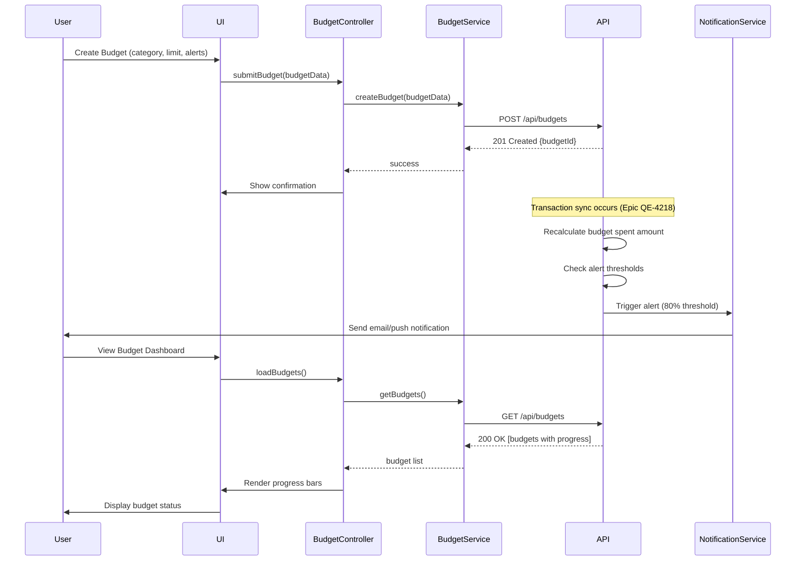

# Low-Level Design: Budget and Goal Management

**Epic ID:** QE-4219

## a. Architecture Mapping

- **Budget Management Module** → AngularJS Module (`app.budgets`) with BudgetController, BudgetService (REST client), and budget-progress directive
- **Goal Tracking Module** → AngularJS Module (`app.goals`) with GoalController, GoalService (REST client), and goal-card directive
- **Notification Preferences** → NotificationService (Factory) for alert configuration and delivery preferences
- **Budget Progress Monitor** → budget-progress directive with real-time progress bar and threshold indicators
- **Goal Projection Calculator** → Client-side projection logic in GoalService for estimated completion dates

**Recommended Folder Structure:**
```
/app
  /modules
    /budgets
    /goals
    /notifications
  /services
  /directives
  /models
  /config
```

## b. Component Specifications

| Name | Artifact Type | Responsibility | Key Dependencies |
|------|---------------|----------------|------------------|
| BudgetController | Controller | Create/edit budgets, set limits and alerts, display progress | BudgetService, $scope, $filter |
| BudgetService | Service | REST API calls for budget CRUD, fetch spending vs. limit, trigger recalculation | $http, API_CONFIG |
| GoalController | Controller | Create/edit goals, track contributions, display projected completion | GoalService, $scope |
| GoalService | Service | REST API calls for goal CRUD, calculate projections client-side, fetch progress | $http, API_CONFIG |
| NotificationService | Factory | Configure alert thresholds, manage notification preferences (email/push) | $http |
| budget-progress | Directive | Render progress bar with color-coded thresholds (green/yellow/red), show percentage | BudgetService |
| goal-card | Directive | Display goal details, progress bar, projected date, contribution history | GoalService |
| budget-alert-config | Directive | UI for setting alert thresholds (50%, 80%, 100%) with toggle switches | none |

## c. Data Model

**Budget Model:**
```javascript
{
  id: String,
  userId: String,
  categoryId: String,
  categoryName: String,
  limitAmount: Number,
  spentAmount: Number,
  period: String, // 'monthly', 'weekly'
  alertThresholds: Array, // [50, 80, 100]
  startDate: Date,
  endDate: Date
}
```

**Goal Model:**
```javascript
{
  id: String,
  userId: String,
  name: String,
  targetAmount: Number,
  currentAmount: Number,
  targetDate: Date,
  projectedCompletionDate: Date,
  contributionHistory: Array // [{date, amount}]
}
```

**NotificationPreference Model:**
```javascript
{
  userId: String,
  emailEnabled: Boolean,
  pushEnabled: Boolean,
  budgetAlerts: Boolean,
  goalMilestones: Boolean
}
```

## d. Data Flow

User creates a budget via BudgetController, which calls BudgetService POST `/api/budgets` with category, limit, and alert thresholds. The backend stores the budget and subscribes to transaction events. As transactions sync (from Epic QE-4218), the Budget Service backend recalculates spent amounts and checks thresholds. When a threshold is crossed, the Notification Service sends alerts via configured channels. The BudgetController fetches current budget status via GET `/api/budgets/{id}` and renders progress using the budget-progress directive. For goals, user creates a goal via GoalController, which POSTs to `/api/goals`. The GoalService fetches contribution history and calculates projected completion date client-side using linear regression on historical contributions. Goal progress is displayed via goal-card directive with real-time updates.

## e. Primary Sequence Diagram



## f. Implementation Notes

- Use AngularJS 1.x module pattern with dependency injection for all services and controllers
- Implement budget progress calculation client-side for real-time updates without API calls when viewing cached data
- Use `$watch` on budget data to trigger progress bar color changes (green < 50%, yellow 50-80%, red > 80%)
- Goal projection uses simple linear regression on contribution history; calculate in GoalService using ES6 array methods
- Leverage `ng-model` two-way binding for alert threshold configuration sliders

## g. Error Handling

HTTP interceptor catches API errors; failed budget/goal creation shows inline validation errors; notification delivery failures logged but don't block user workflow.

## h. Security Notes

Standard input validation and secure API calls assumed; budget and goal data scoped to authenticated user via JWT.