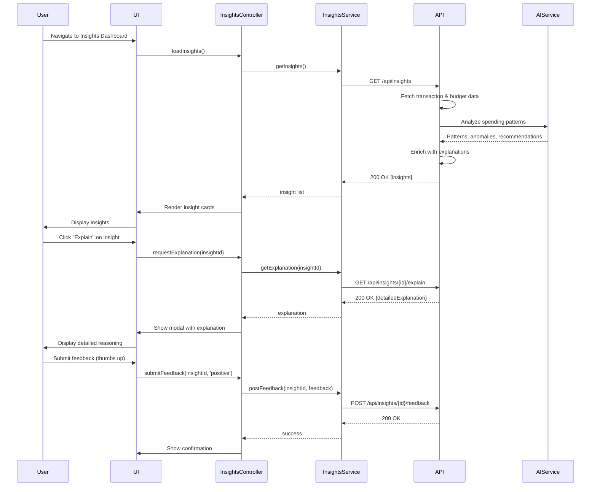

# Low-Level Design: AI-Powered Financial Insights

**Epic ID:** QE-4220

## a. Architecture Mapping

- **Insights Dashboard Module** → AngularJS Module (`app.insights`) with InsightsController, InsightsService (REST client), and insight-card directive
- **Natural Language Query** → NLQueryController and NLQueryService for conversational financial queries
- **Pattern Detection** → Client-side rendering of AI-generated insights; backend handles AI/LLM integration
- **Recommendation Engine** → RecommendationService (Factory) for fetching and displaying personalized budget recommendations
- **Feedback Mechanism** → insight-feedback directive for user thumbs-up/down and explanation requests

**Recommended Folder Structure:**
```
/app
  /modules
    /insights
    /nlquery
    /recommendations
  /services
  /directives
  /models
  /config
```

## b. Component Specifications

| Name | Artifact Type | Responsibility | Key Dependencies |
|------|---------------|----------------|------------------|
| InsightsController | Controller | Display AI-generated insights, handle user feedback, trigger refresh | InsightsService, $scope |
| InsightsService | Service | REST API calls to fetch insights, submit feedback, request explanations | $http, API_CONFIG |
| NLQueryController | Controller | Handle natural language query input, display conversational responses | NLQueryService, $scope |
| NLQueryService | Service | POST natural language queries to AI endpoint, parse and format responses | $http, API_CONFIG |
| RecommendationService | Factory | Fetch personalized budget recommendations with supporting data | $http |
| insight-card | Directive | Render individual insight with title, description, explanation, and feedback buttons | InsightsService |
| nl-query-input | Directive | Chat-style input box with submit button and response history | NLQueryService |
| insight-feedback | Directive | Thumbs-up/down buttons with optional text feedback form | InsightsService |
| spending-pattern-chart | Directive | Render spending trend chart using Chart.js with AI-detected patterns highlighted | none |

## c. Data Model

**Insight Model:**
```javascript
{
  id: String,
  type: String, // 'spending_pattern', 'recurring_subscription', 'unusual_spending', 'recommendation'
  title: String,
  description: String,
  explanation: String,
  supportingData: Object, // {chartData, transactions, calculations}
  confidence: Number, // 0-100
  createdAt: Date,
  userFeedback: String // 'positive', 'negative', null
}
```

**NLQuery Model:**
```javascript
{
  id: String,
  query: String,
  response: String,
  supportingData: Object,
  timestamp: Date
}
```

**Recommendation Model:**
```javascript
{
  id: String,
  category: String,
  currentSpending: Number,
  recommendedLimit: Number,
  reasoning: String,
  potentialSavings: Number
}
```

## d. Data Flow

User views the Insights Dashboard, triggering InsightsController to call InsightsService GET `/api/insights`. The backend Insights Service queries transaction and budget data, sends anonymized data to the AI/LLM service, receives pattern analysis and recommendations, enriches with explanations and supporting data, and returns to the client. The InsightsController renders insights using insight-card directives. User clicks "Explain" on an insight, triggering InsightsService GET `/api/insights/{id}/explain`, which returns detailed reasoning. User submits natural language query via nl-query-input directive, which calls NLQueryService POST `/api/insights/query` with query text. AI/LLM service processes query, generates response grounded in user's transaction data, and returns formatted answer. User provides feedback via insight-feedback directive, which POSTs to `/api/insights/{id}/feedback` to improve future recommendations.

## e. Primary Sequence Diagram



## f. Implementation Notes

- Use AngularJS 1.x module pattern with dependency injection for all services and controllers
- Implement Chart.js integration via custom directive for spending pattern visualization with AI-highlighted anomalies
- Use `ng-repeat` with `track by` for rendering insight cards; lazy-load explanations on user request to reduce initial payload
- Natural language query input uses debounce (300ms) to prevent excessive API calls while typing
- Cache insights in `$cacheFactory` with 5-minute TTL; refresh on user action or budget/transaction updates

## g. Error Handling

HTTP interceptor catches API errors; AI service timeouts handled with fallback message; user feedback submission failures retried once before showing error toast.

## h. Security Notes

AI/LLM service receives anonymized transaction data only; no PII sent to external AI provider; audit logs for all AI operations; user consent required before enabling AI features.