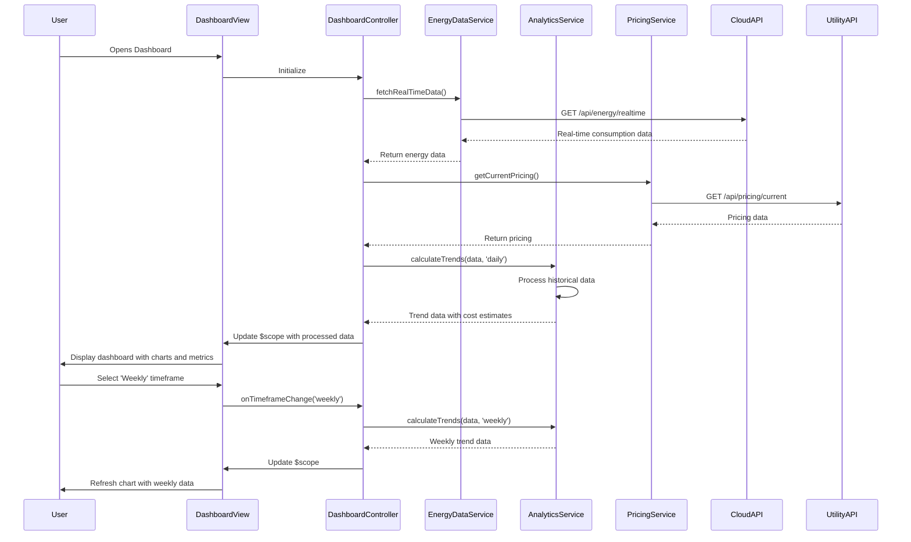

# Low-Level Design: Real-Time Energy Monitoring Solution
**Epic ID:** QE-4227  
**Version:** 1.0  
**Technology Stack:** AngularJS 1.x, JavaScript ES6, HTML5, CSS3, Bootstrap, REST APIs, MVC Architecture

---

## a. Architecture Mapping

- **Data Ingestion Service** → AngularJS Service (EnergyDataService) - handles API calls to backend for real-time meter data
- **Analytics Service** → AngularJS Service (AnalyticsService) - processes consumption data, calculates trends and cost estimates
- **Dashboard UI** → AngularJS Module (energyDashboard) with Controllers (DashboardController, DeviceController) and Directives (energyChart, deviceCard)
- **Cloud API** → REST API integration via AngularJS $http service with interceptors for authentication and error handling
- **Utility Pricing API** → AngularJS Service (PricingService) - fetches and caches utility pricing data
- **Device Management** → AngularJS Controller (DeviceManagementController) and Service (DeviceService) for discovery, grouping, and control

**Recommended Folder Structure:**
```
/app
  /modules
    /dashboard
      dashboard.module.js
      dashboard.controller.js
      dashboard.service.js
    /devices
      device.module.js
      device.controller.js
      device.service.js
  /shared
    /services (EnergyDataService, AnalyticsService, PricingService)
    /directives (energyChart, deviceCard)
    /filters (costFormat, energyUnit)
  /assets
    /css
    /js
  index.html
```

---

## b. Component Specifications

| Component Name | Artifact Type | Responsibility | Key Dependencies |
|---|---|---|---|
| energyDashboard | Module | Root module for energy monitoring dashboard | angular, ngRoute, chart.js |
| DashboardController | Controller | Manages dashboard view, fetches real-time and historical data | EnergyDataService, AnalyticsService, $scope |
| DeviceController | Controller | Manages device list view and device-level consumption display | DeviceService, $scope, $routeParams |
| DeviceManagementController | Controller | Handles device discovery, grouping, and control operations | DeviceService, $scope, $timeout |
| EnergyDataService | Service | Fetches real-time energy data from smart meters via Cloud API | $http, $q, API_CONFIG |
| AnalyticsService | Service | Processes consumption data, calculates trends (daily/weekly/monthly) and aggregates device-level metrics | EnergyDataService, PricingService |
| PricingService | Service | Retrieves utility pricing data and caches for cost calculations | $http, $cacheFactory, API_CONFIG |
| DeviceService | Service | Manages device CRUD operations, discovery, and grouping | $http, $q, API_CONFIG |
| energyChart | Directive | Renders interactive consumption charts using Chart.js for multiple timeframes | chart.js, $timeout |
| deviceCard | Directive | Displays individual device consumption card with real-time updates | DeviceService, $interval |
| authInterceptor | Factory | Intercepts HTTP requests to add authentication tokens and handle 401/403 errors | $q, $injector, AuthService |

---

## c. Data Model

**EnergyConsumption Object:**
```javascript
{
  timestamp: Date,
  totalConsumption: Number, // kWh
  instantaneousPower: Number, // kW
  cost: Number, // currency
  devices: Array // array of DeviceConsumption objects
}
```

**DeviceConsumption Object:**
```javascript
{
  deviceId: String,
  deviceName: String,
  deviceType: String,
  consumption: Number, // kWh
  power: Number, // kW
  status: String, // 'active', 'idle', 'offline'
  lastUpdated: Date
}
```

**HistoricalData Object:**
```javascript
{
  period: String, // 'daily', 'weekly', 'monthly'
  dataPoints: Array, // [{date: Date, consumption: Number, cost: Number}]
  totalConsumption: Number,
  totalCost: Number,
  averageDaily: Number
}
```

**UtilityPricing Object:**
```javascript
{
  currency: String,
  ratePerKwh: Number,
  peakRate: Number,
  offPeakRate: Number,
  lastUpdated: Date
}
```

**Device Object:**
```javascript
{
  id: String,
  name: String,
  type: String, // 'appliance', 'hvac', 'lighting', etc.
  protocol: String, // 'Matter', 'Zigbee', 'Wi-Fi'
  status: String,
  groupId: String,
  isConnected: Boolean
}
```

---

## d. Data Flow

User opens the dashboard → DashboardController initializes and calls EnergyDataService to fetch real-time consumption data from the Cloud API → EnergyDataService returns data to controller → Controller invokes AnalyticsService to process historical trends (daily/weekly/monthly) and PricingService to calculate cost estimates → Processed data is bound to $scope → View renders real-time metrics, interactive charts via energyChart directive, and device cards via deviceCard directive with two-way data binding → User interactions (timeframe selection, device filtering) trigger controller methods that update services and refresh view → For device management, DeviceManagementController calls DeviceService to perform discovery, grouping, or control operations via Cloud API → Response updates $scope and UI reflects changes immediately.

---

## e. Primary Sequence Diagram



---

## f. Implementation Notes

- Use AngularJS Dependency Injection for all services, controllers, and directives to ensure testability and modularity
- Implement ES6 classes for services with arrow functions for callbacks to maintain proper `this` context
- Use $http interceptors for centralized authentication token injection, request/response logging, and error handling
- Leverage $cacheFactory for PricingService to cache utility pricing data with TTL of 24 hours to minimize API calls
- Implement Chart.js integration within energyChart directive with $timeout for proper digest cycle management and responsive chart updates

---

## g. Error Handling

HTTP interceptor-based error handling with try/catch blocks in services; user notifications via Bootstrap modals/toasts for API failures and connection issues.

---

## h. Security Notes

Requires token-based authentication via existing SSO with JWT tokens stored securely; end-to-end encryption for all API communications as per HLD NFR requirements.

---