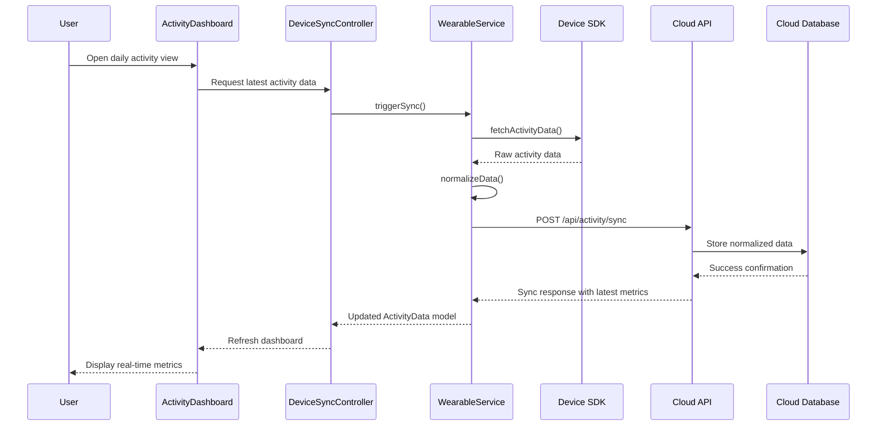

# Low-Level Design: Wearable Device Integration

**Epic ID:** QE-4285

## a. Architecture Mapping

- **Wearable Integration Module** (`app.wearableIntegration`) → Main AngularJS module
- **Device Sync Controller** (`DeviceSyncController`) → Manages device pairing, sync triggers, and dashboard display
- **Wearable Service** (`WearableService`) → Factory handling SDK initialization, background sync orchestration, and API communication
- **Activity Dashboard Directive** (`activityDashboard`) → Renders unified daily activity metrics with real-time updates
- **Sync Status Factory** (`SyncStatusFactory`) → Tracks sync state, battery optimization logic, and retry mechanisms

**Recommended Folder Structure:**
```
app/
├── modules/wearable/
│   ├── controllers/device-sync.controller.js
│   ├── services/wearable.service.js
│   ├── factories/sync-status.factory.js
│   ├── directives/activity-dashboard.directive.js
│   └── wearable.module.js
├── models/activity-data.model.js
└── config/wearable-config.js
```

## b. Component Specifications

| Component Name | Artifact Type | Responsibility | Key Dependencies |
|----------------|---------------|----------------|------------------|
| WearableModule | Module | Bootstrap wearable integration features | ngRoute, ngResource |
| DeviceSyncController | Controller | Handle device pairing UI, trigger manual sync, display sync status | WearableService, SyncStatusFactory, $scope |
| WearableService | Service | Initialize device SDKs, orchestrate background sync, normalize data from multiple platforms | $http, $interval, SyncStatusFactory, API_CONFIG |
| ActivityDashboardDirective | Directive | Render real-time activity metrics (steps, heart rate, calories, distance, workouts) | WearableService, $timeout |
| SyncStatusFactory | Factory | Maintain sync state, implement battery-efficient scheduling, handle retry logic | $window, $interval |
| ActivityDataModel | Model | Define structure for normalized activity data across all wearable platforms | - |
| WearableAPIInterceptor | Interceptor | Add authentication headers, handle sync-specific errors | $q, AuthService |

## c. Data Model

```javascript
// ActivityData Model
class ActivityData {
  constructor() {
    this.userId = '';              // string
    this.deviceType = '';          // string: 'apple_watch', 'fitbit', 'garmin', 'wear_os'
    this.timestamp = null;         // Date
    this.steps = 0;                // number
    this.heartRate = 0;            // number (bpm)
    this.caloriesBurned = 0;       // number
    this.distance = 0;             // number (meters)
    this.workouts = [];            // Array<Workout>
    this.syncStatus = 'pending';   // string: 'pending', 'synced', 'failed'
    this.batteryLevel = 100;       // number (percentage)
  }
}

// Workout Model
class Workout {
  constructor() {
    this.workoutType = '';         // string
    this.duration = 0;             // number (minutes)
    this.caloriesBurned = 0;       // number
    this.startTime = null;         // Date
    this.endTime = null;           // Date
  }
}

// SyncConfig Model
class SyncConfig {
  constructor() {
    this.syncInterval = 1800000;   // number (milliseconds, default 30 min)
    this.batteryThreshold = 20;    // number (percentage)
    this.lastSyncTime = null;      // Date
    this.autoSyncEnabled = true;   // boolean
  }
}
```

## d. Data Flow

User pairs wearable device via mobile app, triggering DeviceSyncController to initialize appropriate SDK through WearableService. Background sync runs at optimized intervals (15-30 minutes based on battery level) managed by SyncStatusFactory. WearableService polls device SDKs (Apple Health, Google Health Connect, Fitbit SDK, Garmin SDK) for new activity data, normalizes the data into ActivityData model, and sends to Cloud API via REST endpoint. API response updates local state, and ActivityDashboardDirective re-renders the unified dashboard with real-time metrics (steps, heart rate, calories, distance, workouts) achieving sub-60-second sync latency.

## e. Primary Sequence Diagram



## f. Implementation Notes

- Use AngularJS factory pattern for WearableService to maintain singleton instance managing all device SDK connections
- Implement $interval-based background sync with dynamic interval adjustment based on battery level and user activity state
- Apply ES6 classes for ActivityData and Workout models with constructor initialization and validation methods
- Use AngularJS $http service with promise chaining for REST API calls to Cloud API endpoints
- Leverage Dependency Injection for all services, factories, and controllers to ensure testability and modularity

## g. Error Handling

HTTP interceptor-based error handling with retry logic for sync failures, user notifications via toaster service, and graceful degradation when device SDK unavailable.

## h. Security Notes

Requires token-based authentication via existing SSO; all health data encrypted in transit (HTTPS) and at rest; GDPR-compliant data handling with user consent management.