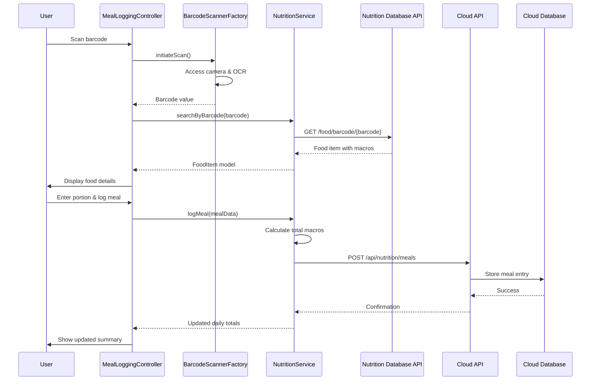

# Low-Level Design: Nutrition Tracking

**Epic ID:** QE-4286

## a. Architecture Mapping

- **Nutrition Module** (`app.nutrition`) → Main AngularJS module for nutrition features
- **Meal Logging Controller** (`MealLoggingController`) → Manages food search, barcode scanning, and meal entry UI
- **Nutrition Service** (`NutritionService`) → Service handling food database queries, barcode lookup, and meal tracking
- **Food Search Directive** (`foodSearch`) → Autocomplete food search with nutrition database integration
- **Barcode Scanner Factory** (`BarcodeScannerFactory`) → Camera-based barcode scanning and OCR processing
- **Water Intake Controller** (`WaterIntakeController`) → Manages water logging and daily hydration tracking
- **Nutrition Summary Directive** (`nutritionSummary`) → Displays daily/weekly summaries with progress visualization

**Recommended Folder Structure:**
```
app/
├── modules/nutrition/
│   ├── controllers/meal-logging.controller.js
│   ├── controllers/water-intake.controller.js
│   ├── services/nutrition.service.js
│   ├── factories/barcode-scanner.factory.js
│   ├── directives/food-search.directive.js
│   ├── directives/nutrition-summary.directive.js
│   └── nutrition.module.js
├── models/meal.model.js
└── config/nutrition-db-config.js
```

## b. Component Specifications

| Component Name | Artifact Type | Responsibility | Key Dependencies |
|----------------|---------------|----------------|------------------|
| NutritionModule | Module | Bootstrap nutrition tracking features | ngRoute, ngResource |
| MealLoggingController | Controller | Handle meal entry, food search, barcode scan triggers, portion size input | NutritionService, BarcodeScannerFactory, $scope |
| WaterIntakeController | Controller | Manage water intake logging and daily hydration target tracking | NutritionService, $scope |
| NutritionService | Service | Query nutrition databases, aggregate daily/weekly data, calculate macro totals | $http, $q, NUTRITION_API_CONFIG |
| BarcodeScannerFactory | Factory | Access device camera, perform OCR/image recognition, query nutrition DB by barcode | $window, $q |
| FoodSearchDirective | Directive | Provide autocomplete search interface with nutrition database results | NutritionService, $timeout |
| NutritionSummaryDirective | Directive | Render daily/weekly summaries with macro breakdown and target comparison charts | NutritionService, ChartService |
| MealModel | Model | Define structure for logged meals with food items, portions, and calculated macros | - |
| NutritionAPIInterceptor | Interceptor | Add authentication, handle nutrition API rate limits and errors | $q, AuthService |

## c. Data Model

```javascript
// Meal Model
class Meal {
  constructor() {
    this.userId = '';              // string
    this.mealId = '';              // string (UUID)
    this.mealType = '';            // string: 'breakfast', 'lunch', 'dinner', 'snack'
    this.timestamp = null;         // Date
    this.foodItems = [];           // Array<FoodItem>
    this.totalCalories = 0;        // number
    this.totalProtein = 0;         // number (grams)
    this.totalCarbs = 0;           // number (grams)
    this.totalFats = 0;            // number (grams)
  }
}

// FoodItem Model
class FoodItem {
  constructor() {
    this.foodId = '';              // string
    this.foodName = '';            // string
    this.barcode = '';             // string (optional)
    this.servingSize = 0;          // number
    this.servingUnit = '';         // string: 'g', 'ml', 'oz', 'cup'
    this.calories = 0;             // number
    this.protein = 0;              // number (grams)
    this.carbs = 0;                // number (grams)
    this.fats = 0;                 // number (grams)
    this.source = '';              // string: database source identifier
  }
}

// WaterIntake Model
class WaterIntake {
  constructor() {
    this.userId = '';              // string
    this.date = null;              // Date
    this.amount = 0;               // number (ml)
    this.target = 2000;            // number (ml, default)
  }
}

// NutritionTarget Model
class NutritionTarget {
  constructor() {
    this.userId = '';              // string
    this.dailyCalories = 2000;     // number
    this.dailyProtein = 150;       // number (grams)
    this.dailyCarbs = 250;         // number (grams)
    this.dailyFats = 65;           // number (grams)
    this.dailyWater = 2000;        // number (ml)
  }
}
```

## d. Data Flow

User initiates food search or barcode scan via MealLoggingController. FoodSearchDirective queries NutritionService which calls multiple nutrition database APIs to retrieve food data with macros. For barcode scan, BarcodeScannerFactory accesses device camera, performs OCR, and queries databases by barcode. User selects food item, enters portion size, and logs meal. NutritionService calculates total macros, creates Meal model, and sends to Cloud API via POST request. For water intake, WaterIntakeController logs amount through NutritionService. Analytics Engine aggregates data at midnight (daily) and weekly intervals, comparing against user-defined NutritionTarget. NutritionSummaryDirective fetches aggregated data and renders progress visualization with macro breakdown charts.

## e. Primary Sequence Diagram



## f. Implementation Notes

- Use AngularJS service pattern for NutritionService with $http for RESTful calls to multiple nutrition database APIs with fallback logic
- Implement debounced autocomplete in FoodSearchDirective using $timeout to minimize API calls during user typing
- Apply ES6 classes for Meal, FoodItem, WaterIntake, and NutritionTarget models with computed properties for macro calculations
- Use factory pattern for BarcodeScannerFactory to encapsulate camera access and OCR library integration (e.g., QuaggaJS)
- Leverage AngularJS $q service for promise-based async handling of multiple database queries with $q.all for parallel requests

## g. Error Handling

HTTP interceptor catches API errors with user-friendly notifications; try/catch blocks in barcode scanning with fallback to manual search; graceful degradation when nutrition databases unavailable.

## h. Security Notes

Standard input validation and secure API calls assumed; token-based auth via existing SSO; GDPR-compliant health data encryption.