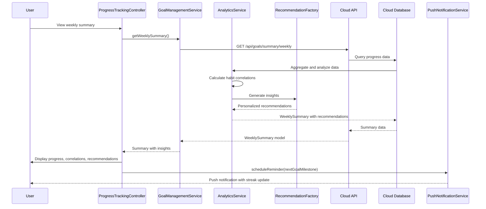

# Low-Level Design: Goal Setting and Progress Tracking

**Epic ID:** QE-4287

## a. Architecture Mapping

- **Goals Module** (`app.goals`) → Main AngularJS module for goal management
- **Goal Setting Controller** (`GoalSettingController`) → Manages goal creation, editing, and target configuration UI
- **Progress Tracking Controller** (`ProgressTrackingController`) → Displays progress visualization and weekly summaries
- **Goal Management Service** (`GoalManagementService`) → Service handling CRUD operations for goals and progress data
- **Analytics Service** (`AnalyticsService`) → Service for habit correlation analysis and pattern identification
- **Recommendation Factory** (`RecommendationFactory`) → Generates personalized insights and goal adjustments
- **Progress Chart Directive** (`progressChart`) → Renders progress visualization with Chart.js integration
- **Streak Tracker Directive** (`streakTracker`) → Displays habit streaks and milestone achievements
- **Push Notification Service** (`PushNotificationService`) → Manages reminder scheduling and streak alerts

**Recommended Folder Structure:**
```
app/
├── modules/goals/
│   ├── controllers/goal-setting.controller.js
│   ├── controllers/progress-tracking.controller.js
│   ├── services/goal-management.service.js
│   ├── services/analytics.service.js
│   ├── services/push-notification.service.js
│   ├── factories/recommendation.factory.js
│   ├── directives/progress-chart.directive.js
│   ├── directives/streak-tracker.directive.js
│   └── goals.module.js
├── models/goal.model.js
└── config/goals-config.js
```

## b. Component Specifications

| Component Name | Artifact Type | Responsibility | Key Dependencies |
|----------------|---------------|----------------|------------------|
| GoalsModule | Module | Bootstrap goal setting and tracking features | ngRoute, ngResource, chart.js |
| GoalSettingController | Controller | Handle goal creation/editing UI for weight, body fat, activity, nutrition targets | GoalManagementService, $scope |
| ProgressTrackingController | Controller | Display progress charts, weekly summaries, habit correlations, and recommendations | GoalManagementService, AnalyticsService, RecommendationFactory, $scope |
| GoalManagementService | Service | Perform CRUD operations on goals, fetch progress data, sync with Cloud API | $http, $q, API_CONFIG |
| AnalyticsService | Service | Process user activity data, identify patterns, calculate habit correlations | $http, GoalManagementService |
| RecommendationFactory | Factory | Generate personalized insights based on progress and habit analysis | AnalyticsService |
| PushNotificationService | Service | Schedule push reminders, send streak updates, manage notification preferences | $window, $interval |
| ProgressChartDirective | Directive | Render interactive progress charts using Chart.js with time-series data | GoalManagementService, ChartService |
| StreakTrackerDirective | Directive | Display current streaks, milestones, and achievement badges | GoalManagementService |
| GoalModel | Model | Define structure for goals with targets, progress tracking, and status | - |

## c. Data Model

```javascript
// Goal Model
class Goal {
  constructor() {
    this.userId = '';              // string
    this.goalId = '';              // string (UUID)
    this.goalType = '';            // string: 'weight', 'body_fat', 'activity', 'nutrition'
    this.targetValue = 0;          // number
    this.currentValue = 0;         // number
    this.unit = '';                // string: 'kg', '%', 'steps', 'calories'
    this.startDate = null;         // Date
    this.targetDate = null;        // Date
    this.status = 'active';        // string: 'active', 'completed', 'paused'
    this.progressHistory = [];     // Array<ProgressEntry>
  }
}

// ProgressEntry Model
class ProgressEntry {
  constructor() {
    this.date = null;              // Date
    this.value = 0;                // number
    this.notes = '';               // string (optional)
  }
}

// WeeklySummary Model
class WeeklySummary {
  constructor() {
    this.userId = '';              // string
    this.weekStartDate = null;     // Date
    this.weekEndDate = null;       // Date
    this.goalsProgress = [];       // Array<{goalId, percentComplete, trend}>
    this.habitCorrelations = [];   // Array<{habit, correlation, insight}>
    this.recommendations = [];     // Array<string>
  }
}

// Streak Model
class Streak {
  constructor() {
    this.userId = '';              // string
    this.streakType = '';          // string: 'daily_log', 'workout', 'nutrition'
    this.currentStreak = 0;        // number (days)
    this.longestStreak = 0;        // number (days)
    this.lastActivityDate = null;  // Date
  }
}

// Recommendation Model
class Recommendation {
  constructor() {
    this.recommendationId = '';    // string
    this.goalId = '';              // string
    this.message = '';             // string
    this.actionable = true;        // boolean
    this.priority = 'medium';      // string: 'low', 'medium', 'high'
    this.createdAt = null;         // Date
  }
}
```

## d. Data Flow

User creates or edits goals (weight, body fat %, activity levels, nutrition objectives) via GoalSettingController, which calls GoalManagementService to persist Goal models to Cloud Database via Cloud API. As user logs activities and nutrition data, progress is automatically tracked and stored as ProgressEntry records. AnalyticsService continuously processes accumulated data (requiring minimum 2 weeks) to identify patterns and calculate habit correlations. Every Sunday evening, Analytics Engine generates WeeklySummary with progress metrics, habit insights, and trends. RecommendationFactory consumes analytics output to produce personalized Recommendation models with actionable adjustments. ProgressTrackingController fetches weekly summaries and recommendations, rendering them via ProgressChartDirective and StreakTrackerDirective. PushNotificationService schedules reminders based on goal deadlines and sends streak updates to maintain engagement.

## e. Primary Sequence Diagram



## f. Implementation Notes

- Use AngularJS service pattern for GoalManagementService and AnalyticsService with $http for RESTful API communication
- Implement Chart.js integration in ProgressChartDirective with responsive configuration and time-series data binding
- Apply ES6 classes for Goal, ProgressEntry, WeeklySummary, Streak, and Recommendation models with validation methods
- Use factory pattern for RecommendationFactory to encapsulate business logic for insight generation based on analytics output
- Leverage AngularJS $interval in PushNotificationService for scheduled reminder checks with configurable frequency

## g. Error Handling

HTTP interceptor-based error handling with retry logic for API failures; user notifications via toaster service for goal save/update errors; graceful degradation when analytics unavailable.

## h. Security Notes

Requires token-based auth via existing SSO; all health data encrypted in transit and at rest; GDPR-compliant data handling with user consent.