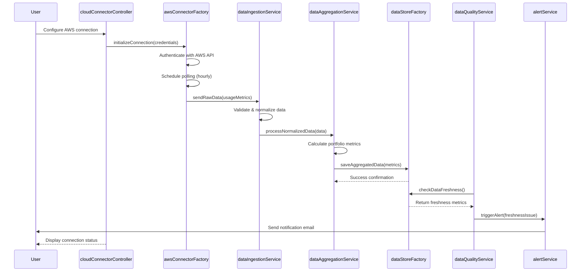

# Low-Level Design: AI Data Integration and Aggregation Platform
**Epic ID:** QE-4288

## a. Architecture Mapping

- **AWS API Connector** → AngularJS Factory (`awsConnectorFactory`)
- **Azure API Connector** → AngularJS Factory (`azureConnectorFactory`)
- **GCP API Connector** → AngularJS Factory (`gcpConnectorFactory`)
- **Data Ingestion Pipeline** → AngularJS Service (`dataIngestionService`)
- **Data Aggregation Engine** → AngularJS Service (`dataAggregationService`)
- **Data Quality Monitor** → AngularJS Service (`dataQualityService`)
- **Alert Service** → AngularJS Service (`alertService`)
- **Encrypted Data Store** → Backend API integration via AngularJS Factory (`dataStoreFactory`)

**Recommended Folder Structure:**
```
/app
  /modules
    /data-integration
      /controllers
      /services
      /factories
      /directives
      /views
  /shared
    /services
    /factories
```

## b. Component Specifications

| Name | Artifact Type | Responsibility | Key Dependencies |
|------|---------------|----------------|------------------|
| dataIntegrationModule | Module | Root module for data integration features | ngRoute, ui.bootstrap |
| cloudConnectorController | Controller | Manages cloud provider connection UI and configuration | awsConnectorFactory, azureConnectorFactory, gcpConnectorFactory |
| awsConnectorFactory | Factory | Handles AWS API authentication and data retrieval | $http, authService |
| azureConnectorFactory | Factory | Handles Azure API authentication and data retrieval | $http, authService |
| gcpConnectorFactory | Factory | Handles GCP API authentication and data retrieval | $http, authService |
| dataIngestionService | Service | Validates, cleanses, and normalizes raw cloud data | $q, validationService |
| dataAggregationService | Service | Calculates portfolio-level metrics and summaries | dataStoreFactory, $q |
| dataQualityService | Service | Monitors data freshness and completeness | $interval, alertService |
| alertService | Service | Sends notifications for data issues and threshold breaches | $http, notificationFactory |
| dataStoreFactory | Factory | Interfaces with encrypted backend data store API | $http, $q |
| connectionStatusDirective | Directive | Displays real-time cloud provider connection status | dataQualityService |

## c. Data Model

**CloudProviderConnection:**
```javascript
{
  id: String,
  provider: String, // 'AWS' | 'Azure' | 'GCP'
  companyId: String,
  credentials: Object, // encrypted
  status: String, // 'active' | 'inactive' | 'error'
  lastSyncTimestamp: Date
}
```

**AIUsageData:**
```javascript
{
  id: String,
  companyId: String,
  provider: String,
  service: String,
  usageMetrics: Object,
  cost: Number,
  timestamp: Date,
  department: String
}
```

**DataQualityMetrics:**
```javascript
{
  companyId: String,
  lastUpdateTimestamp: Date,
  freshnessScore: Number,
  completenessPercentage: Number,
  anomalyDetected: Boolean
}
```

**AlertConfig:**
```javascript
{
  id: String,
  type: String, // 'data_freshness' | 'budget_threshold'
  threshold: Number,
  recipients: Array<String>,
  enabled: Boolean
}
```

## d. Data Flow

User configures cloud provider credentials via cloudConnectorController → Controller invokes appropriate connector factory (AWS/Azure/GCP) → Factory authenticates and schedules periodic API polling → Raw data flows to dataIngestionService for validation and normalization → Normalized data passed to dataAggregationService for metric calculation → Aggregated data persisted via dataStoreFactory to encrypted backend → dataQualityService monitors freshness and completeness → On threshold breach, alertService triggers notifications → Dashboard UI updates via two-way binding to reflect latest data and quality metrics.

## e. Primary Sequence Diagram



## f. Implementation Notes

- Use AngularJS Dependency Injection for all services and factories to enable testability and modularity
- Implement $http interceptors for automatic token refresh and error handling across all API calls
- Use $interval service for scheduled polling with configurable intervals (hourly/daily) per provider
- Leverage ES6 Promises ($q service) for asynchronous data pipeline operations with proper error propagation
- Implement factory pattern for cloud connectors to enable easy addition of new providers

## g. Error Handling

HTTP interceptor captures API failures, retries transient errors (3 attempts with exponential backoff), logs persistent failures, and displays user-friendly error messages via notification service.

## h. Security Notes

Requires token-based authentication via existing SSO; all API credentials encrypted using AES-256 before storage; TLS 1.2+ enforced for all cloud provider API calls.