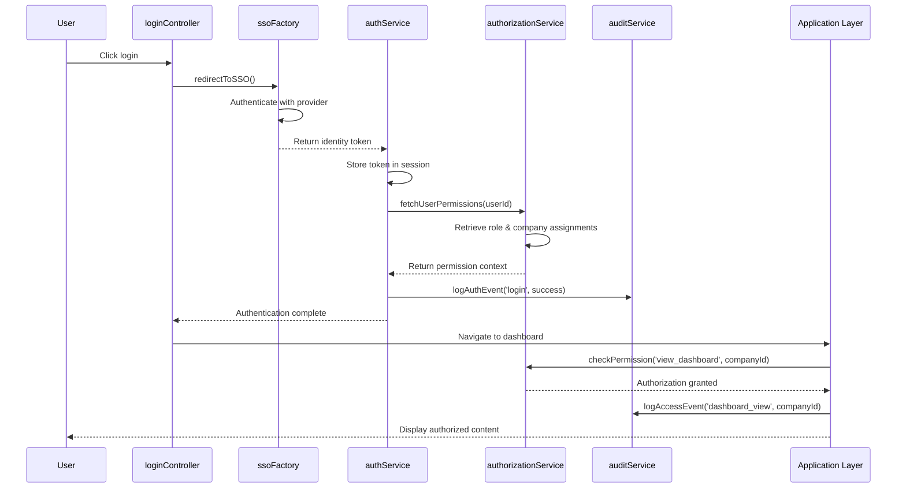

# Low-Level Design: Security and Access Management
**Epic ID:** QE-4289

## a. Architecture Mapping

- **SSO Provider** → External SAML/OAuth integration via AngularJS Factory (`ssoFactory`)
- **Authentication Service** → AngularJS Service (`authService`)
- **Authorization Engine** → AngularJS Service (`authorizationService`)
- **Audit Logger** → AngularJS Service (`auditService`)
- **User Management Console** → AngularJS Module with Controller (`userManagementController`)
- **Application Layer** → AngularJS $http interceptor for security context injection

**Recommended Folder Structure:**
```
/app
  /modules
    /security
      /controllers
      /services
      /factories
      /views
    /user-management
      /controllers
      /services
      /views
  /shared
    /interceptors
```

## b. Component Specifications

| Name | Artifact Type | Responsibility | Key Dependencies |
|------|---------------|----------------|------------------|
| securityModule | Module | Root module for authentication and authorization | ngRoute, ngCookies |
| authService | Service | Manages user authentication state and SSO token lifecycle | ssoFactory, $cookies, $rootScope |
| ssoFactory | Factory | Handles SSO provider integration (SAML/OAuth) | $http, $window |
| authorizationService | Service | Evaluates role-based permissions and company-level access | $http, $q |
| auditService | Service | Logs all authentication, authorization, and access events | $http, $log |
| userManagementController | Controller | Manages user permission assignment and role configuration | authorizationService, userService |
| userService | Service | CRUD operations for user accounts and company assignments | $http, $q |
| authInterceptor | Factory | Injects security tokens and handles 401/403 responses | $q, $injector, authService |
| loginController | Controller | Handles SSO login flow and user lockout recovery | authService, ssoFactory |
| permissionDirective | Directive | Conditionally shows/hides UI elements based on user permissions | authorizationService |

## c. Data Model

**User:**
```javascript
{
  id: String,
  email: String,
  displayName: String,
  role: String, // 'Enterprise Admin' | 'Operating Partner' | 'Deal Partner' | 'General Partner'
  assignedCompanies: Array<String>,
  status: String, // 'active' | 'locked' | 'inactive'
  lastLoginTimestamp: Date
}
```

**Permission:**
```javascript
{
  userId: String,
  companyId: String,
  accessLevel: String, // 'read' | 'write' | 'admin'
  grantedBy: String,
  grantedAt: Date
}
```

**AuditLog:**
```javascript
{
  id: String,
  userId: String,
  action: String, // 'login' | 'access' | 'permission_change'
  resource: String,
  timestamp: Date,
  ipAddress: String,
  success: Boolean
}
```

**AuthToken:**
```javascript
{
  accessToken: String,
  refreshToken: String,
  expiresAt: Date,
  userContext: Object
}
```

## d. Data Flow

User initiates login → loginController redirects to SSO Provider via ssoFactory → SSO validates credentials and returns identity token → authService stores token and retrieves user profile → authorizationService fetches user's role and company assignments → All subsequent requests pass through authInterceptor which injects security context → Application components query authorizationService before rendering protected content → Every authentication attempt, authorization check, and data access logged by auditService to backend → Enterprise Admin uses userManagementController to modify permissions → Changes propagate to authorizationService policy cache → UI updates via permissionDirective based on new access rights.

## e. Primary Sequence Diagram



## f. Implementation Notes

- Use $http interceptor (authInterceptor) to automatically attach JWT tokens to all API requests and handle 401/403 responses with token refresh
- Implement stateless authentication using JWT tokens stored in $cookies with httpOnly and secure flags
- Leverage AngularJS $rootScope events for broadcasting authentication state changes across modules
- Use custom permissionDirective with isolated scope to declaratively control UI element visibility based on user roles
- Implement route-level guards using $routeProvider resolve property to prevent unauthorized navigation

## g. Error Handling

Authentication failures captured by authInterceptor, trigger automatic token refresh attempt, redirect to login on persistent failure, and log all unauthorized access attempts via auditService with user notification.

## h. Security Notes

Requires SSO integration via SAML 2.0/OAuth 2.0; all tokens transmitted over TLS 1.2+; session tokens expire after 30 minutes of inactivity; audit logs immutable and retained for compliance.