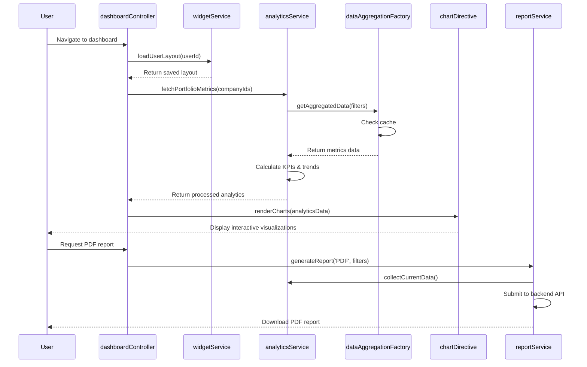

# Low-Level Design: Analytics and Reporting Platform
**Epic ID:** QE-4290

## a. Architecture Mapping

- **Data Aggregation Layer** → AngularJS Factory (`dataAggregationFactory`)
- **Analytics Engine** → AngularJS Service (`analyticsService`)
- **Dashboard UI** → AngularJS Module with Controllers and Directives
- **Report Generator** → AngularJS Service (`reportService`)
- **Recommendation Engine** → AngularJS Service (`recommendationService`)
- **User Interface** → AngularJS Controllers and custom Directives for widgets

**Recommended Folder Structure:**
```
/app
  /modules
    /dashboard
      /controllers
      /directives
      /services
      /views
    /reports
      /controllers
      /services
      /views
  /shared
    /widgets
    /charts
```

## b. Component Specifications

| Name | Artifact Type | Responsibility | Key Dependencies |
|------|---------------|----------------|------------------|
| dashboardModule | Module | Root module for analytics and reporting features | ngRoute, ui.bootstrap, chart.js |
| dashboardController | Controller | Orchestrates dashboard layout and widget management | analyticsService, widgetService |
| analyticsService | Service | Processes raw data into KPIs, trends, and benchmarks | dataAggregationFactory, $q |
| dataAggregationFactory | Factory | Fetches aggregated data from backend API | $http, $q, cacheService |
| reportService | Service | Generates PDF/Excel reports from dashboard data | $http, analyticsService |
| recommendationService | Service | Provides AI-driven cost optimization insights | $http, analyticsService |
| widgetService | Service | Manages widget configuration, layout, and persistence | $http, $localStorage |
| chartDirective | Directive | Renders interactive charts using Chart.js | analyticsService |
| widgetDirective | Directive | Reusable widget container with drag-drop and resize | widgetService |
| benchmarkController | Controller | Handles cross-company and industry benchmarking views | analyticsService, filterService |
| drillDownController | Controller | Manages drill-down analytics by department/project | analyticsService, $routeParams |

## c. Data Model

**DashboardConfig:**
```javascript
{
  userId: String,
  layout: Array<Object>, // widget positions and sizes
  savedViews: Array<Object>,
  defaultView: String
}
```

**AnalyticsMetrics:**
```javascript
{
  companyId: String,
  totalSpend: Number,
  usageByService: Object,
  trendData: Array<Object>,
  benchmarkScore: Number,
  timestamp: Date
}
```

**ReportConfig:**
```javascript
{
  id: String,
  type: String, // 'PDF' | 'Excel'
  schedule: String, // cron expression
  recipients: Array<String>,
  filters: Object,
  template: String
}
```

**Recommendation:**
```javascript
{
  id: String,
  companyId: String,
  type: String, // 'cost_optimization' | 'vendor_consolidation'
  description: String,
  potentialSavings: Number,
  confidence: Number,
  actions: Array<String>
}
```

## d. Data Flow

User accesses dashboard → dashboardController loads saved layout via widgetService → analyticsService fetches aggregated data from dataAggregationFactory with caching → Data processed into KPIs, trends, and benchmarks → chartDirective and widgetDirective render visualizations with two-way binding → User interacts with filters or drill-down → drillDownController updates query parameters and refreshes analyticsService → recommendationService periodically polls for AI insights and displays notifications → User requests report → reportService collects current dashboard state and submits to backend API for PDF/Excel generation → Generated report downloaded or emailed → All user interactions logged for audit and personalization.

## e. Primary Sequence Diagram



## f. Implementation Notes

- Use AngularJS $cacheFactory to cache aggregated data for 5 minutes to achieve 3-second load time target
- Implement lazy loading for chart.js library and heavy visualization components using $ocLazyLoad
- Leverage AngularJS $localStorage service to persist user dashboard layouts and saved views
- Use custom chartDirective with isolated scope and watchers for efficient chart updates on data changes
- Implement pagination and virtual scrolling for large datasets in drill-down views to support 200 portfolio companies

## g. Error Handling

$http interceptor captures API failures, displays user-friendly error messages via toast notifications, implements automatic retry for transient errors, and gracefully degrades visualizations on partial data failures.

## h. Security Notes

All API calls authenticated via existing SSO token; data filtered server-side based on user's assigned companies; WCAG 2.1 AA compliance enforced via aria-labels and keyboard navigation support.