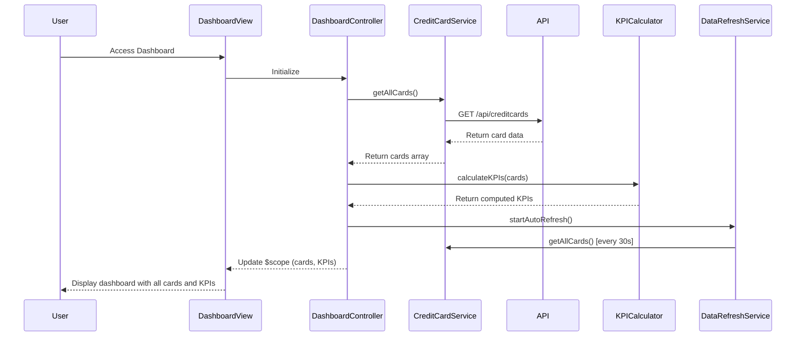

# Low-Level Design: Credit Card Analysis Dashboard

**Epic ID:** QE-4297

**Technology Stack:** AngularJS 1.x, JavaScript ES6, HTML5, CSS3, Bootstrap, REST APIs, MVC Architecture

---

## a. Architecture Mapping

- **Dashboard Module** → AngularJS Module (`creditCardDashboard`)
- **Dashboard Controller** → AngularJS Controller (`DashboardController`)
- **Credit Card Service** → AngularJS Service (`CreditCardService`)
- **KPI Calculation** → AngularJS Factory (`KPICalculator`)
- **Real-time Refresh** → AngularJS Service with `$interval` (`DataRefreshService`)
- **Dashboard View** → HTML5 template with Bootstrap responsive grid

**Recommended Folder Structure:**
```
/app
  /modules
    /dashboard
      dashboard.module.js
      dashboard.controller.js
      dashboard.html
  /services
    credit-card.service.js
    data-refresh.service.js
  /factories
    kpi-calculator.factory.js
  /styles
    dashboard.css
```

---

## b. Component Specifications

| Component Name | Artifact Type | Responsibility | Key Dependencies |
|----------------|---------------|----------------|------------------|
| DashboardController | Controller | Manages dashboard state, fetches credit card data, triggers KPI calculations, handles refresh logic | CreditCardService, KPICalculator, DataRefreshService, $scope |
| CreditCardService | Service | Retrieves credit card data from REST API endpoints | $http, $q |
| KPICalculator | Factory | Computes monthly spend, available credit (limit - outstanding), aggregates portfolio metrics | None |
| DataRefreshService | Service | Implements auto-refresh mechanism using $interval for real-time data updates | $interval, CreditCardService |
| DashboardView | Directive/Template | Renders responsive dashboard UI with Bootstrap grid, displays all cards and KPIs | Bootstrap CSS, AngularJS directives (ng-repeat, ng-if) |

---

## c. Data Model

**CreditCard Object:**
```javascript
{
  cardId: String,
  cardNumber: String (masked),
  cardName: String,
  totalCreditLimit: Number,
  outstandingAmount: Number,
  monthlySpend: Number,
  availableCredit: Number (calculated),
  lastUpdated: Date
}
```

**DashboardKPI Object:**
```javascript
{
  totalCards: Number,
  totalCreditLimit: Number,
  totalOutstanding: Number,
  totalAvailableCredit: Number,
  totalMonthlySpend: Number
}
```

---

## d. Data Flow

User accesses the dashboard → DashboardView loads and DashboardController initializes → Controller calls CreditCardService.getAllCards() which invokes REST API (GET /api/creditcards) → Service returns array of credit card objects → KPICalculator processes each card to compute availableCredit (limit - outstanding) and aggregates portfolio-level metrics → DataRefreshService starts $interval-based polling (every 30 seconds) to refresh data → Controller updates $scope with cards and KPIs → View re-renders responsive Bootstrap grid displaying all cards with monthly spend, total limit, available credit, and outstanding amounts.

---

## e. Primary Sequence Diagram



---

## f. Implementation Notes

- Use AngularJS dependency injection for all services, factories, and controllers
- Implement promise-based API calls using $http and $q for error handling
- Apply Bootstrap responsive grid (col-xs, col-sm, col-md, col-lg) for cross-device compatibility
- Use $interval service for real-time refresh with cleanup on $scope.$on('$destroy')
- Implement one-way data binding where possible to optimize digest cycle performance

---

## g. Error Handling

HTTP interceptor-based error handling with user-friendly notifications via Bootstrap alerts for API failures.

---

## h. Security Notes

Requires token-based authentication via existing SSO; card numbers must be masked in UI and API responses.