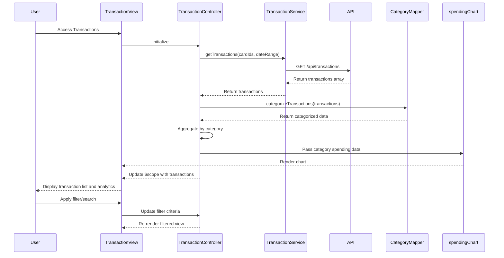

# Low-Level Design: Transaction Monitoring and Spending Analytics

**Epic ID:** QE-4298

**Technology Stack:** AngularJS 1.x, JavaScript ES6, HTML5, CSS3, Bootstrap, REST APIs, MVC Architecture

---

## a. Architecture Mapping

- **Transaction Module** → AngularJS Module (`transactionMonitoring`)
- **Transaction Controller** → AngularJS Controller (`TransactionController`)
- **Transaction Service** → AngularJS Service (`TransactionService`)
- **Categorization Logic** → AngularJS Factory (`CategoryMapper`)
- **Analytics Visualization** → AngularJS Directive (`spendingChart`)
- **Filter Component** → AngularJS Filter (`transactionFilter`)

**Recommended Folder Structure:**
```
/app
  /modules
    /transactions
      transaction.module.js
      transaction.controller.js
      transaction.html
  /services
    transaction.service.js
  /factories
    category-mapper.factory.js
  /directives
    spending-chart.directive.js
  /filters
    transaction.filter.js
  /styles
    transactions.css
```

---

## b. Component Specifications

| Component Name | Artifact Type | Responsibility | Key Dependencies |
|----------------|---------------|----------------|------------------|
| TransactionController | Controller | Manages transaction list state, applies filters, triggers analytics rendering | TransactionService, CategoryMapper, $scope, $filter |
| TransactionService | Service | Retrieves transaction data from REST API for selected cards and date ranges | $http, $q |
| CategoryMapper | Factory | Maps transactions to 9 predefined categories (Food & Dining, Fuel, Shopping, Travel, Entertainment, Utilities, Healthcare, Education, Miscellaneous) | None |
| spendingChart | Directive | Renders interactive category-wise spending visualizations using Chart.js or D3.js | CategoryMapper, chart library |
| transactionFilter | Filter | Filters transactions by search term, date range, category, and card | None |
| TransactionListView | Template | Displays transaction table with search, filter controls, and embedded chart directive | Bootstrap, AngularJS directives |

---

## c. Data Model

**Transaction Object:**
```javascript
{
  transactionId: String,
  cardId: String,
  merchantName: String,
  amount: Number,
  transactionDate: Date,
  category: String (enum: Food & Dining, Fuel, Shopping, Travel, Entertainment, Utilities, Healthcare, Education, Miscellaneous),
  description: String,
  status: String
}
```

**CategorySpending Object:**
```javascript
{
  category: String,
  totalAmount: Number,
  transactionCount: Number,
  percentage: Number
}
```

---

## d. Data Flow

User accesses transaction monitoring interface → TransactionController initializes and calls TransactionService.getTransactions(cardIds, dateRange) → Service invokes REST API (GET /api/transactions?cards=...&from=...&to=...) → API returns transaction array → CategoryMapper processes each transaction and assigns category if not pre-categorized → Controller aggregates spending by category using Array.reduce() → spendingChart directive receives category data and renders interactive chart within 1 second → TransactionListView displays filterable transaction table and category analytics → User applies filters via transactionFilter which updates view in real-time.

---

## e. Primary Sequence Diagram



---

## f. Implementation Notes

- Use AngularJS custom filters for transaction search and filtering with debounce for performance
- Implement lazy loading for large transaction datasets using pagination or infinite scroll
- Integrate Chart.js via angular-chart.js wrapper for category spending visualizations
- Use ES6 Array methods (map, filter, reduce) for efficient data aggregation
- Cache transaction data in service layer to minimize redundant API calls

---

## g. Error Handling

HTTP interceptor captures API errors with fallback to cached data and user notification via Bootstrap modals.

---

## h. Security Notes

Standard input validation and secure API calls assumed; transaction data requires authenticated session.