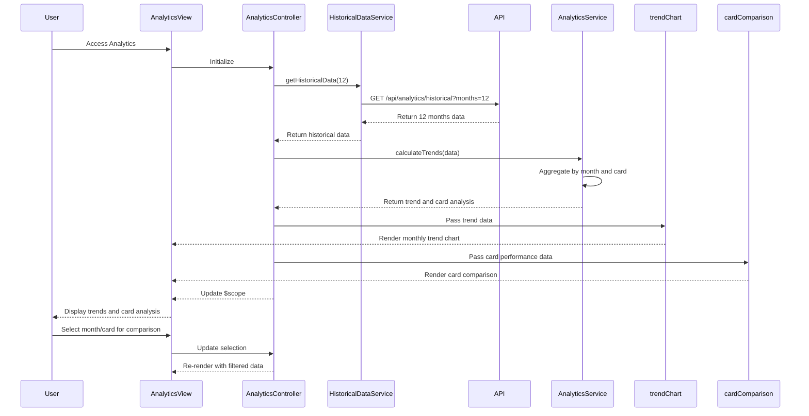

# Low-Level Design: Monthly Spending Trends and Card-wise Analysis

**Epic ID:** QE-4299

**Technology Stack:** AngularJS 1.x, JavaScript ES6, HTML5, CSS3, Bootstrap, REST APIs, MVC Architecture

---

## a. Architecture Mapping

- **Analytics Module** → AngularJS Module (`spendingAnalytics`)
- **Analytics Controller** → AngularJS Controller (`AnalyticsController`)
- **Analytics Service** → AngularJS Service (`AnalyticsService`)
- **Historical Data Handler** → AngularJS Service (`HistoricalDataService`)
- **Trend Visualization** → AngularJS Directive (`trendChart`)
- **Card Comparison Component** → AngularJS Directive (`cardComparison`)

**Recommended Folder Structure:**
```
/app
  /modules
    /analytics
      analytics.module.js
      analytics.controller.js
      analytics.html
  /services
    analytics.service.js
    historical-data.service.js
  /directives
    trend-chart.directive.js
    card-comparison.directive.js
  /styles
    analytics.css
```

---

## b. Component Specifications

| Component Name | Artifact Type | Responsibility | Key Dependencies |
|----------------|---------------|----------------|------------------|
| AnalyticsController | Controller | Manages analytics state, fetches historical data, coordinates trend and card-wise analysis | AnalyticsService, HistoricalDataService, $scope |
| AnalyticsService | Service | Aggregates spending data by month and by card, performs trend calculations | $http, $q |
| HistoricalDataService | Service | Retrieves 12 months of historical transaction and spending data from REST API | $http, $q |
| trendChart | Directive | Renders interactive line/bar charts showing monthly spending trends over time | Chart.js, AnalyticsService |
| cardComparison | Directive | Displays card-wise spend comparison with performance metrics and visual indicators | AnalyticsService, Bootstrap |
| AnalyticsView | Template | Presents trend charts, card comparison tables, and month-over-month insights | Bootstrap, AngularJS directives |

---

## c. Data Model

**MonthlySpend Object:**
```javascript
{
  month: String (YYYY-MM),
  totalSpend: Number,
  cardBreakdown: Array<{cardId: String, amount: Number}>,
  categoryBreakdown: Array<{category: String, amount: Number}>
}
```

**CardPerformance Object:**
```javascript
{
  cardId: String,
  cardName: String,
  totalSpend: Number,
  averageMonthlySpend: Number,
  trendDirection: String (increasing, decreasing, stable),
  utilizationRate: Number (percentage)
}
```

**TrendData Object:**
```javascript
{
  months: Array<String>,
  spendValues: Array<Number>,
  trendLine: Array<Number>
}
```

---

## d. Data Flow

User accesses analytics interface → AnalyticsController initializes and calls HistoricalDataService.getHistoricalData(12) → Service invokes REST API (GET /api/analytics/historical?months=12) → API returns 12 months of aggregated spending data → AnalyticsService processes data to compute monthly trends and card-wise breakdowns → Service calculates trend direction using linear regression or moving averages → trendChart directive receives monthly data and renders line chart within 2 seconds → cardComparison directive displays card performance metrics with visual indicators → User interacts with charts to compare specific months or cards → View updates dynamically based on user selections.

---

## e. Primary Sequence Diagram



---

## f. Implementation Notes

- Use AngularJS $q.all() to parallelize API calls for historical data and dashboard KPI validation
- Implement Chart.js with responsive configuration for trend line charts and bar charts
- Apply ES6 Array.reduce() for monthly and card-wise aggregations
- Cache historical data in service with TTL-based invalidation to reduce API load
- Use AngularJS watchers sparingly; prefer controller methods for data updates to avoid performance degradation

---

## g. Error Handling

Interceptor-based error handling with try/catch blocks in service layer; user notified via Bootstrap alert on data fetch failures.

---

## h. Security Notes

Requires token-based auth via existing SSO; historical data access restricted to authenticated user's cards only.