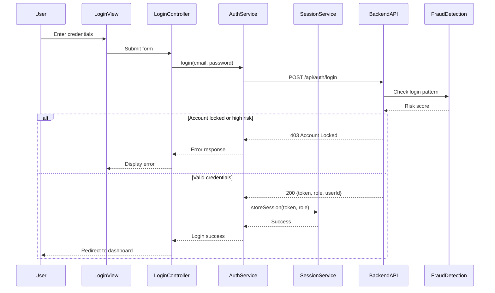

# Low-Level Design: User Security and Identity Management

## Epic ID: QE-4306

---

## a. Architecture Mapping

- **User Registration Interface** → AngularJS Module: `userAuth.registration`, Controller: `RegistrationController`, View: `registration.html`
- **Login Interface** → AngularJS Module: `userAuth.login`, Controller: `LoginController`, View: `login.html`
- **Authentication Service** → AngularJS Service: `AuthService` (handles credential validation, session creation)
- **Authorization Service** → AngularJS Service: `AuthorizationService` (validates tokens, enforces RBAC)
- **User Profile Service** → AngularJS Service: `UserProfileService` (manages user data CRUD)
- **Fraud Detection Service** → AngularJS Factory: `FraudDetectionFactory` (integrates with backend fraud API)
- **Session Management** → AngularJS Service: `SessionService` (manages token storage, expiry)
- **Email/SMS Provider** → Backend REST API integration via `NotificationService`

**Recommended Folder Structure:**
```
/app
  /modules
    /user-auth
      /controllers
      /services
      /views
      /directives
  /shared
    /services
    /factories
    /interceptors
  /assets
```

---

## b. Component Specifications

| Component Name | Artifact Type | Responsibility | Key Dependencies |
|----------------|---------------|----------------|------------------|
| RegistrationController | Controller | Handles user registration form submission, validation, and API calls | AuthService, $scope, $location |
| LoginController | Controller | Manages login form, credential submission, error handling | AuthService, SessionService, $scope |
| AuthService | Service | Validates credentials, communicates with backend auth API, triggers fraud checks | $http, FraudDetectionFactory, SessionService |
| AuthorizationService | Service | Validates session tokens, enforces role-based access (buyer/seller/admin) | SessionService, $http |
| UserProfileService | Service | Fetches and updates user profile data from backend | $http, SessionService |
| FraudDetectionFactory | Factory | Sends registration/login data to fraud detection API, processes risk scores | $http |
| SessionService | Service | Stores/retrieves session tokens, handles expiry and logout | $window.localStorage, $timeout |
| AuthInterceptor | HTTP Interceptor | Attaches auth tokens to outgoing requests, handles 401/403 responses | SessionService, $q |
| RegistrationDirective | Directive | Custom validation for registration form fields (email, password strength) | None |
| LoginDirective | Directive | Custom validation for login form fields | None |

---

## c. Data Model

**User Object:**
```javascript
{
  userId: String,
  email: String,
  passwordHash: String,
  role: String, // 'buyer', 'seller', 'admin'
  firstName: String,
  lastName: String,
  phoneNumber: String,
  accountStatus: String, // 'active', 'locked', 'pending_verification'
  createdAt: Date,
  lastLoginAt: Date,
  failedLoginAttempts: Number
}
```

**Session Object:**
```javascript
{
  sessionToken: String,
  userId: String,
  role: String,
  expiresAt: Date,
  createdAt: Date
}
```

**FraudScore Object:**
```javascript
{
  userId: String,
  riskScore: Number, // 0-100
  flagged: Boolean,
  reason: String,
  timestamp: Date
}
```

---

## d. Data Flow

User submits registration details via `registration.html` → `RegistrationController` validates input and invokes `AuthService.register()` → `AuthService` sends POST to `/api/auth/register` and triggers `FraudDetectionFactory.checkRegistration()` → Backend validates, stores encrypted user data, and sends verification email/SMS → User clicks verification link → User navigates to `login.html` → `LoginController` captures credentials and calls `AuthService.login()` → `AuthService` sends POST to `/api/auth/login` → Backend verifies credentials, checks account status, returns session token → `SessionService` stores token in localStorage → `AuthInterceptor` attaches token to all subsequent API requests → `AuthorizationService` validates token and role before allowing access to protected routes → On failed login attempts exceeding threshold, backend locks account and `FraudDetectionFactory` flags user.

---

## e. Primary Sequence Diagram



---

## f. Implementation Notes

- Use AngularJS Dependency Injection to inject `AuthService`, `SessionService`, and `AuthorizationService` into controllers and route resolvers.
- Implement `AuthInterceptor` as an HTTP interceptor to automatically attach Bearer tokens to all API requests and handle 401/403 globally.
- Store session tokens in `localStorage` with 30-minute expiry; use `$timeout` to auto-logout on inactivity.
- Use AngularJS `$routeProvider` with `resolve` to enforce role-based route protection before controller instantiation.
- Leverage ES6 classes for services and factories; use arrow functions for cleaner callback handling in API responses.

---

## g. Error Handling

HTTP interceptor-based error handling with try/catch blocks in services; user-friendly notifications via toast/modal for authentication failures, account lockouts, and network errors.

---

## h. Security Notes

Requires token-based authentication with secure session management; all API calls over HTTPS; passwords hashed with bcrypt; PCI DSS compliance for payment data; fraud detection with automatic account lockout.