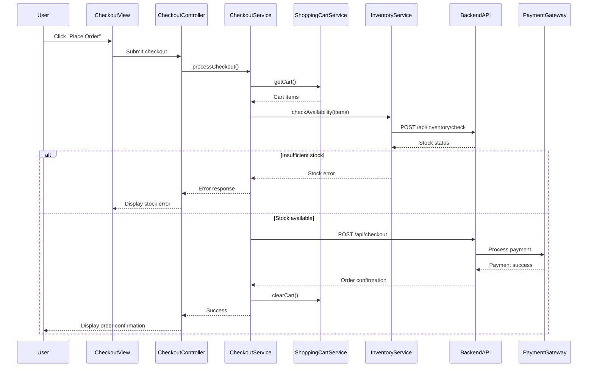

# Low-Level Design: Product Catalog and Shopping Experience

## Epic ID: QE-4307

---

## a. Architecture Mapping

- **Consumer Web Interface** → AngularJS Module: `ecommerce.catalog`, Controller: `CatalogController`, View: `catalog.html`
- **Seller Product Management** → AngularJS Module: `ecommerce.seller`, Controller: `SellerProductController`, View: `seller-products.html`
- **Product Catalog Service** → AngularJS Service: `ProductCatalogService` (fetches product data from backend)
- **Search and Filter Engine** → AngularJS Service: `SearchFilterService` (handles search queries, filters, sorting)
- **Shopping Cart Service** → AngularJS Service: `ShoppingCartService` (manages cart state, persistence)
- **Checkout and Payment Service** → AngularJS Service: `CheckoutService` (orchestrates checkout flow, payment API calls)
- **Review and Rating Service** → AngularJS Service: `ReviewService` (submits/fetches reviews and ratings)
- **Inventory Management Service** → AngularJS Service: `InventoryService` (manages stock levels, alerts)
- **Wishlist** → AngularJS Service: `WishlistService` (manages user wishlist)
- **CDN** → Static asset delivery (images, CSS, JS)

**Recommended Folder Structure:**
```
/app
  /modules
    /catalog
      /controllers
      /services
      /views
      /directives
    /seller
      /controllers
      /services
      /views
    /checkout
      /controllers
      /services
      /views
  /shared
    /services
    /filters
  /assets
```

---

## b. Component Specifications

| Component Name | Artifact Type | Responsibility | Key Dependencies |
|----------------|---------------|----------------|------------------|
| CatalogController | Controller | Displays product list, handles search/filter/sort interactions | ProductCatalogService, SearchFilterService, $scope |
| ProductDetailController | Controller | Displays single product details, reviews, add-to-cart action | ProductCatalogService, ShoppingCartService, ReviewService, $routeParams |
| ShoppingCartController | Controller | Manages cart view, quantity updates, remove items | ShoppingCartService, $scope |
| CheckoutController | Controller | Orchestrates checkout flow, payment submission | CheckoutService, ShoppingCartService, $scope, $location |
| SellerProductController | Controller | Manages seller product listing, inventory updates | ProductCatalogService, InventoryService, $scope |
| ProductCatalogService | Service | Fetches product data from backend API, caches results | $http, $q |
| SearchFilterService | Service | Sends search queries, filters, and sort params to backend | $http |
| ShoppingCartService | Service | Maintains cart state in localStorage, syncs with backend | $window.localStorage, $http |
| CheckoutService | Service | Validates cart, checks inventory, processes payment via gateway API | $http, ShoppingCartService, InventoryService |
| ReviewService | Service | Submits and retrieves product reviews and ratings | $http |
| InventoryService | Service | Fetches inventory levels, triggers low-stock alerts | $http |
| WishlistService | Service | Manages user wishlist (add/remove products) | $http, $window.localStorage |
| ProductCardDirective | Directive | Reusable product card UI component with image, price, rating | None |
| StarRatingDirective | Directive | Displays star rating UI, handles user rating input | None |

---

## c. Data Model

**Product Object:**
```javascript
{
  productId: String,
  name: String,
  description: String,
  price: Number,
  currency: String,
  imageUrls: Array, // CDN URLs
  category: String,
  sellerId: String,
  stockQuantity: Number,
  averageRating: Number,
  reviewCount: Number,
  createdAt: Date
}
```

**CartItem Object:**
```javascript
{
  productId: String,
  name: String,
  price: Number,
  quantity: Number,
  imageUrl: String,
  stockAvailable: Number
}
```

**Review Object:**
```javascript
{
  reviewId: String,
  productId: String,
  userId: String,
  rating: Number, // 1-5
  comment: String,
  createdAt: Date
}
```

**Order Object:**
```javascript
{
  orderId: String,
  userId: String,
  items: Array, // CartItem[]
  totalAmount: Number,
  paymentStatus: String, // 'pending', 'completed', 'failed'
  orderStatus: String, // 'processing', 'shipped', 'delivered'
  createdAt: Date
}
```

---

## d. Data Flow

User navigates to `catalog.html` → `CatalogController` invokes `ProductCatalogService.getProducts()` → Service sends GET to `/api/products` → Backend returns product list with CDN image URLs → User applies search/filter via `SearchFilterService` which sends query params to `/api/products/search` → User clicks product → `ProductDetailController` fetches details via `ProductCatalogService.getProductById()` and reviews via `ReviewService.getReviews()` → User clicks "Add to Cart" → `ShoppingCartService.addItem()` updates localStorage and sends POST to `/api/cart` → User navigates to cart → `ShoppingCartController` displays items from `ShoppingCartService.getCart()` → User proceeds to checkout → `CheckoutController` invokes `CheckoutService.processCheckout()` → Service validates cart, calls `InventoryService.checkAvailability()`, then sends POST to `/api/checkout` with payment details → Backend integrates with payment gateway API → On success, order confirmation displayed and cart cleared.

---

## e. Primary Sequence Diagram



---

## f. Implementation Notes

- Use AngularJS `$http` service with promise chaining for all REST API calls; leverage `$q` for complex async flows.
- Implement `ShoppingCartService` with localStorage persistence and periodic sync to backend for cross-device cart continuity.
- Use AngularJS custom filters for currency formatting, product sorting, and search highlighting.
- Leverage Bootstrap grid system for responsive product catalog layout; use CSS3 media queries for mobile optimization.
- Implement lazy loading for product images via AngularJS directives to improve page load performance.

---

## g. Error Handling

HTTP interceptor captures API errors; try/catch in services with user notifications via toast messages for payment failures, inventory issues, and network errors.

---

## h. Security Notes

All payment transactions via PCI DSS-compliant gateway; checkout requires token-based authentication; input validation for product search and review submission; secure API calls over HTTPS.