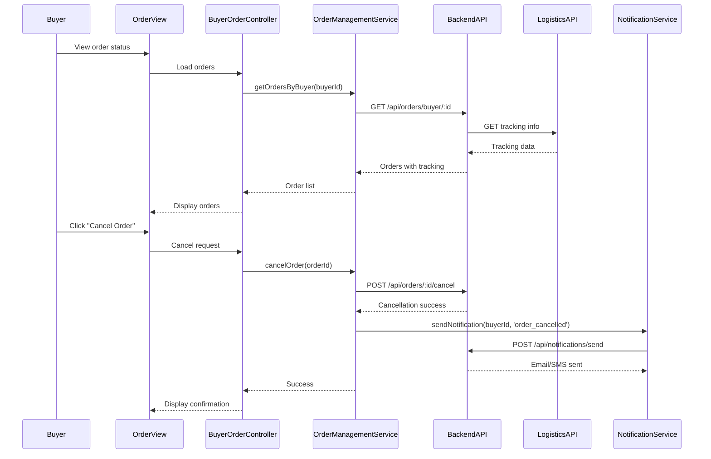

# Low-Level Design: Order Management and Platform Administration

## Epic ID: QE-4308

---

## a. Architecture Mapping

- **Buyer Interface** → AngularJS Module: `ecommerce.orders`, Controller: `BuyerOrderController`, View: `buyer-orders.html`
- **Seller Dashboard** → AngularJS Module: `ecommerce.sellerDashboard`, Controller: `SellerDashboardController`, View: `seller-dashboard.html`
- **Admin Dashboard** → AngularJS Module: `ecommerce.admin`, Controller: `AdminDashboardController`, View: `admin-dashboard.html`
- **Order Management Service** → AngularJS Service: `OrderManagementService` (handles order CRUD, status updates)
- **Analytics Engine** → AngularJS Service: `AnalyticsService` (fetches sales reports, platform metrics)
- **Fraud Detection Service** → AngularJS Service: `FraudDetectionService` (monitors fraud alerts, seller scoring)
- **Notification Service** → AngularJS Service: `NotificationService` (sends email/SMS for order updates)
- **External Logistics APIs** → Backend integration via `OrderManagementService`

**Recommended Folder Structure:**
```
/app
  /modules
    /orders
      /controllers
      /services
      /views
    /seller-dashboard
      /controllers
      /services
      /views
    /admin
      /controllers
      /services
      /views
  /shared
    /services
    /directives
  /assets
```

---

## b. Component Specifications

| Component Name | Artifact Type | Responsibility | Key Dependencies |
|----------------|---------------|----------------|------------------|
| BuyerOrderController | Controller | Displays buyer order history, handles cancellation/refund requests | OrderManagementService, $scope |
| SellerDashboardController | Controller | Displays seller orders, sales analytics, inventory alerts | OrderManagementService, AnalyticsService, $scope |
| AdminDashboardController | Controller | Displays platform metrics, fraud alerts, dispute resolution interface | AnalyticsService, FraudDetectionService, $scope |
| OrderManagementService | Service | Fetches orders, updates status, processes cancellations/refunds | $http, NotificationService |
| AnalyticsService | Service | Retrieves sales reports, platform health metrics, user activity data | $http |
| FraudDetectionService | Service | Fetches fraud alerts, seller risk scores, suspicious activity logs | $http |
| NotificationService | Service | Triggers email/SMS notifications for order status changes | $http |
| OrderTrackingDirective | Directive | Real-time order tracking UI component with status timeline | OrderManagementService |
| SalesChartDirective | Directive | Displays sales analytics charts using Chart.js or D3.js | AnalyticsService |
| FraudAlertDirective | Directive | Displays fraud alerts with severity indicators | FraudDetectionService |

---

## c. Data Model

**Order Object:**
```javascript
{
  orderId: String,
  buyerId: String,
  sellerId: String,
  items: Array, // {productId, quantity, price}
  totalAmount: Number,
  orderStatus: String, // 'processing', 'shipped', 'delivered', 'cancelled'
  paymentStatus: String, // 'pending', 'completed', 'refunded'
  trackingNumber: String,
  createdAt: Date,
  updatedAt: Date
}
```

**SalesAnalytics Object:**
```javascript
{
  sellerId: String,
  totalSales: Number,
  totalOrders: Number,
  averageOrderValue: Number,
  period: String, // 'daily', 'weekly', 'monthly'
  data: Array // [{date, sales, orders}]
}
```

**FraudAlert Object:**
```javascript
{
  alertId: String,
  userId: String,
  alertType: String, // 'suspicious_login', 'high_value_transaction', 'seller_fraud'
  severity: String, // 'low', 'medium', 'high'
  description: String,
  timestamp: Date,
  resolved: Boolean
}
```

**PlatformMetrics Object:**
```javascript
{
  totalUsers: Number,
  activeOrders: Number,
  totalRevenue: Number,
  systemUptime: Number, // percentage
  averageResponseTime: Number, // milliseconds
  timestamp: Date
}
```

---

## d. Data Flow

Buyer navigates to `buyer-orders.html` → `BuyerOrderController` invokes `OrderManagementService.getOrdersByBuyer()` → Service sends GET to `/api/orders/buyer/:id` → Backend retrieves orders from database and logistics APIs for tracking updates → Buyer clicks "Cancel Order" → `OrderManagementService.cancelOrder()` sends POST to `/api/orders/:id/cancel` → Backend updates order status, triggers refund, and `NotificationService` sends confirmation email/SMS → Seller accesses `seller-dashboard.html` → `SellerDashboardController` calls `OrderManagementService.getOrdersBySeller()` and `AnalyticsService.getSalesReport()` → Services fetch data from `/api/orders/seller/:id` and `/api/analytics/sales` → Admin accesses `admin-dashboard.html` → `AdminDashboardController` invokes `AnalyticsService.getPlatformMetrics()` and `FraudDetectionService.getFraudAlerts()` → Services retrieve data from `/api/analytics/platform` and `/api/fraud/alerts` → Admin resolves disputes via UI, triggering backend updates.

---

## e. Primary Sequence Diagram



---

## f. Implementation Notes

- Use AngularJS `$interval` for polling order status updates every 30 seconds to simulate real-time tracking without WebSocket overhead.
- Implement `AnalyticsService` with caching using `$cacheFactory` to reduce redundant API calls for dashboard metrics.
- Use AngularJS `ng-repeat` with `track by` for efficient rendering of large order lists and analytics data.
- Leverage Chart.js or D3.js via AngularJS directives for interactive sales charts and platform metrics visualization.
- Implement role-based route guards using `$routeProvider` resolve to restrict admin/seller dashboard access.

---

## g. Error Handling

HTTP interceptor handles API failures; try/catch in services with user-friendly error modals for order cancellation failures, refund processing errors, and analytics data fetch issues.

---

## h. Security Notes

Role-based access control enforced via token validation; admin and seller dashboards require elevated permissions; fraud detection data encrypted; all API calls over HTTPS; regional data privacy compliance (GDPR, CCPA).