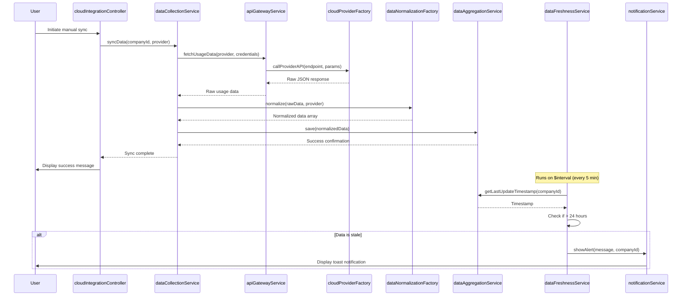

# Low-Level Design: Cloud AI Provider Integration
**Epic ID:** QE-4315

## a. Architecture Mapping

- **Cloud Provider Connectors** → AngularJS Factory (`cloudProviderFactory`) for AWS/Azure/GCP API client wrappers
- **API Gateway** → Backend REST endpoint; AngularJS Service (`apiGatewayService`) for client-side routing and retry logic
- **Data Collection Service** → AngularJS Service (`dataCollectionService`) orchestrating scheduled data pulls via `$interval`
- **Data Normalization Engine** → AngularJS Factory (`dataNormalizationFactory`) transforming provider-specific responses to unified schema
- **Data Aggregation Store** → Backend database; AngularJS Service (`dataAggregationService`) for client-side caching using `$cacheFactory`
- **Data Freshness Monitor** → AngularJS Service (`dataFreshnessService`) checking timestamps and triggering alerts
- **Notification Service** → AngularJS Service (`notificationService`) displaying toast notifications via custom directive

**Recommended Folder Structure:**
```
/app
  /modules
    /cloud-integration
      /controllers
      /services
      /factories
      /directives
  /shared
    /services
    /factories
```

## b. Component Specifications

| Component Name | Artifact Type | Responsibility | Key Dependencies |
|---|---|---|---|
| cloudProviderFactory | Factory | Encapsulates AWS/Azure/GCP API client logic with credential management | $http, $q |
| apiGatewayService | Service | Routes API requests with rate limiting, retry, and error handling | $http, $timeout, cloudProviderFactory |
| dataCollectionService | Service | Orchestrates scheduled data pulls from cloud providers using $interval | $interval, apiGatewayService, dataNormalizationFactory |
| dataNormalizationFactory | Factory | Transforms provider-specific JSON to unified schema (company_id, service_name, usage_quantity, cost, timestamp, region) | None |
| dataAggregationService | Service | Manages client-side data cache and provides aggregated data to controllers | $cacheFactory, $http |
| dataFreshnessService | Service | Monitors last update timestamps and triggers alerts when data exceeds 24-hour threshold | $interval, notificationService, dataAggregationService |
| notificationService | Service | Displays toast notifications for data freshness alerts | None |
| cloudIntegrationController | Controller | Manages cloud integration settings UI and credential configuration | $scope, apiGatewayService, notificationService |
| dataFreshnessDirective | Directive | Displays visual indicator (icon/badge) showing data freshness status | dataFreshnessService |

## c. Data Model

**CloudProviderCredential** (JS Object):
- `id` (string) - Unique credential identifier
- `companyId` (string) - Portfolio company ID
- `provider` (string) - Cloud provider name (AWS/Azure/GCP)
- `credentials` (object) - Encrypted credential payload
- `lastValidated` (Date) - Last successful validation timestamp

**NormalizedUsageData** (JS Object):
- `company_id` (string) - Portfolio company identifier
- `service_name` (string) - AI service name (normalized)
- `usage_quantity` (number) - Usage metric value
- `cost` (number) - Cost in USD
- `timestamp` (Date) - Data collection timestamp
- `region` (string) - Cloud region

**DataFreshnessStatus** (JS Object):
- `companyId` (string) - Portfolio company ID
- `lastUpdate` (Date) - Most recent data timestamp
- `isStale` (boolean) - True if data exceeds 24-hour threshold
- `provider` (string) - Cloud provider name

## d. Data Flow

User (Enterprise Admin) navigates to the cloud integration settings page, triggering `cloudIntegrationController` to load. The controller calls `apiGatewayService.getCredentials()` to fetch stored cloud provider credentials. When the user initiates a manual sync or the scheduled `$interval` fires, `dataCollectionService.syncData()` is invoked, which calls `cloudProviderFactory` methods to retrieve raw usage data from AWS/Azure/GCP APIs via backend REST endpoints. The response is passed to `dataNormalizationFactory.normalize()`, which transforms provider-specific JSON into the unified schema. Normalized data is sent to the backend via `dataAggregationService.save()` and cached locally. `dataFreshnessService` continuously monitors cached data timestamps and, if any company's data exceeds 24 hours, calls `notificationService.showAlert()` to display a toast notification. The UI updates reactively via `$scope.$watch` bindings.

## e. Primary Sequence Diagram



## f. Implementation Notes

- Use AngularJS Dependency Injection for all services/factories to enable testability and modularity
- Implement `cloudProviderFactory` with provider-specific methods (e.g., `getAWSUsage()`, `getAzureUsage()`) using ES6 classes wrapped in factory pattern
- Use `$http` interceptors for global error handling, token refresh, and retry logic with exponential backoff
- Leverage `$cacheFactory` in `dataAggregationService` to reduce backend calls and meet 3-second load time requirement
- Use `$interval` in `dataFreshnessService` with 5-minute polling interval to check data staleness and trigger alerts

## g. Error Handling

HTTP interceptor-based global error handling with try/catch blocks in service methods; user-facing error notifications via `notificationService` toast messages.

## h. Security Notes

Requires token-based authentication via existing SSO; all API calls use TLS 1.2+; credentials encrypted with AES-256 before storage.