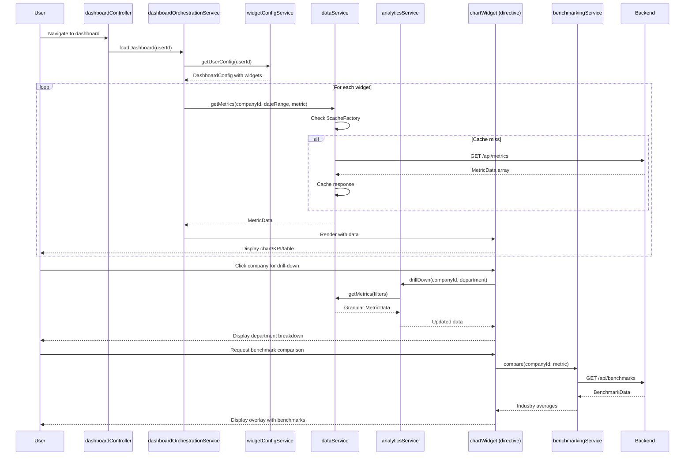

# Low-Level Design: Dashboard Visualization
**Epic ID:** QE-4316

## a. Architecture Mapping

- **User Interface Layer** → AngularJS Module (`dashboardModule`) with Controllers (`dashboardController`, `widgetController`) and Directives (`chartWidget`, `kpiWidget`, `tableWidget`)
- **Dashboard Orchestration Service** → AngularJS Service (`dashboardOrchestrationService`) coordinating widget rendering and data requests
- **Analytics Engine** → AngularJS Service (`analyticsService`) processing drill-down queries and metric calculations
- **Benchmarking Service** → AngularJS Service (`benchmarkingService`) fetching and comparing industry benchmark data
- **Report Generation Service** → AngularJS Service (`reportGenerationService`) exporting data to PDF/Excel via backend API
- **Data Aggregation Layer** → Backend REST API; AngularJS Service (`dataService`) for client-side data retrieval with caching
- **Widget Configuration Store** → AngularJS Service (`widgetConfigService`) managing user-specific widget preferences using `localStorage`

**Recommended Folder Structure:**
```
/app
  /modules
    /dashboard
      /controllers
      /services
      /directives
      /filters
  /shared
    /services
    /directives
```

## b. Component Specifications

| Component Name | Artifact Type | Responsibility | Key Dependencies |
|---|---|---|---|
| dashboardController | Controller | Manages main dashboard view, date range selection, and company filters | $scope, dashboardOrchestrationService, widgetConfigService |
| widgetController | Controller | Manages individual widget lifecycle, configuration, and data binding | $scope, analyticsService, dataService |
| dashboardOrchestrationService | Service | Coordinates widget rendering, data fetching, and user configuration retrieval | widgetConfigService, dataService, $q |
| analyticsService | Service | Processes drill-down queries by company/department/project and calculates metrics | $http, dataService |
| benchmarkingService | Service | Fetches industry benchmark data and performs cross-company comparisons | $http, $cacheFactory |
| reportGenerationService | Service | Triggers backend PDF/Excel export and handles file download | $http, $window |
| dataService | Service | Retrieves normalized AI usage/spend data from backend with client-side caching | $http, $cacheFactory |
| widgetConfigService | Service | Persists and retrieves user-specific widget configurations using localStorage | $window.localStorage |
| chartWidget | Directive | Renders interactive charts (line, bar, pie) using Chart.js or D3.js | analyticsService |
| kpiWidget | Directive | Displays key performance indicator cards with trend indicators | analyticsService |
| tableWidget | Directive | Renders sortable/filterable data tables with pagination | analyticsService |
| exportButton | Directive | Provides PDF/Excel export button with format selection dropdown | reportGenerationService |

## c. Data Model

**DashboardConfig** (JS Object):
- `userId` (string) - User identifier
- `widgets` (array) - Array of WidgetConfig objects
- `layout` (object) - Grid layout configuration (rows/columns)
- `defaultFilters` (object) - Default company/date filters

**WidgetConfig** (JS Object):
- `id` (string) - Unique widget identifier
- `type` (string) - Widget type (chart/kpi/table)
- `title` (string) - Widget display title
- `dataSource` (string) - Metric/data source identifier
- `filters` (object) - Widget-specific filters
- `position` (object) - Grid position (x, y, width, height)

**MetricData** (JS Object):
- `companyId` (string) - Portfolio company ID
- `metricName` (string) - Metric identifier (e.g., total_spend, usage_count)
- `value` (number) - Metric value
- `timestamp` (Date) - Data timestamp
- `department` (string) - Optional department filter
- `project` (string) - Optional project filter

**BenchmarkData** (JS Object):
- `industry` (string) - Industry category
- `metric` (string) - Benchmark metric name
- `average` (number) - Industry average value
- `percentile75` (number) - 75th percentile value
- `percentile90` (number) - 90th percentile value

## d. Data Flow

User navigates to the dashboard, triggering `dashboardController` to initialize. The controller calls `dashboardOrchestrationService.loadDashboard()`, which retrieves user-specific widget configurations from `widgetConfigService` (localStorage). For each configured widget, the orchestration service invokes `dataService.getMetrics()` with company/date filters to fetch aggregated AI usage and spend data from the backend REST API. The response is cached via `$cacheFactory` to optimize subsequent requests. Widget directives (`chartWidget`, `kpiWidget`, `tableWidget`) bind to the retrieved data and render visualizations. When the user drills down (e.g., clicks a company to view department breakdown), `analyticsService.drillDown()` is called, fetching granular data and updating the widget view. For benchmarking, `benchmarkingService.compare()` retrieves industry averages from an external API and overlays them on the chart. When the user clicks export, `reportGenerationService.export()` sends selected data to the backend, which generates a PDF/Excel file and returns a download URL; the file is downloaded via `$window.open()`.

## e. Primary Sequence Diagram



## f. Implementation Notes

- Use AngularJS two-way data binding (`ng-model`) for filter controls (company selector, date range picker) to reactively update all widgets
- Implement widget directives with isolated scope and attribute bindings for reusability across different dashboard layouts
- Use `$q.all()` in `dashboardOrchestrationService` to parallelize multiple widget data requests and meet 3-second load time SLA
- Leverage `$cacheFactory` with TTL (time-to-live) of 5 minutes to balance data freshness and performance
- Implement Chart.js or D3.js integration within directives for interactive visualizations with drill-down click handlers

## g. Error Handling

HTTP interceptor for global API error handling; widget-level try/catch with fallback to "No data available" message displayed in widget container.

## h. Security Notes

Requires token-based auth via existing SSO; inherits RBAC from Epic QE-4317 to filter visible company data per user permissions.