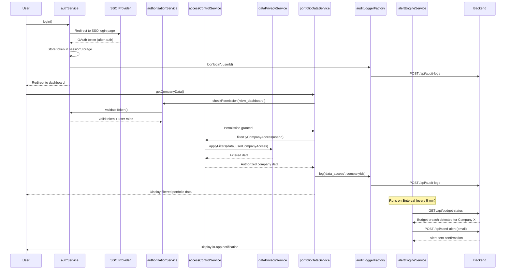

# Low-Level Design: Security & Access Control
**Epic ID:** QE-4317

## a. Architecture Mapping

- **User Authentication (SSO)** → AngularJS Service (`authService`) integrating with SSO provider via OAuth 2.0/SAML redirect flow
- **RBAC Authorization Engine** → AngularJS Service (`authorizationService`) validating user permissions and roles
- **Access Control Service** → AngularJS Service (`accessControlService`) enforcing company-level data access restrictions
- **Audit Logging Service** → AngularJS Factory (`auditLoggerFactory`) capturing user actions and sending logs to backend
- **Alert Engine** → AngularJS Service (`alertEngineService`) monitoring budget thresholds and triggering email notifications
- **User Management Service** → AngularJS Service (`userManagementService`) handling user CRUD operations and lockout recovery
- **Data Privacy Layer** → AngularJS Service (`dataPrivacyService`) filtering and anonymizing data based on user permissions
- **Portfolio Company Data** → Backend REST API; AngularJS Service (`portfolioDataService`) for client-side data retrieval with RBAC filtering

**Recommended Folder Structure:**
```
/app
  /modules
    /security
      /controllers
      /services
      /factories
      /interceptors
  /shared
    /services
    /interceptors
```

## b. Component Specifications

| Component Name | Artifact Type | Responsibility | Key Dependencies |
|---|---|---|---|
| authService | Service | Handles SSO login/logout, token management, and session validation | $http, $window, $location |
| authorizationService | Service | Validates user roles and permissions against RBAC rules | authService, $q |
| accessControlService | Service | Enforces company-level data access restrictions before API calls | authorizationService, $http |
| auditLoggerFactory | Factory | Captures user actions (login, data access, config changes) and sends to backend audit API | $http, authService |
| alertEngineService | Service | Monitors budget thresholds via polling and triggers email alerts when breached | $interval, $http |
| userManagementService | Service | Manages user CRUD operations, role assignments, and lockout recovery workflows | $http, authService |
| dataPrivacyService | Service | Filters and anonymizes portfolio data based on user's assigned permissions | authorizationService |
| portfolioDataService | Service | Retrieves portfolio company data with RBAC filtering applied | $http, accessControlService, dataPrivacyService |
| authInterceptor | Factory ($httpInterceptor) | Injects auth tokens into HTTP headers and handles 401/403 responses | $q, $injector, authService |
| adminController | Controller | Manages admin UI for user/role management and integration settings | $scope, userManagementService, authorizationService |
| budgetAlertDirective | Directive | Displays budget threshold alerts with dismiss functionality | alertEngineService |

## c. Data Model

**User** (JS Object):
- `id` (string) - Unique user identifier
- `email` (string) - User email address
- `roles` (array) - Array of role names (e.g., ['Enterprise Admin', 'Operating Partner'])
- `companyAccess` (array) - Array of portfolio company IDs user can access
- `isLocked` (boolean) - Account lockout status

**Role** (JS Object):
- `name` (string) - Role name
- `permissions` (array) - Array of permission strings (e.g., ['view_dashboard', 'manage_users', 'configure_integrations'])
- `companyRestrictions` (array) - Array of company IDs role can access (empty = all companies)

**AuditLog** (JS Object):
- `userId` (string) - User who performed action
- `action` (string) - Action type (e.g., 'login', 'data_access', 'config_change')
- `resource` (string) - Resource identifier (e.g., company ID, user ID)
- `timestamp` (Date) - Action timestamp
- `ipAddress` (string) - User IP address

**BudgetAlert** (JS Object):
- `companyId` (string) - Portfolio company ID
- `threshold` (number) - Budget threshold in USD
- `currentSpend` (number) - Current AI spend
- `breachTimestamp` (Date) - When threshold was exceeded
- `notificationSent` (boolean) - Alert email sent status

## d. Data Flow

User initiates login, redirecting to SSO provider via `authService.login()`. Upon successful SSO authentication, the provider returns an OAuth token, which `authService` stores in `sessionStorage` and validates. The `authInterceptor` automatically injects this token into all outgoing HTTP request headers. When the user navigates to a protected route (e.g., dashboard), `authorizationService.checkPermission()` validates the user's role and permissions against the required access level. Before rendering portfolio data, `accessControlService.filterByCompanyAccess()` is called, which invokes `dataPrivacyService.applyFilters()` to remove companies the user is not authorized to view. All user actions (navigation, data access, configuration changes) trigger `auditLoggerFactory.log()`, which sends audit events to the backend API. Simultaneously, `alertEngineService` runs on a 5-minute `$interval`, polling the backend for budget threshold breaches via `$http.get('/api/budget-status')`. When a breach is detected, the service calls the backend alert endpoint to trigger email notifications. If a user account is locked, `userManagementService.sendRecoveryEmail()` is invoked, which calls the backend to send a password reset link within 2 minutes.

## e. Primary Sequence Diagram



## f. Implementation Notes

- Use AngularJS `$httpInterceptor` to inject auth tokens and handle 401/403 responses by redirecting to login or showing access denied message
- Implement `authService` with token refresh logic using OAuth refresh tokens to maintain session without re-login
- Store user roles and permissions in `sessionStorage` after login to avoid repeated backend calls for authorization checks
- Use AngularJS route resolvers to enforce permission checks before route activation, preventing unauthorized access to views
- Implement `auditLoggerFactory` with batching to send audit logs in groups every 30 seconds to reduce API calls

## g. Error Handling

HTTP interceptor handles 401 (redirect to login) and 403 (show access denied); service-level try/catch with user notification for audit log failures.

## h. Security Notes

Requires token-based auth via SSO (OAuth 2.0/SAML); all data encrypted with TLS 1.2+ in transit and AES-256 at rest; RBAC enforced at service layer before API calls.