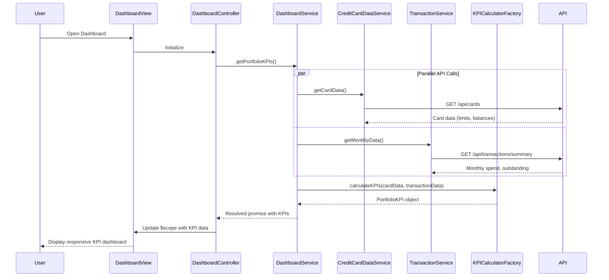

# Low-Level Design: Credit Card Portfolio Dashboard

**Epic ID:** QE-4324

## a. Architecture Mapping

- **Dashboard Module** → AngularJS Module (`app.dashboard`)
- **Dashboard Controller** → AngularJS Controller (`DashboardController`)
- **Dashboard Service** → AngularJS Service (`DashboardService`)
- **KPI Calculator** → AngularJS Factory (`KPICalculatorFactory`)
- **Dashboard View** → HTML5 Template with Bootstrap responsive grid

**Recommended Folder Structure:**
```
/app
  /dashboard
    dashboard.module.js
    dashboard.controller.js
    dashboard.service.js
    dashboard.html
  /shared
    /factories
      kpi-calculator.factory.js
    /services
      credit-card-data.service.js
      transaction.service.js
```

## b. Component Specifications

| Name | Artifact Type | Responsibility | Key Dependencies |
|------|---------------|----------------|------------------|
| DashboardModule | Module | Registers dashboard feature module and routing | angular, ui.router |
| DashboardController | Controller | Manages dashboard view state and KPI data binding | DashboardService, $scope |
| DashboardService | Service | Orchestrates data retrieval from multiple services and coordinates KPI calculation | CreditCardDataService, TransactionService, KPICalculatorFactory, $q |
| KPICalculatorFactory | Factory | Aggregates portfolio-level metrics (total credit, available credit, monthly spend, outstanding) | None |
| CreditCardDataService | Service | Fetches card balances, credit limits, and card information via REST API | $http |
| TransactionService | Service | Retrieves monthly spend and outstanding amounts via REST API | $http |
| DashboardView | Template | Renders responsive KPI cards using Bootstrap grid system | Bootstrap CSS |

## c. Data Model

**PortfolioKPI** (JavaScript Object)
- `monthlySpend`: Number (currency)
- `totalCreditLimit`: Number (currency)
- `availableCredit`: Number (currency)
- `outstandingAmount`: Number (currency)
- `lastUpdated`: Date

**CreditCard** (JavaScript Object)
- `cardId`: String
- `creditLimit`: Number
- `currentBalance`: Number

**Transaction** (JavaScript Object)
- `transactionId`: String
- `amount`: Number
- `date`: Date
- `cardId`: String

## d. Data Flow

User opens the dashboard → DashboardView loads and DashboardController initializes → Controller calls DashboardService.getPortfolioKPIs() → Service makes parallel $http calls to CreditCardDataService (for card limits/balances) and TransactionService (for monthly spend/outstanding) → Responses are passed to KPICalculatorFactory which aggregates data (Available Credit = Total Credit Limit - Outstanding Amount) → Aggregated PortfolioKPI object is returned via promise → Controller updates $scope with KPI data → View renders responsive KPI cards using Bootstrap grid with real-time refresh capability via $interval.

## e. Primary Sequence Diagram



## f. Implementation Notes

- Use AngularJS dependency injection for all services and factories to enable testability and modularity
- Implement $q.all() for parallel API calls to CreditCardDataService and TransactionService to meet 2-second load time NFR
- Use Bootstrap responsive grid (col-xs/sm/md/lg) for KPI cards to ensure mobile/tablet/desktop compatibility
- Implement $interval service for real-time refresh with configurable polling interval (default 30 seconds)
- Apply ES6 arrow functions and const/let for cleaner service implementations

## g. Error Handling

HTTP interceptor captures API errors, displays user-friendly notifications via toast/modal, and provides retry mechanism for failed KPI loads.

## h. Security Notes

Requires token-based auth via existing SSO; all API calls include authentication headers.