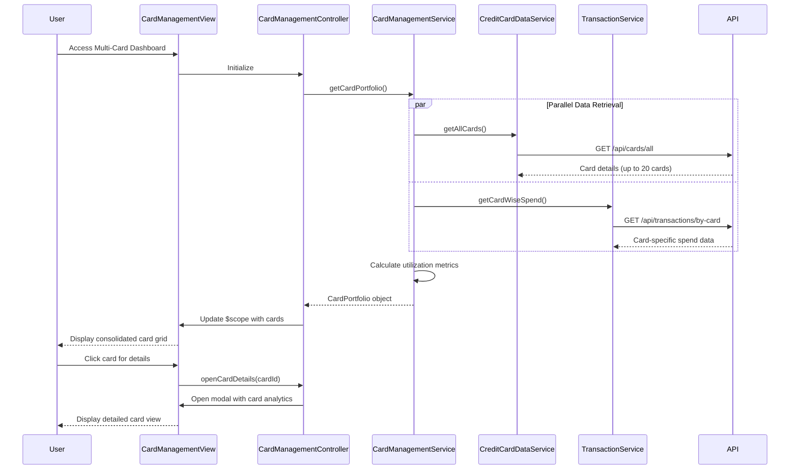

# Low-Level Design: Multi-Card Management Interface

**Epic ID:** QE-4325

## a. Architecture Mapping

- **Card Management Module** → AngularJS Module (`app.cardManagement`)
- **Card Management Controller** → AngularJS Controller (`CardManagementController`)
- **Card Management Service** → AngularJS Service (`CardManagementService`)
- **Card Comparison Component** → AngularJS Directive (`cardComparison`)
- **Card Details Modal** → AngularJS Directive (`cardDetailsModal`)

**Recommended Folder Structure:**
```
/app
  /card-management
    card-management.module.js
    card-management.controller.js
    card-management.service.js
    card-management.html
    /directives
      card-comparison.directive.js
      card-details-modal.directive.js
  /shared
    /services
      credit-card-data.service.js
      transaction.service.js
```

## b. Component Specifications

| Name | Artifact Type | Responsibility | Key Dependencies |
|------|---------------|----------------|------------------|
| CardManagementModule | Module | Registers multi-card management feature and routing | angular, ui.router |
| CardManagementController | Controller | Manages card list state, selection, and drill-down navigation | CardManagementService, $scope, $uibModal |
| CardManagementService | Service | Orchestrates card data retrieval, spend analysis aggregation, and utilization calculation | CreditCardDataService, TransactionService, $q |
| CreditCardDataService | Service | Fetches card information, balances, limits via REST API | $http |
| TransactionService | Service | Retrieves card-specific transaction data for spend analysis | $http |
| CardComparisonDirective | Directive | Renders side-by-side card comparison view with utilization metrics | None |
| CardDetailsModalDirective | Directive | Displays detailed card information in modal overlay | $uibModal |
| CardManagementView | Template | Displays consolidated card grid with Bootstrap cards and responsive layout | Bootstrap CSS |

## c. Data Model

**CreditCardSummary** (JavaScript Object)
- `cardId`: String
- `cardName`: String
- `cardNumber`: String (masked)
- `creditLimit`: Number
- `currentBalance`: Number
- `availableCredit`: Number
- `utilizationRate`: Number (percentage)
- `monthlySpend`: Number

**CardPortfolio** (JavaScript Object)
- `cards`: Array<CreditCardSummary>
- `totalCards`: Number
- `lastSyncTime`: Date

**CardSpendAnalysis** (JavaScript Object)
- `cardId`: String
- `currentMonthSpend`: Number
- `previousMonthSpend`: Number
- `topCategories`: Array<{category: String, amount: Number}>

## d. Data Flow

User accesses multi-card dashboard → CardManagementView loads and CardManagementController initializes → Controller calls CardManagementService.getCardPortfolio() → Service makes parallel $http calls to CreditCardDataService (for card details, limits, balances) and TransactionService (for card-specific spending) → Service calculates utilization rate (currentBalance/creditLimit * 100) for each card → CardPortfolio object with aggregated CreditCardSummary array is returned → Controller updates $scope with card list → View renders responsive Bootstrap card grid → User clicks card for details or comparison → Modal/comparison directive displays detailed analytics with drill-down capability.

## e. Primary Sequence Diagram



## f. Implementation Notes

- Use AngularJS $q.all() to fetch all card data within 3-second SLA requirement for synchronization
- Implement ng-repeat with track by cardId for efficient rendering of up to 20 cards without performance degradation
- Use Bootstrap card component with responsive grid (col-md-4 col-sm-6 col-xs-12) for optimal multi-device layout
- Apply ES6 map/filter/reduce for efficient card data transformation and utilization calculation
- Implement ui-bootstrap modal service for card details drill-down with lazy-loading of detailed analytics

## g. Error Handling

HTTP interceptor handles API failures with user notification; partial card data loads are supported with error indicators on failed cards.

## h. Security Notes

Requires token-based auth via existing SSO; card numbers are masked (last 4 digits only) in all views per PCI compliance.