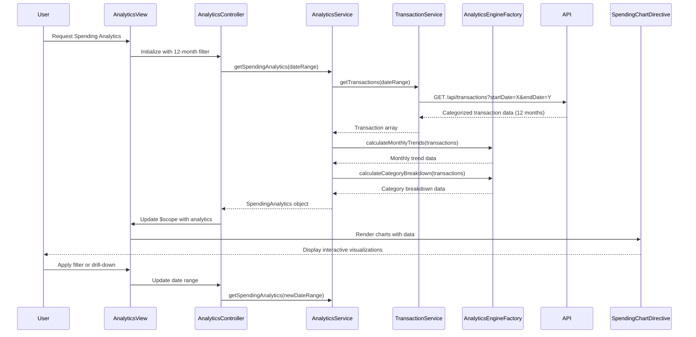

# Low-Level Design: Interactive Spending Analytics

**Epic ID:** QE-4326

## a. Architecture Mapping

- **Analytics Module** → AngularJS Module (`app.analytics`)
- **Analytics Controller** → AngularJS Controller (`AnalyticsController`)
- **Analytics Service** → AngularJS Service (`AnalyticsService`)
- **Chart Directive** → AngularJS Directive (`spendingChart`)
- **Analytics Engine** → AngularJS Factory (`AnalyticsEngineFactory`)

**Recommended Folder Structure:**
```
/app
  /analytics
    analytics.module.js
    analytics.controller.js
    analytics.service.js
    analytics.html
    /directives
      spending-chart.directive.js
  /shared
    /factories
      analytics-engine.factory.js
    /services
      transaction.service.js
```

## b. Component Specifications

| Name | Artifact Type | Responsibility | Key Dependencies |
|------|---------------|----------------|------------------|
| AnalyticsModule | Module | Registers analytics feature module and routing configuration | angular, ui.router, chart.js |
| AnalyticsController | Controller | Manages analytics view state, filter selections, and chart data binding | AnalyticsService, $scope, $filter |
| AnalyticsService | Service | Orchestrates transaction data retrieval and coordinates analytics processing | TransactionService, AnalyticsEngineFactory, $q |
| TransactionService | Service | Fetches categorized transaction data for 12-month history via REST API | $http |
| AnalyticsEngineFactory | Factory | Processes transaction data to calculate monthly trends and category totals | None |
| SpendingChartDirective | Directive | Renders interactive charts (line for trends, pie for categories) using Chart.js | chart.js |
| AnalyticsView | Template | Displays analytics dashboard with filters and chart containers using Bootstrap layout | Bootstrap CSS |

## c. Data Model

**SpendingAnalytics** (JavaScript Object)
- `monthlyTrends`: Array<{month: String, totalSpend: Number}>
- `categoryBreakdown`: Array<{category: String, amount: Number, percentage: Number}>
- `dateRange`: {startDate: Date, endDate: Date}
- `totalSpend`: Number

**Transaction** (JavaScript Object)
- `transactionId`: String
- `amount`: Number
- `date`: Date
- `category`: String (one of 9 predefined categories)
- `merchantName`: String

**CategoryEnum** (JavaScript Constant)
- Categories: ['Food & Dining', 'Fuel', 'Shopping', 'Travel', 'Entertainment', 'Utilities', 'Healthcare', 'Education', 'Miscellaneous']

## d. Data Flow

User requests spending analytics → AnalyticsView loads and AnalyticsController initializes with default 12-month filter → Controller calls AnalyticsService.getSpendingAnalytics(dateRange) → Service calls TransactionService via $http to fetch categorized transaction data from API → AnalyticsEngineFactory processes transactions to calculate monthly trends (group by month, sum amounts) and category breakdown (group by category, calculate totals and percentages) → SpendingAnalytics object is returned via promise → Controller updates $scope with analytics data → SpendingChartDirective renders interactive Chart.js visualizations (line chart for trends, pie chart for categories) → User interacts with filters or chart drill-down → Controller updates date range and re-fetches data.

## e. Primary Sequence Diagram



## f. Implementation Notes

- Use Chart.js library integrated via angular-chart.js directive for responsive and interactive visualizations
- Implement AnalyticsEngineFactory with ES6 reduce/map functions for efficient monthly trend and category aggregation
- Apply $http caching strategy for transaction data to meet 3-second rendering NFR and reduce API load
- Use AngularJS $filter service for date range filtering and category selection without re-fetching data
- Implement responsive chart containers using Bootstrap grid to ensure mobile/tablet/desktop compatibility

## g. Error Handling

HTTP interceptor captures API errors with user-friendly toast notifications; partial data rendering supported with loading indicators during async operations.

## h. Security Notes

Requires token-based auth via existing SSO; transaction data is filtered server-side to ensure user sees only their own data.