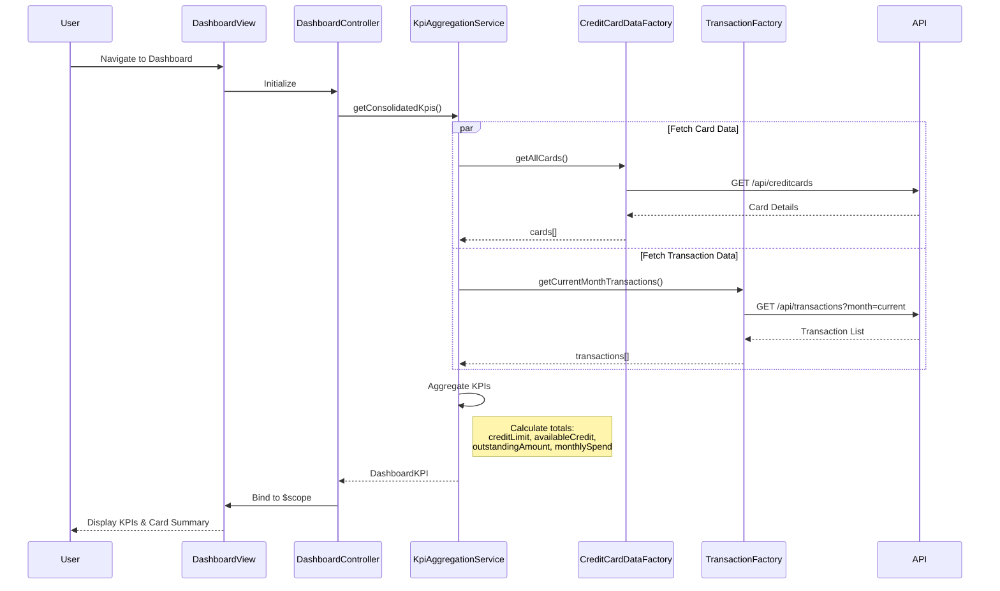

# Low-Level Design: Credit Card Analysis Dashboard

**Epic ID:** QE-4335

## a. Architecture Mapping

- **Dashboard Module** → AngularJS Module (`creditCardDashboardModule`)
- **Dashboard View** → HTML5 template with Bootstrap grid (`dashboard.html`)
- **Dashboard Controller** → AngularJS Controller (`DashboardController`)
- **KPI Aggregation Service** → AngularJS Service (`KpiAggregationService`)
- **Credit Card Data Service** → AngularJS Factory (`CreditCardDataFactory`)
- **Transaction Service** → AngularJS Factory (`TransactionFactory`)
- **KPI Display Components** → AngularJS Directives (`kpiCard`, `creditSummary`)

**Recommended Folder Structure:**
```
app/
├── modules/
│   └── dashboard/
│       ├── controllers/
│       │   └── dashboard.controller.js
│       ├── services/
│       │   ├── kpi-aggregation.service.js
│       │   ├── credit-card-data.factory.js
│       │   └── transaction.factory.js
│       ├── directives/
│       │   ├── kpi-card.directive.js
│       │   └── credit-summary.directive.js
│       ├── views/
│       │   └── dashboard.html
│       └── dashboard.module.js
```

## b. Component Specifications

| Component Name | Artifact Type | Responsibility | Key Dependencies |
|----------------|---------------|----------------|------------------|
| creditCardDashboardModule | Module | Root module for dashboard feature | ngRoute, ui.bootstrap |
| DashboardController | Controller | Orchestrates dashboard view and KPI display | KpiAggregationService, $scope |
| KpiAggregationService | Service | Aggregates KPIs from multiple data sources and calculates metrics | CreditCardDataFactory, TransactionFactory, $q |
| CreditCardDataFactory | Factory | Fetches credit card details, balances, limits from REST API | $http |
| TransactionFactory | Factory | Retrieves transaction data for monthly spend calculation | $http |
| kpiCard | Directive | Renders individual KPI metric card with value and label | None |
| creditSummary | Directive | Displays consolidated credit card summary table | None |

## c. Data Model

**CreditCard Model:**
```javascript
{
  cardId: String,
  cardNumber: String,
  cardType: String,
  creditLimit: Number,
  outstandingAmount: Number,
  availableCredit: Number
}
```

**Transaction Model:**
```javascript
{
  transactionId: String,
  cardId: String,
  amount: Number,
  transactionDate: Date,
  description: String
}
```

**DashboardKPI Model:**
```javascript
{
  totalCreditLimit: Number,
  totalAvailableCredit: Number,
  totalOutstandingAmount: Number,
  monthlySpend: Number,
  cards: Array<CreditCard>
}
```

## d. Data Flow

User navigates to dashboard → Dashboard view loads and DashboardController initializes → Controller calls KpiAggregationService.getConsolidatedKpis() → Service invokes CreditCardDataFactory.getAllCards() and TransactionFactory.getCurrentMonthTransactions() in parallel → API responses return card details and transaction data → Service aggregates total credit limit (sum of all card limits), calculates total available credit (sum of availableCredit per card), sums outstanding amounts, and computes monthly spend (sum of transaction amounts for current month) → Aggregated DashboardKPI object returned to controller → Controller binds data to $scope → View renders KPI cards via kpiCard directive and credit summary table via creditSummary directive → UI updates with consolidated metrics.

## e. Primary Sequence Diagram



## f. Implementation Notes

- Use AngularJS dependency injection to inject services and factories into controllers and services
- Leverage ES6 classes for service/factory definitions with arrow functions for cleaner promise handling
- Use $q.all() for parallel API calls to CreditCardDataFactory and TransactionFactory to meet 2-second load time NFR
- Implement Bootstrap responsive grid (col-xs, col-sm, col-md, col-lg) in dashboard.html for cross-device compatibility
- Use AngularJS $http interceptor for centralized API request/response handling and authentication token injection

## g. Error Handling

HTTP interceptor-based error handling with $q rejection, user-friendly error messages displayed via Bootstrap alert directive, and fallback to cached data if API calls fail.

## h. Security Notes

Requires token-based authentication via existing SSO; sensitive card data masked in UI (last 4 digits only); all API calls over HTTPS.