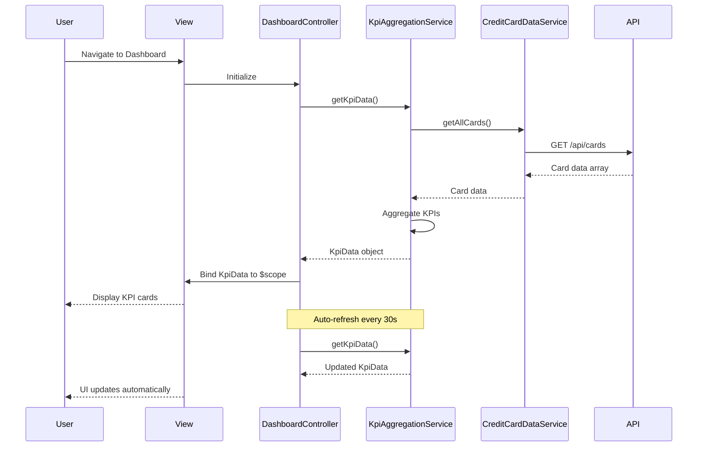

# Low-Level Design: QE-4363 - Dashboard and KPI Monitoring

## a. Architecture Mapping

**HLD Component → AngularJS Artifact:**
- User Interface → `dashboard.html` view + Bootstrap responsive grid
- Dashboard Controller → `DashboardController` (Controller)
- KPI Aggregation Service → `KpiAggregationService` (Service)
- Credit Card Data Service → `CreditCardDataService` (Service)
- Data Store → REST API endpoint integration via `$http`

**Recommended Folder Structure:**
```
app/
  dashboard/
    dashboard.module.js
    dashboard.controller.js
    dashboard.service.js
    dashboard.routes.js
    views/dashboard.html
  shared/
    services/creditCardData.service.js
    interceptors/
```

## b. Component Specifications

| Name | Artifact Type | Responsibility | Key Dependencies |
|------|---------------|----------------|------------------|
| DashboardController | Controller | Orchestrates KPI display, handles user interactions, binds data to view | KpiAggregationService, $scope, $interval |
| KpiAggregationService | Service | Aggregates monthly spend, total credit limit, available credit, outstanding amounts across all cards | CreditCardDataService, $q |
| CreditCardDataService | Service | Fetches card details, transaction data, and balance information from REST API or mock service | $http, $q |
| dashboard.html | View | Renders KPI cards in responsive Bootstrap grid layout with real-time data binding | Bootstrap CSS, AngularJS directives |
| dashboardRefresh | Directive | Auto-refreshes KPI data at configurable intervals for near real-time updates | $interval, KpiAggregationService |

## c. Data Model

```js
KpiData = {
  monthlySpend: Number,
  totalCreditLimit: Number,
  availableCredit: Number,
  outstandingAmount: Number,
  lastUpdated: Date
}

CreditCard = {
  cardId: String,
  cardNumber: String,
  balance: Number,
  creditLimit: Number,
  availableCredit: Number,
  monthlySpend: Number
}
```

## d. Data Flow

User navigates to dashboard view → `dashboard.html` loads and instantiates `DashboardController` → Controller invokes `KpiAggregationService.getKpiData()` → Service calls `CreditCardDataService.getAllCards()` to fetch card data via REST API → Service aggregates KPI metrics (sum of monthly spend, total credit limit, available credit, outstanding amounts) → Aggregated data returned to Controller → Controller binds KPI data to `$scope` → View renders KPI cards with two-way data binding → `dashboardRefresh` directive polls `KpiAggregationService` every 30 seconds to refresh KPIs → UI updates automatically via Angular digest cycle.

## e. Primary Sequence Diagram



## f. Implementation Notes

- Use constructor injection with `$inject` array annotation for minification-safe DI: `DashboardController.$inject = ['$scope', 'KpiAggregationService', '$interval']`
- Centralize all REST API calls in `CreditCardDataService` using `$http`; Controllers never call API directly
- Implement auto-refresh using `$interval` service with 30-second polling interval, cancel on `$scope.$on('$destroy')` to prevent memory leaks
- Use Bootstrap responsive grid (`col-xs-*`, `col-md-*`) for cross-device KPI card layout (desktop, tablet, mobile)
- Leverage `$q.all()` in `KpiAggregationService` if multiple parallel API calls are needed for aggregation

## g. Error Handling

HTTP interceptor captures API errors, displays user-friendly toast notifications via shared notification service, and logs errors to console.

## h. Security Notes

Requires token-based authentication via existing SSO; all API requests include Authorization header with bearer token.