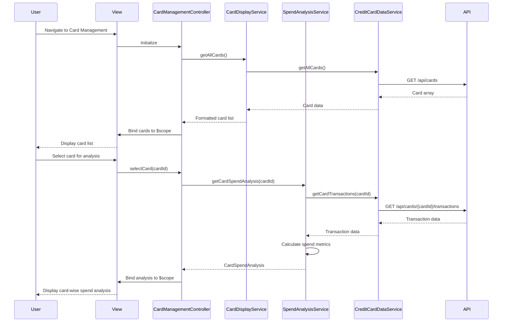

# Low-Level Design: QE-4364 - Credit Card Management and Visualization

## a. Architecture Mapping

**HLD Component → AngularJS Artifact:**
- User Interface → `cardManagement.html` view + Bootstrap card components
- Card Management Controller → `CardManagementController` (Controller)
- Card Display Service → `CardDisplayService` (Service)
- Spend Analysis Service → `SpendAnalysisService` (Service)
- Card Data Provider → `CreditCardDataService` (Service, shared)

**Recommended Folder Structure:**
```
app/
  cardManagement/
    cardManagement.module.js
    cardManagement.controller.js
    cardDisplay.service.js
    spendAnalysis.service.js
    cardManagement.routes.js
    views/cardManagement.html
  shared/
    services/creditCardData.service.js
    directives/cardItem.directive.js
```

## b. Component Specifications

| Name | Artifact Type | Responsibility | Key Dependencies |
|------|---------------|----------------|------------------|
| CardManagementController | Controller | Manages card list display, handles card selection/filtering, coordinates spend analysis | CardDisplayService, SpendAnalysisService, $scope |
| CardDisplayService | Service | Retrieves and formats card data for display, applies filters, manages card metadata | CreditCardDataService, $q |
| SpendAnalysisService | Service | Calculates card-wise spend metrics, provides per-card spending breakdown | CreditCardDataService, $q |
| CreditCardDataService | Service | Fetches card information, branding, and transaction data from REST API or mock service | $http, $q |
| cardItem | Directive | Reusable card display component showing card details, branding, and spend summary | None |
| cardManagement.html | View | Renders consolidated card list with filtering controls and card-wise spend analysis | Bootstrap, cardItem directive |

## c. Data Model

```js
CreditCard = {
  cardId: String,
  cardNumber: String,
  cardType: String,
  issuerBrand: String,
  lastFourDigits: String,
  balance: Number,
  creditLimit: Number,
  availableCredit: Number,
  monthlySpend: Number,
  active: Boolean
}

CardSpendAnalysis = {
  cardId: String,
  totalSpend: Number,
  monthlySpend: Number,
  utilizationPercent: Number,
  transactionCount: Number
}
```

## d. Data Flow

User navigates to card management view → `cardManagement.html` loads and instantiates `CardManagementController` → Controller calls `CardDisplayService.getAllCards()` → Service invokes `CreditCardDataService.getAllCards()` to fetch card data via REST API → Card data returned to Controller and bound to `$scope.cards` → View renders card list using `cardItem` directive for each card → User selects a card → Controller calls `SpendAnalysisService.getCardSpendAnalysis(cardId)` → Service retrieves card-specific transaction data from `CreditCardDataService` and calculates spend metrics → Analysis data returned to Controller → Controller binds analysis to `$scope.selectedCardAnalysis` → View updates to display card-wise spend breakdown.

## e. Primary Sequence Diagram



## f. Implementation Notes

- Use `$inject` array annotation for all Controllers and Services to ensure minification safety
- Implement `cardItem` directive with isolated scope (`scope: { card: '=' }`) for reusable card display component
- Use `ng-repeat` with `track by cardId` for efficient rendering of card list with large datasets
- Apply client-side filtering using Angular filters (`| filter: searchText`) for card selection/filtering
- Cache card list in `CardDisplayService` using a Factory singleton pattern to avoid redundant API calls across views

## g. Error Handling

HTTP interceptor handles API failures; user-friendly error messages displayed via toast notifications for failed card data retrieval.

## h. Security Notes

Standard input validation and secure API calls assumed; card numbers masked to show last four digits only.