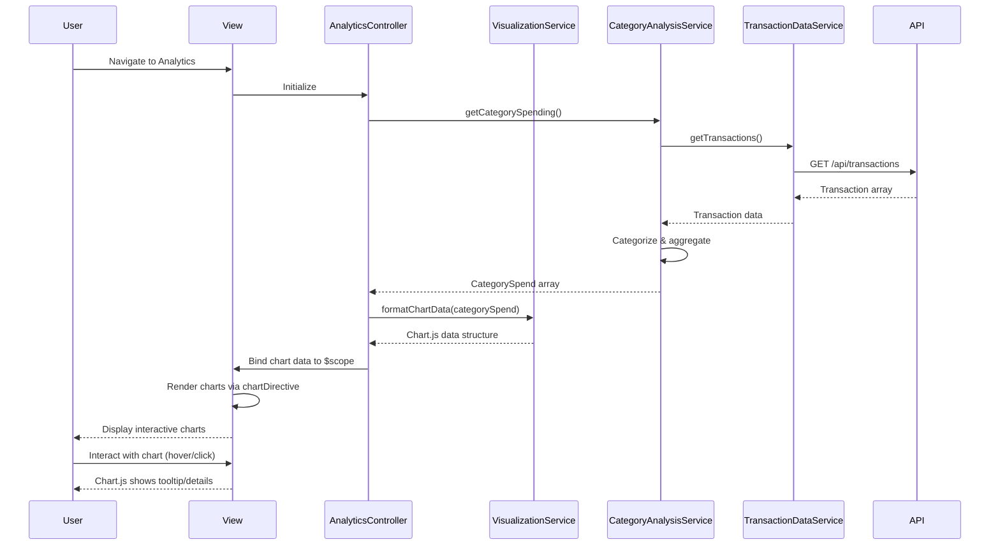

# Low-Level Design: QE-4365 - Spending Analytics and Insights

## a. Architecture Mapping

**HLD Component → AngularJS Artifact:**
- User Interface → `analytics.html` view + charting directives
- Analytics Controller → `AnalyticsController` (Controller)
- Visualization Engine → `VisualizationService` (Service) + Chart.js integration
- Category Analysis Service → `CategoryAnalysisService` (Service)
- Transaction Data Service → `TransactionDataService` (Service)
- Charting Library → Chart.js (external library wrapped in AngularJS directive)

**Recommended Folder Structure:**
```
app/
  analytics/
    analytics.module.js
    analytics.controller.js
    visualization.service.js
    categoryAnalysis.service.js
    analytics.routes.js
    views/analytics.html
  shared/
    services/transactionData.service.js
    directives/chartDirective.js
```

## b. Component Specifications

| Name | Artifact Type | Responsibility | Key Dependencies |
|------|---------------|----------------|------------------|
| AnalyticsController | Controller | Orchestrates analytics display, handles user interactions with charts, manages date range selection | VisualizationService, CategoryAnalysisService, $scope |
| VisualizationService | Service | Prepares chart data structures, configures Chart.js options, formats data for monthly spend trends | CategoryAnalysisService, $q |
| CategoryAnalysisService | Service | Categorizes transactions into 9 predefined categories, calculates category-wise spending totals | TransactionDataService, $q |
| TransactionDataService | Service | Fetches categorized transaction history from REST API or mock data provider | $http, $q |
| chartDirective | Directive | Wraps Chart.js library, renders interactive charts (line, bar, pie) with responsive behavior | Chart.js library |
| analytics.html | View | Renders monthly spend trends and category-wise spending charts with interactive controls | Bootstrap, chartDirective |

## c. Data Model

```js
Transaction = {
  transactionId: String,
  cardId: String,
  amount: Number,
  category: String,
  merchantName: String,
  transactionDate: Date,
  description: String
}

MonthlySpendTrend = {
  month: String,
  totalSpend: Number
}

CategorySpend = {
  category: String,
  totalSpend: Number,
  transactionCount: Number,
  percentage: Number
}

Categories = ['Food & Dining', 'Fuel', 'Shopping', 'Travel', 'Entertainment', 'Utilities', 'Healthcare', 'Education', 'Miscellaneous']
```

## d. Data Flow

User navigates to analytics view → `analytics.html` loads and instantiates `AnalyticsController` → Controller calls `VisualizationService.getMonthlySpendTrends()` and `CategoryAnalysisService.getCategorySpending()` → `CategoryAnalysisService` invokes `TransactionDataService.getTransactions()` to fetch transaction history via REST API → Service categorizes transactions into 9 predefined categories and calculates totals → `VisualizationService` formats data into Chart.js-compatible structures (labels, datasets) → Data returned to Controller and bound to `$scope` → View renders charts using `chartDirective` which initializes Chart.js with provided data → User interacts with charts (hover, click) → Chart.js handles interactivity natively → Controller updates date range filter → Services re-fetch and re-calculate data → Charts update via Angular digest cycle.

## e. Primary Sequence Diagram



## f. Implementation Notes

- Use `$inject` annotation for DI: `AnalyticsController.$inject = ['$scope', 'VisualizationService', 'CategoryAnalysisService']`
- Wrap Chart.js in a custom directive (`chartDirective`) with isolated scope to encapsulate chart rendering logic and enable reusability
- Use ES6 `Array.reduce()` and `Array.filter()` in `CategoryAnalysisService` for efficient transaction categorization and aggregation
- Implement client-side caching in `TransactionDataService` to avoid redundant API calls when switching between chart views
- Use `$q.all()` to parallelize fetching monthly trends and category spending data for faster initial load

## g. Error Handling

HTTP interceptor captures API errors; fallback to empty chart state with user notification via toast message on transaction data fetch failure.

## h. Security Notes

Standard input validation and secure API calls assumed; transaction data filtered by authenticated user context on server side.