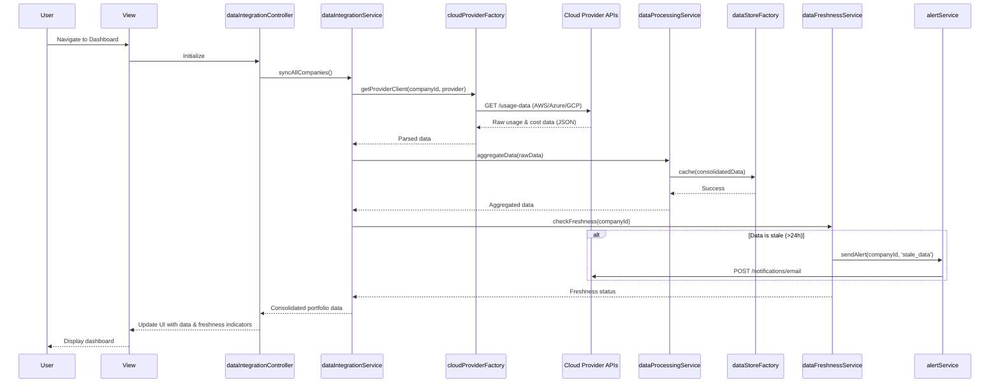

# Low-Level Design: QE-4366 - Data Integration and Real-Time Aggregation

## a. Architecture Mapping

**Component to Artifact Mapping:**
- API Integration Layer → `dataIntegrationService` (Service) + `cloudProviderFactory` (Factory)
- Data Processing Pipeline → `dataProcessingService` (Service)
- Data Freshness Monitor → `dataFreshnessService` (Service) + `freshnessDirective` (Directive)
- Alert Service → `alertService` (Service)
- Consolidated Data Store → `dataStoreFactory` (Factory, singleton cache)
- Data Integration Dashboard → `dataIntegrationController` (Controller) + `views/data-integration.html` (View)
- API Configuration → `apiConfigService` (Service)

**Folder Structure:**
```
app/
  dataIntegration/
    dataIntegration.module.js
    dataIntegration.controller.js
    dataIntegration.service.js
    cloudProvider.factory.js
    dataProcessing.service.js
    dataFreshness.service.js
    alert.service.js
    dataStore.factory.js
    apiConfig.service.js
    dataIntegration.routes.js
    views/data-integration.html
    directives/freshness-indicator.directive.js
  shared/
    services/
    interceptors/http-error.interceptor.js
```

## b. Component Specifications

| Component Name | Artifact Type | Responsibility | Key Dependencies |
|---|---|---|---|
| dataIntegrationModule | Module | Groups data integration features | angular, ui-router |
| dataIntegrationController | Controller | Manages dashboard UI state and user interactions | dataIntegrationService, alertService, $scope |
| dataIntegrationService | Service | Orchestrates data collection from cloud providers | cloudProviderFactory, dataProcessingService, $http, $q |
| cloudProviderFactory | Factory | Singleton managing AWS/Azure/GCP API clients and credentials | $http, apiConfigService |
| dataProcessingService | Service | Aggregates and transforms raw cloud provider data | dataStoreFactory, $q |
| dataFreshnessService | Service | Monitors data age and triggers alerts for stale data (>24h) | dataStoreFactory, alertService, $interval |
| alertService | Service | Sends notifications for missing/outdated data | $http (email API), $rootScope |
| dataStoreFactory | Factory | Centralized cache for consolidated portfolio data | $cacheFactory |
| apiConfigService | Service | Manages cloud provider API endpoints and credentials | $http |
| freshnessIndicator | Directive | Visual indicator showing data freshness status | dataFreshnessService |
| httpErrorInterceptor | Interceptor | Handles API failures and retry logic | $q, $injector |

## c. Data Model

```js
CloudProviderConfig = {
  id: String,
  provider: String, // 'AWS' | 'Azure' | 'GCP'
  companyId: String,
  apiKey: String,
  apiSecret: String,
  region: String,
  lastSyncTimestamp: Date,
  active: Boolean
}

AIUsageData = {
  id: String,
  companyId: String,
  provider: String,
  serviceName: String,
  usageMetrics: Object, // { requests: Number, computeHours: Number, ... }
  cost: Number,
  currency: String,
  timestamp: Date,
  dataFreshness: String // 'fresh' | 'stale' | 'missing'
}

ConsolidatedPortfolioData = {
  portfolioId: String,
  companies: Array<CompanySummary>,
  totalCost: Number,
  lastUpdated: Date,
  freshnessStatus: Object // { fresh: Number, stale: Number, missing: Number }
}

CompanySummary = {
  companyId: String,
  companyName: String,
  providers: Array<String>,
  totalCost: Number,
  lastSyncTimestamp: Date,
  dataFreshness: String
}

Alert = {
  id: String,
  type: String, // 'stale_data' | 'missing_data' | 'api_error'
  companyId: String,
  message: String,
  timestamp: Date,
  resolved: Boolean
}
```

## d. Data Flow

User navigates to Data Integration Dashboard → View loads and `dataIntegrationController` initializes → Controller calls `dataIntegrationService.syncAllCompanies()` → Service retrieves API configs via `apiConfigService` and iterates through portfolio companies → For each company, `cloudProviderFactory` creates provider-specific API client and fetches usage/cost data from AWS/Azure/GCP REST APIs → Raw data is passed to `dataProcessingService` for aggregation and transformation → Processed data is stored in `dataStoreFactory` cache → `dataFreshnessService` checks timestamps and updates freshness status → If data is stale (>24h) or missing, `alertService` sends notification via email API → Controller receives consolidated data and updates View with portfolio-wide summary, freshness indicators (via `freshnessIndicator` directive), and alert badges → User can drill down into individual company details, triggering additional Service calls for granular data.

## e. Primary Sequence Diagram



## f. Implementation Notes

- Use constructor injection with `$inject` array annotation for all Controllers/Services to ensure minification safety
- All API calls centralized in Services (`dataIntegrationService`, `cloudProviderFactory`); Controllers never call `$http` directly
- Leverage ES6: arrow functions for callbacks, `const`/`let` for variables, template literals for string interpolation, Promise chaining with `$q`
- Implement `httpErrorInterceptor` with exponential backoff retry logic for transient API failures (rate limits, timeouts)
- Use `$interval` in `dataFreshnessService` to periodically check data age (every 15 minutes) and trigger alerts for stale data

## g. Error Handling

Centralized `$http` interceptor catches API failures (rate limits, auth errors, network issues), implements retry logic with exponential backoff, and surfaces user-facing errors via `alertService` with actionable messages.

## h. Security Notes

Requires token-based authentication via existing SSO; cloud provider API credentials encrypted at rest (AES-256) and in transit (TLS 1.2+); all API calls include auth tokens from `apiConfigService`.