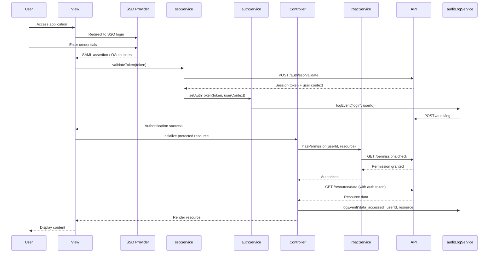

# Low-Level Design: QE-4367 - Security, Access Control, and User Management

## a. Architecture Mapping

**Component to Artifact Mapping:**
- Authentication Service → `authService` (Service) + `authInterceptor` (Interceptor)
- SSO Provider Integration → `ssoService` (Service)
- RBAC Engine → `rbacService` (Service) + `permissionDirective` (Directive)
- Audit Logger → `auditLogService` (Service) + `auditInterceptor` (Interceptor)
- User Management → `userManagementController` (Controller) + `views/user-management.html` (View)
- Permission Assignment → `permissionService` (Service)
- User Lockout/Recovery → `accountRecoveryService` (Service)

**Folder Structure:**
```
app/
  security/
    security.module.js
    auth.service.js
    sso.service.js
    rbac.service.js
    permission.service.js
    accountRecovery.service.js
    auditLog.service.js
    security.routes.js
  userManagement/
    userManagement.module.js
    userManagement.controller.js
    views/user-management.html
  shared/
    interceptors/auth.interceptor.js
    interceptors/audit.interceptor.js
    directives/permission.directive.js
```

## b. Component Specifications

| Component Name | Artifact Type | Responsibility | Key Dependencies |
|---|---|---|---|
| securityModule | Module | Groups security and access control features | angular, ui-router |
| authService | Service | Manages user authentication state and SSO token lifecycle | ssoService, $http, $window |
| ssoService | Service | Integrates with external SSO provider (SAML 2.0/OAuth 2.0) | $http, $q |
| rbacService | Service | Evaluates user permissions based on role and company assignments | $http, $q, $cacheFactory |
| permissionService | Service | Assigns and revokes user permissions by company and role | $http, rbacService |
| auditLogService | Service | Logs all access attempts and security events to audit infrastructure | $http |
| accountRecoveryService | Service | Handles user lockout detection and recovery email workflows | $http, $timeout |
| userManagementController | Controller | Manages Enterprise Admin UI for user/permission management | permissionService, rbacService, $scope |
| authInterceptor | Interceptor | Attaches auth tokens to outgoing requests and handles 401/403 responses | authService, $q, $injector |
| auditInterceptor | Interceptor | Logs all HTTP requests/responses for compliance audit trail | auditLogService, $q |
| permissionDirective | Directive | Shows/hides UI elements based on user permissions (e.g., `app-has-permission="admin"`) | rbacService |

## c. Data Model

```js
User = {
  id: String,
  email: String,
  displayName: String,
  roles: Array<String>, // ['Operating_Partner', 'Deal_Partner', 'Enterprise_Admin', 'General_Partner']
  companyAccess: Array<String>, // Array of companyIds user can access
  active: Boolean,
  lockedOut: Boolean,
  lastLoginTimestamp: Date,
  ssoProviderId: String
}

Role = {
  id: String,
  name: String, // 'Operating_Partner' | 'Deal_Partner' | 'Enterprise_Admin' | 'General_Partner'
  permissions: Array<String>, // ['read:dashboard', 'write:reports', 'admin:users', ...]
  description: String
}

Permission = {
  id: String,
  userId: String,
  companyId: String,
  role: String,
  grantedBy: String, // userId of admin who granted permission
  grantedAt: Date,
  active: Boolean
}

AuditLogEntry = {
  id: String,
  userId: String,
  action: String, // 'login', 'logout', 'access_denied', 'permission_granted', 'data_accessed', ...
  resource: String, // URL or resource identifier
  timestamp: Date,
  ipAddress: String,
  userAgent: String,
  success: Boolean,
  metadata: Object
}

AuthToken = {
  accessToken: String,
  refreshToken: String,
  expiresAt: Date,
  userId: String,
  roles: Array<String>
}
```

## d. Data Flow

User attempts to access application → View redirects to SSO login page → User authenticates with SSO provider (Okta/Azure AD) → SSO provider redirects back with SAML assertion/OAuth token → `ssoService` validates token and exchanges it for application session token via backend API → `authService` stores token in `$window.sessionStorage` and sets user context → `authInterceptor` attaches token to all subsequent API requests → User navigates to protected resource → `rbacService` checks user roles and company access against required permissions → If authorized, Controller loads resource data via Service → `auditInterceptor` logs request/response to `auditLogService` → Service returns data and Controller updates View → If unauthorized (403), `authInterceptor` redirects to access-denied page and `auditLogService` logs failed access attempt → Enterprise Admin can assign/revoke permissions via `userManagementController`, which calls `permissionService` to update user permissions and logs action via `auditLogService`.

## e. Primary Sequence Diagram



## f. Implementation Notes

- Use `$inject` array annotation for all Services/Controllers to ensure minification safety
- Store auth tokens in `$window.sessionStorage` (not `localStorage`) to limit session lifetime to browser tab
- `authInterceptor` automatically refreshes expired tokens using refresh token before retrying failed requests
- `rbacService` caches permission checks in `$cacheFactory` (5-minute TTL) to reduce API calls while maintaining security
- `permissionDirective` uses `ng-if` internally to remove unauthorized elements from DOM (not just hide with CSS) for security

## g. Error Handling

Centralized `authInterceptor` catches 401 (unauthorized) and 403 (forbidden) responses, redirects to SSO login or access-denied page, and logs all failures via `auditLogService` for security monitoring.

## h. Security Notes

Requires token-based auth via existing SSO (SAML 2.0/OAuth 2.0); all data encrypted in transit (TLS 1.2+) and at rest (AES-256); mandatory RBAC checks on all protected resources; comprehensive audit logging of access attempts.