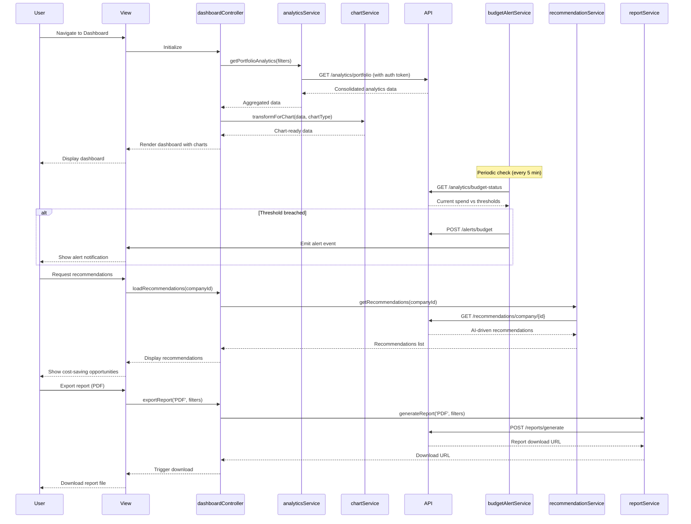

# Low-Level Design: QE-4368 - Analytics, Reporting, and Actionable Insights

## a. Architecture Mapping

**Component to Artifact Mapping:**
- Analytics Engine → `analyticsService` (Service)
- Visualization Service → `chartService` (Service) + `chartDirective` (Directive)
- Alert Service → `budgetAlertService` (Service)
- Report Generator → `reportService` (Service)
- Benchmarking Service → `benchmarkingService` (Service)
- User Dashboard → `dashboardController` (Controller) + `views/dashboard.html` (View)
- Customizable Widgets → `widgetFactory` (Factory) + `widgetDirective` (Directive)
- Drill-Down Analytics → `drillDownController` (Controller) + `views/drill-down.html` (View)
- Cost Optimization Recommendations → `recommendationService` (Service)
- Cost Savings Simulation → `simulationService` (Service)

**Folder Structure:**
```
app/
  analytics/
    analytics.module.js
    analytics.service.js
    chart.service.js
    budgetAlert.service.js
    report.service.js
    benchmarking.service.js
    recommendation.service.js
    simulation.service.js
    analytics.routes.js
  dashboard/
    dashboard.module.js
    dashboard.controller.js
    drillDown.controller.js
    widget.factory.js
    views/dashboard.html
    views/drill-down.html
    directives/chart.directive.js
    directives/widget.directive.js
  shared/
    services/
    directives/
```

## b. Component Specifications

| Component Name | Artifact Type | Responsibility | Key Dependencies |
|---|---|---|---|
| analyticsModule | Module | Groups analytics and reporting features | angular, ui-router |
| dashboardController | Controller | Manages dashboard UI state, widget configuration, and user interactions | analyticsService, chartService, widgetFactory, $scope |
| drillDownController | Controller | Manages drill-down views by company/department/project | analyticsService, chartService, $routeParams, $scope |
| analyticsService | Service | Aggregates and analyzes AI usage/spend data from consolidated data store | $http, $q, $cacheFactory |
| chartService | Service | Transforms analytics data into chart-ready formats (line, bar, pie) | $q |
| budgetAlertService | Service | Monitors spend against thresholds and triggers alerts within 5 minutes | $http, $interval, $rootScope |
| reportService | Service | Generates PDF/Excel reports from analytics data | $http, $q |
| benchmarkingService | Service | Retrieves industry benchmarks and compares portfolio company performance | $http, $q |
| recommendationService | Service | Analyzes usage patterns and generates AI-driven cost optimization recommendations | $http, $q |
| simulationService | Service | Models cost savings scenarios based on proposed changes | $q |
| widgetFactory | Factory | Creates and manages customizable dashboard widget instances | $cacheFactory |
| chartDirective | Directive | Renders interactive charts using D3.js or Chart.js | chartService |
| widgetDirective | Directive | Renders customizable dashboard widgets with drag-and-drop support | widgetFactory |

## c. Data Model

```js
DashboardConfig = {
  userId: String,
  widgets: Array<Widget>,
  layout: Object, // { columns: Number, rows: Number }
  filters: Object, // { companyIds: Array<String>, dateRange: Object, ... }
  lastModified: Date
}

Widget = {
  id: String,
  type: String, // 'chart' | 'metric' | 'alert' | 'recommendation'
  title: String,
  dataSource: String, // API endpoint or data key
  config: Object, // Widget-specific configuration (chart type, metrics, etc.)
  position: Object, // { x: Number, y: Number, width: Number, height: Number }
  refreshInterval: Number // Seconds
}

AnalyticsData = {
  companyId: String,
  companyName: String,
  totalSpend: Number,
  spendByProvider: Object, // { AWS: Number, Azure: Number, GCP: Number }
  spendByService: Array<ServiceSpend>,
  spendByDepartment: Array<DepartmentSpend>,
  spendByProject: Array<ProjectSpend>,
  trend: Array<TrendPoint>, // Time-series data
  budgetThreshold: Number,
  budgetUtilization: Number, // Percentage
  dataFreshness: String
}

ServiceSpend = {
  serviceName: String,
  provider: String,
  cost: Number,
  usage: Object,
  trend: String // 'increasing' | 'decreasing' | 'stable'
}

Benchmark = {
  companyId: String,
  metric: String, // 'spend_per_employee', 'ai_adoption_rate', ...
  value: Number,
  industryAverage: Number,
  portfolioAverage: Number,
  percentile: Number
}

Recommendation = {
  id: String,
  companyId: String,
  type: String, // 'underutilized_resource' | 'redundant_service' | 'pricing_optimization'
  title: String,
  description: String,
  estimatedSavings: Number,
  confidence: Number, // 0-1
  priority: String, // 'high' | 'medium' | 'low'
  createdAt: Date
}

BudgetAlert = {
  id: String,
  companyId: String,
  threshold: Number,
  currentSpend: Number,
  percentageUsed: Number,
  alertType: String, // 'warning' | 'critical'
  timestamp: Date,
  acknowledged: Boolean
}

Report = {
  id: String,
  title: String,
  type: String, // 'executive_summary' | 'detailed_analytics' | 'benchmark_report'
  format: String, // 'PDF' | 'Excel'
  filters: Object,
  generatedAt: Date,
  downloadUrl: String
}
```

## d. Data Flow

User navigates to Analytics Dashboard → View loads and `dashboardController` initializes → Controller retrieves user's dashboard configuration from `widgetFactory` and calls `analyticsService.getPortfolioAnalytics()` → Service fetches consolidated data from backend API (sourced from Epic QE-4366 data store) with user's company access permissions (from Epic QE-4367 RBAC) → `analyticsService` aggregates data and returns to Controller → Controller passes data to `chartService` for transformation into chart-ready format → `chartDirective` renders interactive visualizations in dashboard widgets → `budgetAlertService` runs periodic checks (every 5 minutes via `$interval`) comparing current spend against configured thresholds → If threshold breached, `budgetAlertService` triggers alert notification via backend API and updates UI with alert badge → User clicks drill-down link → `drillDownController` loads detailed analytics for specific company/department/project via `analyticsService` → User requests cost optimization recommendations → Controller calls `recommendationService.getRecommendations(companyId)` → Service analyzes usage patterns and returns AI-driven recommendations → User exports report → Controller calls `reportService.generateReport(format, filters)` → Service sends request to backend report generation API and returns download URL within 10 seconds → Controller triggers browser download.

## e. Primary Sequence Diagram



## f. Implementation Notes

- Use `$inject` array annotation for all Controllers/Services to ensure minification safety
- All API calls centralized in Services; Controllers never call `$http` directly
- Leverage ES6: arrow functions, `const`/`let`, template literals, Promise chaining with `$q.all()` for parallel data fetching
- `analyticsService` caches portfolio-wide data in `$cacheFactory` (3-minute TTL) to meet 3-second load time NFR
- `budgetAlertService` uses `$interval` for periodic threshold checks (every 5 minutes) to meet 5-minute alert NFR; alerts deduplicated to prevent spam

## g. Error Handling

Centralized `$http` interceptor catches API failures (timeouts, 500 errors), implements retry logic for transient failures, and surfaces user-facing errors via shared notification service with actionable messages.

## h. Security Notes

Requires token-based authentication via existing SSO; all API calls include auth tokens; RBAC enforced on analytics data access (users see only companies they have permission to access); data encrypted in transit (TLS 1.2+).