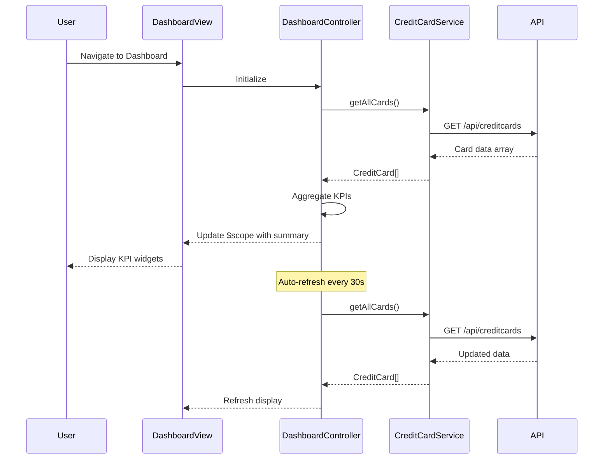

# Low-Level Design: Credit Card Analysis Dashboard

**Epic ID:** QE-4369

## a. Architecture Mapping

- **Dashboard Module** → AngularJS Module (`creditCardDashboard`)
- **Dashboard View** → HTML5 template with Bootstrap grid (`dashboard.html`)
- **Dashboard Controller** → AngularJS Controller (`DashboardController`)
- **Credit Card Service** → AngularJS Service (`CreditCardService`) - handles API calls for card data
- **Authentication Service** → AngularJS Service (`AuthService`) - manages user session
- **KPI Calculation** → Controller logic with real-time data binding

**Folder Structure:**
```
/app
  /modules
    /dashboard
      dashboard.module.js
      dashboard.controller.js
      dashboard.html
  /services
    creditCard.service.js
    auth.service.js
  /models
    creditCard.model.js
```

## b. Component Specifications

| Name | Artifact Type | Responsibility | Key Dependencies |
|------|---------------|----------------|------------------|
| creditCardDashboard | Module | Root module for dashboard feature | ngRoute, ui.bootstrap |
| DashboardController | Controller | Manages dashboard state, aggregates KPIs, handles refresh | CreditCardService, AuthService, $scope |
| CreditCardService | Service | Fetches credit card data via REST API, caches results | $http, $q |
| AuthService | Service | Validates user session, provides auth tokens | $http, $window |
| kpiWidget | Directive | Renders individual KPI card with value and label | None |
| dashboard.html | View | Responsive layout with Bootstrap grid for KPI display | Bootstrap CSS |

## c. Data Model

**CreditCard Model:**
```javascript
{
  cardId: String,
  cardNumber: String (masked),
  cardType: String,
  creditLimit: Number,
  availableCredit: Number,
  outstandingAmount: Number,
  monthlySpend: Number,
  lastUpdated: Date
}
```

**DashboardSummary Model:**
```javascript
{
  totalCreditLimit: Number,
  totalAvailableCredit: Number,
  totalOutstanding: Number,
  totalMonthlySpend: Number,
  cards: Array<CreditCard>
}
```

## d. Data Flow

User navigates to dashboard → DashboardController initializes and calls AuthService to validate session → Upon successful auth, controller invokes CreditCardService.getAllCards() → Service makes REST API call to /api/creditcards → Response data is mapped to CreditCard models → Controller aggregates KPIs (sum of limits, available credit, outstanding, monthly spend) → Data is bound to $scope → View renders KPI widgets using Bootstrap responsive grid → Auto-refresh timer triggers service call every 30 seconds to update data without page reload.

## e. Primary Sequence Diagram



## f. Implementation Notes

- Use AngularJS Dependency Injection to inject CreditCardService and AuthService into DashboardController
- Implement $http interceptor for adding auth tokens to all API requests
- Use $interval service for 30-second auto-refresh with cleanup on $scope.$destroy
- Apply Bootstrap responsive classes (col-xs-*, col-sm-*, col-md-*, col-lg-*) for mobile-first layout
- Cache API responses in CreditCardService using $cacheFactory with 30-second TTL to optimize performance

## g. Error Handling

HTTP interceptor captures API errors, displays user-friendly notifications via Bootstrap alerts, and logs errors to console.

## h. Security Notes

Requires token-based auth via existing SSO; AuthService manages token lifecycle and automatic refresh.