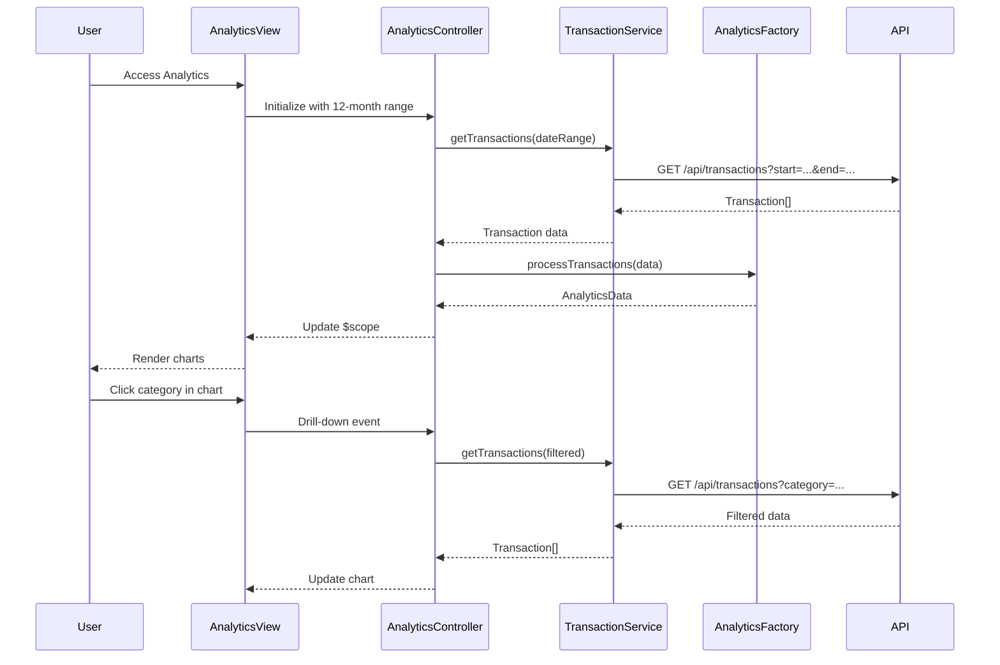

# Low-Level Design: Interactive Analytics

**Epic ID:** QE-4370

## a. Architecture Mapping

- **Analytics Module** → AngularJS Module (`creditCardAnalytics`)
- **Analytics View** → HTML5 template with chart containers (`analytics.html`)
- **Analytics Controller** → AngularJS Controller (`AnalyticsController`)
- **Transaction Service** → AngularJS Service (`TransactionService`) - fetches transaction data
- **Analytics Engine** → AngularJS Factory (`AnalyticsFactory`) - aggregates and processes data
- **Chart Directives** → Custom directives wrapping Chart.js (`trendChart`, `categoryChart`, `cardComparisonChart`)

**Folder Structure:**
```
/app
  /modules
    /analytics
      analytics.module.js
      analytics.controller.js
      analytics.html
  /services
    transaction.service.js
  /factories
    analytics.factory.js
  /directives
    trendChart.directive.js
    categoryChart.directive.js
    cardComparisonChart.directive.js
```

## b. Component Specifications

| Name | Artifact Type | Responsibility | Key Dependencies |
|------|---------------|----------------|------------------|
| creditCardAnalytics | Module | Root module for analytics feature | ngRoute, chart.js |
| AnalyticsController | Controller | Manages analytics state, handles date range selection, triggers data refresh | TransactionService, AnalyticsFactory, $scope |
| TransactionService | Service | Fetches transaction history via REST API with date filters | $http, $q |
| AnalyticsFactory | Factory | Aggregates transactions by month/category/card, formats data for charts | None |
| trendChart | Directive | Renders line chart for monthly spend trends with drill-down | Chart.js |
| categoryChart | Directive | Renders pie/bar chart for category-wise spending | Chart.js |
| cardComparisonChart | Directive | Renders bar chart comparing spend across cards | Chart.js |

## c. Data Model

**Transaction Model:**
```javascript
{
  transactionId: String,
  cardId: String,
  amount: Number,
  date: Date,
  merchant: String,
  category: String
}
```

**AnalyticsData Model:**
```javascript
{
  monthlyTrends: Array<{month: String, amount: Number}>,
  categoryBreakdown: Array<{category: String, amount: Number}>,
  cardComparison: Array<{cardId: String, amount: Number}>,
  dateRange: {start: Date, end: Date}
}
```

## d. Data Flow

User accesses analytics page → AnalyticsController initializes with default 12-month date range → Controller calls TransactionService.getTransactions(dateRange) → Service makes REST API call to /api/transactions with date filters → Transaction array is returned → AnalyticsFactory.processTransactions() aggregates data by month, category, and card → Processed AnalyticsData is bound to $scope → Chart directives render interactive visualizations → User clicks on chart element (e.g., category slice) → Directive emits event to controller → Controller updates filters and re-fetches data for drill-down view.

## e. Primary Sequence Diagram



## f. Implementation Notes

- Use Chart.js library integrated via AngularJS directives with two-way data binding
- Implement AnalyticsFactory as singleton with memoization for repeated aggregations
- Use $q.all() to parallelize multiple API calls if fetching data from different endpoints
- Apply debouncing on date range picker to avoid excessive API calls during user interaction
- Store chart configurations (colors, labels) in constants for consistency across visualizations

## g. Error Handling

Service layer uses try/catch with $q.reject for promise-based error propagation; controller displays error messages via toastr notifications.

## h. Security Notes

Standard input validation and secure API calls assumed; date range inputs sanitized to prevent injection attacks.