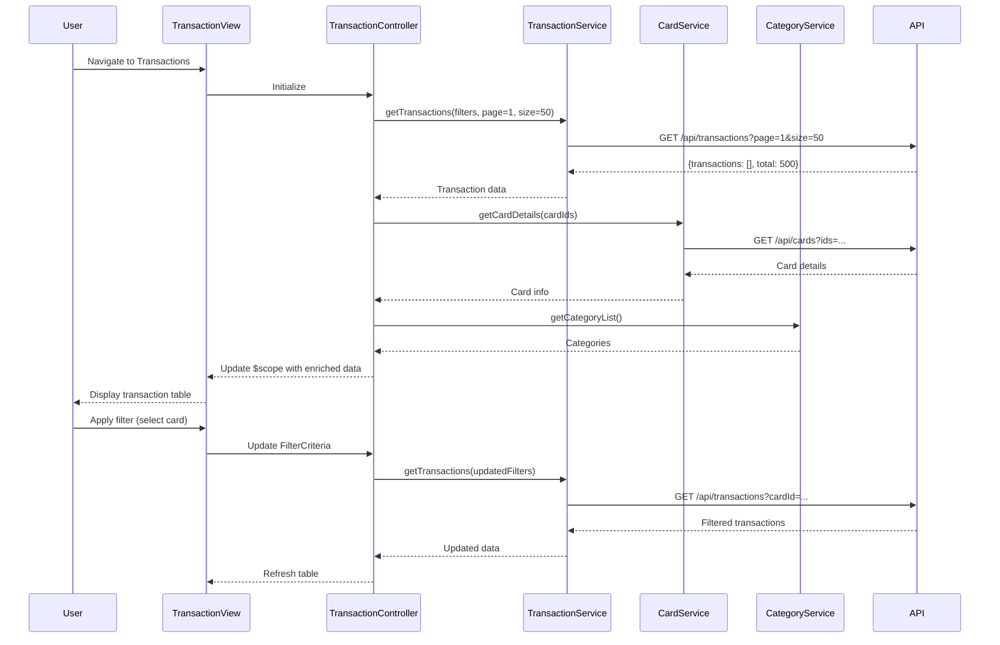

# Low-Level Design: Transaction Management

**Epic ID:** QE-4371

## a. Architecture Mapping

- **Transaction Module** → AngularJS Module (`transactionManagement`)
- **Transaction List View** → HTML5 template with table and filters (`transactions.html`)
- **Transaction Controller** → AngularJS Controller (`TransactionController`)
- **Transaction Service** → AngularJS Service (`TransactionService`) - handles transaction API calls
- **Card Service** → AngularJS Service (`CardService`) - fetches card details
- **Category Service** → AngularJS Service (`CategoryService`) - provides category classification
- **Pagination Directive** → Custom directive for pagination controls (`pagination`)

**Folder Structure:**
```
/app
  /modules
    /transactions
      transaction.module.js
      transaction.controller.js
      transactions.html
  /services
    transaction.service.js
    card.service.js
    category.service.js
  /directives
    pagination.directive.js
  /filters
    transactionFilter.js
```

## b. Component Specifications

| Name | Artifact Type | Responsibility | Key Dependencies |
|------|---------------|----------------|------------------|
| transactionManagement | Module | Root module for transaction management | ngRoute, ui.bootstrap |
| TransactionController | Controller | Manages transaction list state, filtering, sorting, pagination | TransactionService, CardService, CategoryService, $scope |
| TransactionService | Service | Fetches paginated transaction data via REST API | $http, $q |
| CardService | Service | Retrieves card details for filtering | $http |
| CategoryService | Service | Provides category list and classification logic | $http |
| pagination | Directive | Renders pagination controls with page navigation | None |
| transactionFilter | Filter | Client-side filtering for search functionality | None |

## c. Data Model

**Transaction Model:**
```javascript
{
  transactionId: String,
  cardId: String,
  cardNumber: String (masked),
  date: Date,
  amount: Number,
  merchant: String,
  category: String,
  description: String,
  status: String
}
```

**PaginationState Model:**
```javascript
{
  currentPage: Number,
  pageSize: Number,
  totalItems: Number,
  totalPages: Number
}
```

**FilterCriteria Model:**
```javascript
{
  cardId: String,
  category: String,
  dateRange: {start: Date, end: Date},
  searchTerm: String,
  sortBy: String,
  sortOrder: String
}
```

## d. Data Flow

User navigates to transactions page → TransactionController initializes with default filters (all cards, last 30 days, page 1) → Controller calls TransactionService.getTransactions(filters, pagination) → Service makes REST API call to /api/transactions with query params → API returns paginated transaction array with total count → Controller enriches data by calling CardService for card details and CategoryService for category info → Enriched transactions are bound to $scope → View renders table with Bootstrap styling and pagination controls → User applies filter or search → Controller updates FilterCriteria and re-fetches data → View updates with filtered results.

## e. Primary Sequence Diagram



## f. Implementation Notes

- Use cursor-based pagination with TransactionService maintaining cursor state for efficient large dataset handling
- Implement AngularJS custom filter for client-side search on merchant and description fields
- Use ui.bootstrap pagination component for consistent UI across application
- Apply $watch on FilterCriteria with debouncing to trigger API calls only after user stops typing (300ms delay)
- Cache card and category data in respective services using $cacheFactory to avoid redundant API calls

## g. Error Handling

HTTP interceptor handles API errors with retry logic for transient failures; user-facing errors displayed via Bootstrap modal dialogs.

## h. Security Notes

Requires token-based auth via existing SSO; transaction data masked appropriately (card numbers, sensitive merchant info) at API level.