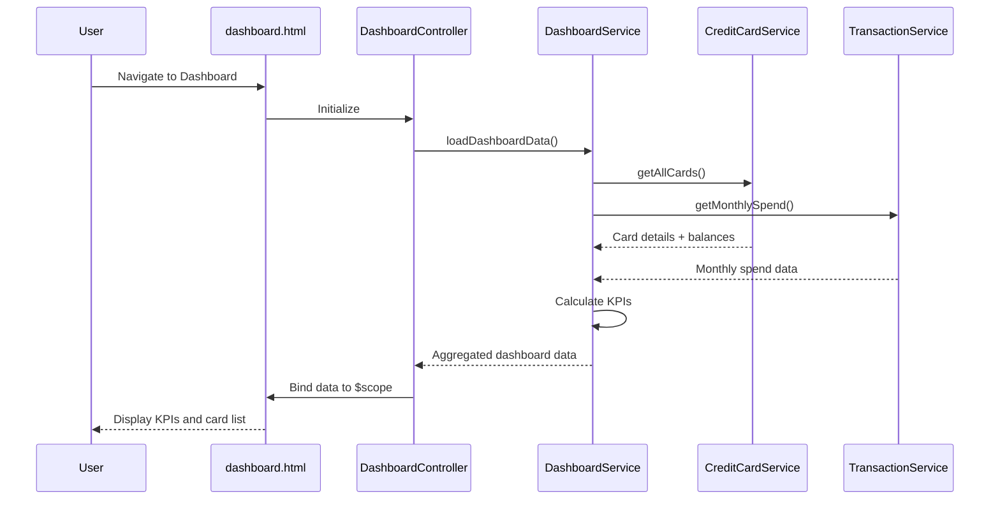

# Low-Level Design: QE-4380 - Credit Card Portfolio and KPI Dashboard

## a. Architecture Mapping

- **User Interface Dashboard** → DashboardController + dashboard.html view
- **Dashboard Service** → DashboardService (API calls for KPIs and card data)
- **Credit Card Service Integration** → CreditCardService (fetches card details and balances)
- **Transaction Service Integration** → TransactionService (fetches monthly spend data)
- **KPI Display Components** → appKpiCard directive (reusable KPI display widget)

**Recommended Folder Structure:**
```
app/
  dashboard/
    dashboard.module.js
    dashboard.controller.js
    dashboard.service.js
    dashboard.routes.js
    views/dashboard.html
  creditcard/
    creditcard.service.js
  transaction/
    transaction.service.js
  shared/
    directives/
      kpi-card.directive.js
```

## b. Component Specifications

| Name | Artifact Type | Responsibility | Key Dependencies |
|------|---------------|----------------|------------------|
| DashboardController | Controller | Orchestrates dashboard view, loads KPIs and card list, handles user interactions | DashboardService, $scope |
| DashboardService | Service | Aggregates data from CreditCardService and TransactionService, calculates KPIs | CreditCardService, TransactionService, $http, $q |
| CreditCardService | Service | Fetches card details, balances, credit limits from Credit Card Service API | $http, $q |
| TransactionService | Service | Fetches monthly spend data from Transaction Service API | $http, $q |
| appKpiCard | Directive | Renders individual KPI card with label, value, and optional trend indicator | None |
| dashboard.html | View | Displays dashboard layout with KPI cards and credit card list using Bootstrap grid | DashboardController |

## c. Data Model

```js
CreditCard = {
  id: String,
  cardNumber: String,
  cardHolderName: String,
  cardType: String,
  totalLimit: Number,
  availableCredit: Number,
  outstandingAmount: Number,
  expiryDate: String
}

DashboardKPI = {
  totalCreditLimit: Number,
  totalAvailableCredit: Number,
  totalOutstanding: Number,
  monthlySpend: Number,
  creditUtilization: Number
}

MonthlySpend = {
  cardId: String,
  month: String,
  amount: Number
}
```

## d. Data Flow

User navigates to dashboard → dashboard.html loads → DashboardController initializes → calls DashboardService.loadDashboardData() → DashboardService concurrently invokes CreditCardService.getAllCards() and TransactionService.getMonthlySpend() → both services make REST API calls via $http → responses aggregated in DashboardService to calculate KPIs (total limit, available credit, outstanding, monthly spend, utilization ratio) → DashboardService returns aggregated data → DashboardController binds data to $scope → view updates with KPI cards and card list rendered via appKpiCard directives and ng-repeat.

## e. Primary Sequence Diagram



## f. Implementation Notes

- Use `$q.all()` to parallelize CreditCardService and TransactionService API calls for faster dashboard load
- Apply `$inject` annotation for all controllers and services to ensure minification safety
- Implement caching in DashboardService using `$cacheFactory` with 60-second TTL to meet 2-second load requirement
- Use Bootstrap responsive grid (col-md-3, col-sm-6, col-xs-12) for KPI cards to support mobile and desktop
- Limit card list to 20 items as per NFR; display warning if user has more cards

## g. Error Handling

HTTP interceptor catches API failures; DashboardService returns rejected promises with user-friendly messages displayed via Bootstrap alert component.

## h. Security Notes

JWT token passed in Authorization header for all API calls; card numbers masked in UI (show last 4 digits only).