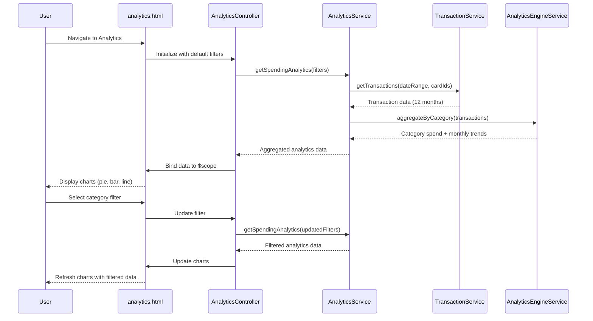

# Low-Level Design: QE-4381 - Spending Analytics and Visualization

## a. Architecture Mapping

- **User Interface** → AnalyticsController + analytics.html view
- **Analytics Service** → AnalyticsService (API calls for spending data and aggregations)
- **Transaction Service Integration** → TransactionService (fetches transaction data)
- **Analytics Engine Integration** → AnalyticsEngineService (data aggregation and processing)
- **Chart Components** → appSpendingChart directive (interactive chart rendering using Chart.js)
- **Category Filter** → appCategoryFilter directive (category selection UI)

**Recommended Folder Structure:**
```
app/
  analytics/
    analytics.module.js
    analytics.controller.js
    analytics.service.js
    analytics.routes.js
    views/analytics.html
  transaction/
    transaction.service.js
  shared/
    directives/
      spending-chart.directive.js
      category-filter.directive.js
    services/
      analytics-engine.service.js
```

## b. Component Specifications

| Name | Artifact Type | Responsibility | Key Dependencies |
|------|---------------|----------------|------------------|
| AnalyticsController | Controller | Manages analytics view, handles filter selections, updates chart data | AnalyticsService, $scope, $filter |
| AnalyticsService | Service | Fetches spending data, coordinates with TransactionService and AnalyticsEngineService | TransactionService, AnalyticsEngineService, $http, $q |
| TransactionService | Service | Retrieves transaction data from Transaction Service API | $http, $q |
| AnalyticsEngineService | Service | Aggregates transactions by category and time period, calculates trends | $q |
| appSpendingChart | Directive | Renders interactive charts (pie, bar, line) using Chart.js library | Chart.js |
| appCategoryFilter | Directive | Multi-select dropdown for 9 predefined spending categories | None |
| analytics.html | View | Displays category filter, card selector, and spending charts in responsive layout | AnalyticsController |

## c. Data Model

```js
Transaction = {
  id: String,
  cardId: String,
  amount: Number,
  category: String,
  date: String,
  merchantName: String
}

CategorySpend = {
  category: String,
  totalAmount: Number,
  transactionCount: Number,
  percentage: Number
}

MonthlyTrend = {
  month: String,
  totalSpend: Number,
  categoryBreakdown: Array<CategorySpend>
}

SpendingCategories = [
  'Food & Dining',
  'Fuel',
  'Shopping',
  'Travel',
  'Entertainment',
  'Utilities',
  'Healthcare',
  'Education',
  'Miscellaneous'
]
```

## d. Data Flow

User navigates to analytics page → analytics.html loads → AnalyticsController initializes with default filters (all categories, last 12 months) → calls AnalyticsService.getSpendingAnalytics(filters) → AnalyticsService invokes TransactionService.getTransactions(dateRange, cardIds) → transaction data returned → AnalyticsEngineService.aggregateByCategory(transactions) processes data → aggregated results returned to AnalyticsController → controller updates $scope with categorySpend and monthlyTrend arrays → appSpendingChart directive watches data changes and renders interactive charts → user selects category filter → controller re-invokes AnalyticsService with updated filters → charts refresh with filtered data.

## e. Primary Sequence Diagram



## f. Implementation Notes

- Use Chart.js v2.x for interactive charts; wrap in appSpendingChart directive with two-way data binding
- Implement AnalyticsEngineService as a Factory for singleton pattern to cache aggregated data
- Apply `$inject` annotation for minification safety across all components
- Use `$filter('date')` and `$filter('currency')` for consistent data formatting in charts
- Lazy-load Chart.js library using ocLazyLoad to reduce initial bundle size

## g. Error Handling

API errors caught in AnalyticsService, logged to console, and displayed to user via toast notification; charts show "No data available" message on empty datasets.

## h. Security Notes

JWT token in Authorization header for Transaction Service API calls; category list hardcoded client-side to prevent injection attacks.