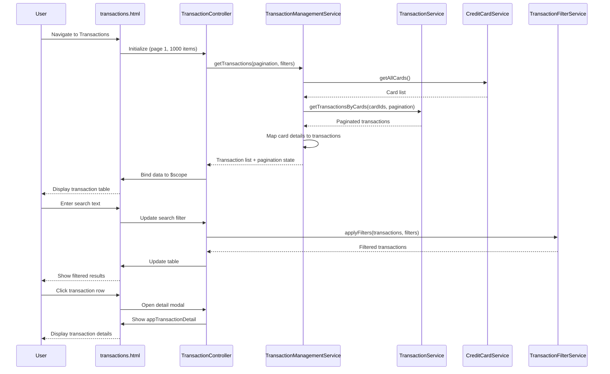

# Low-Level Design: QE-4382 - Transaction Management and Monitoring

## a. Architecture Mapping

- **User Interface** → TransactionController + transactions.html view
- **Transaction Management Service** → TransactionManagementService (orchestrates transaction retrieval and filtering)
- **Transaction Service Integration** → TransactionService (fetches transaction data from API)
- **Credit Card Service Integration** → CreditCardService (maps cards to transactions)
- **Transaction List Component** → appTransactionList directive (paginated transaction table)
- **Transaction Detail Modal** → appTransactionDetail directive (modal for detailed transaction view)
- **Search and Filter** → TransactionFilterService (client-side search and filter logic)

**Recommended Folder Structure:**
```
app/
  transactions/
    transactions.module.js
    transactions.controller.js
    transaction-management.service.js
    transaction.service.js
    transaction-filter.service.js
    transactions.routes.js
    views/transactions.html
  creditcard/
    creditcard.service.js
  shared/
    directives/
      transaction-list.directive.js
      transaction-detail.directive.js
```

## b. Component Specifications

| Name | Artifact Type | Responsibility | Key Dependencies |
|------|---------------|----------------|------------------|
| TransactionController | Controller | Manages transaction list view, handles pagination, search, and filter actions | TransactionManagementService, TransactionFilterService, $scope |
| TransactionManagementService | Service | Coordinates transaction retrieval across multiple cards, manages pagination state | TransactionService, CreditCardService, $http, $q |
| TransactionService | Service | Fetches transaction data from Transaction Service API with pagination support | $http, $q |
| CreditCardService | Service | Retrieves card list for card-transaction mapping | $http, $q |
| TransactionFilterService | Service | Applies client-side search and filters (date, amount, category, card) to transaction list | $filter |
| appTransactionList | Directive | Renders paginated transaction table with sort and select capabilities | None |
| appTransactionDetail | Directive | Displays transaction details in modal overlay | $uibModal (UI Bootstrap) |
| transactions.html | View | Transaction list page with search bar, filters, and pagination controls | TransactionController |

## c. Data Model

```js
Transaction = {
  id: String,
  cardId: String,
  cardLastFour: String,
  amount: Number,
  currency: String,
  category: String,
  merchantName: String,
  merchantCity: String,
  transactionDate: String,
  postingDate: String,
  description: String,
  status: String
}

TransactionFilter = {
  searchText: String,
  cardIds: Array<String>,
  categories: Array<String>,
  dateFrom: String,
  dateTo: String,
  amountMin: Number,
  amountMax: Number
}

PaginationState = {
  currentPage: Number,
  pageSize: Number,
  totalItems: Number,
  totalPages: Number
}
```

## d. Data Flow

User navigates to transactions page → transactions.html loads → TransactionController initializes with default pagination (page 1, 1000 items per page) → calls TransactionManagementService.getTransactions(paginationState, filters) → service invokes CreditCardService.getAllCards() to get card list → then calls TransactionService.getTransactionsByCards(cardIds, pagination) → API returns paginated transaction data → TransactionManagementService maps card details to transactions → data returned to controller → controller binds to $scope → appTransactionList directive renders table → user enters search text or applies filter → TransactionFilterService.applyFilters(transactions, filters) filters client-side → filtered results update view within 1 second → user clicks transaction row → appTransactionDetail directive opens modal with full transaction details.

## e. Primary Sequence Diagram



## f. Implementation Notes

- Implement TransactionFilterService with indexed search using lodash `_.filter()` for sub-1-second performance
- Use UI Bootstrap `$uibModal` for transaction detail modal with lazy template loading
- Apply `$inject` annotation for all services and controllers for minification safety
- Use `track by transaction.id` in ng-repeat for optimal rendering performance with large lists
- Implement virtual scrolling or "Load More" button if pagination exceeds 1000 items to maintain performance

## g. Error Handling

API errors intercepted via $httpProvider.interceptors, logged to console, and displayed via inline alert banner; empty states handled with "No transactions found" message.

## h. Security Notes

JWT token in Authorization header for all API calls; transaction data read-only with no edit/delete operations to prevent unauthorized modifications.